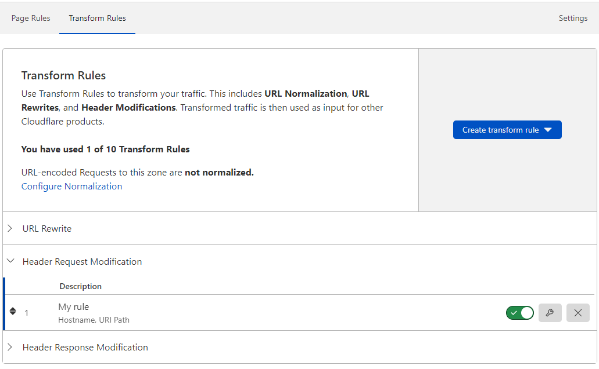
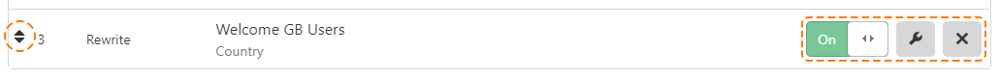

# Manage Transform Rules

**Transform Rules** is a feature of **Rules** in the Cloudflare dashboard.

The **Transform Rules** dashboard interface lets you:

* Create new URL Rewrite Rules and HTTP Request Header Modification Rules.
* See a list of existing rules (both active and paused).
* Activate or pause rules (turn on or off).
* Edit rules.
* Delete rules.
* Reorder rules.

## Create rules

In the **Transform Rules** tab you can:

* [Create a URL Rewrite Rule](/transform/create-url-rewrite-rule)
* [Create an HTTP Request Header Modification Rule](/transform/create-header-modification-rule)

See each linked section for details on creating each rule type.

## Manage rules

You can manage your existing Transform Rules at any time using the buttons located on the right of the rule you want to change, or by using the handle located on the left of the rule. 

### Enable or disable a rule

Use the on/off toggle switch associated with a Transform Rule to enable or disable it.

### Edit a rule

Click the **Edit** button (wrench icon) to open the **Edit Rule** panel and make the changes you want.

### Delete a rule

Use the **Delete** button (X icon) associated with the existing rule you want to remove to delete it. In the confirmation dialog that appears, click **Delete** to confirm and complete the operation.

### Order rules

Cloudflare evaluates each type of Transform Rules in list order, where rules are evaluated in the order they appear in the Rules List. You can drag and drop Transform Rules into position to reorder them using the handle on the left of the rule.
