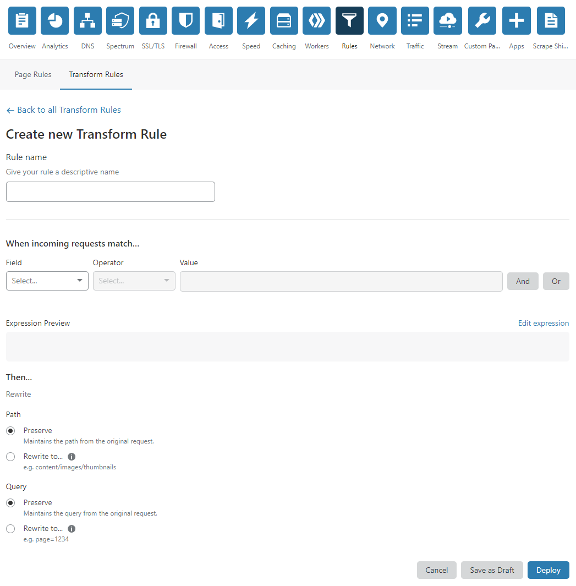
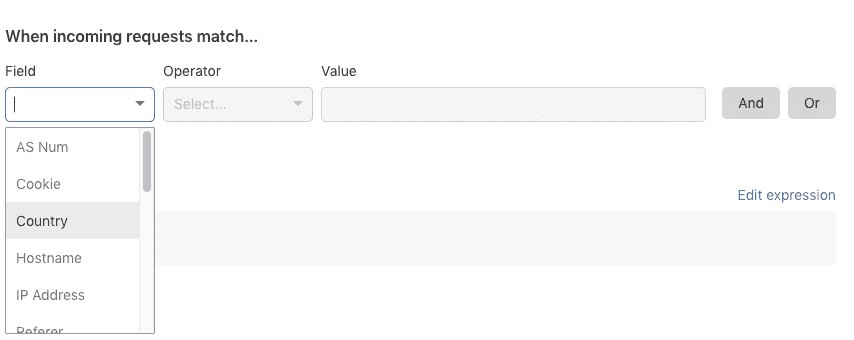
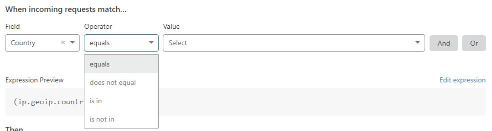
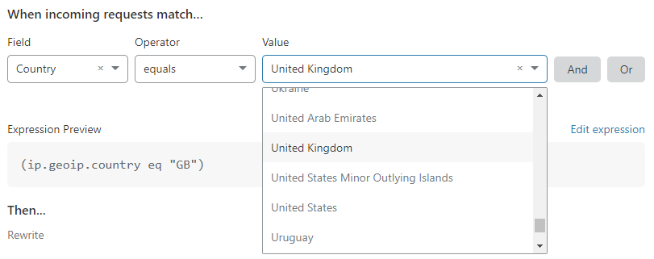
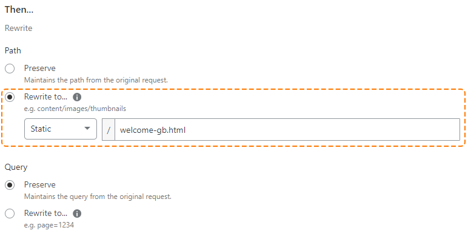
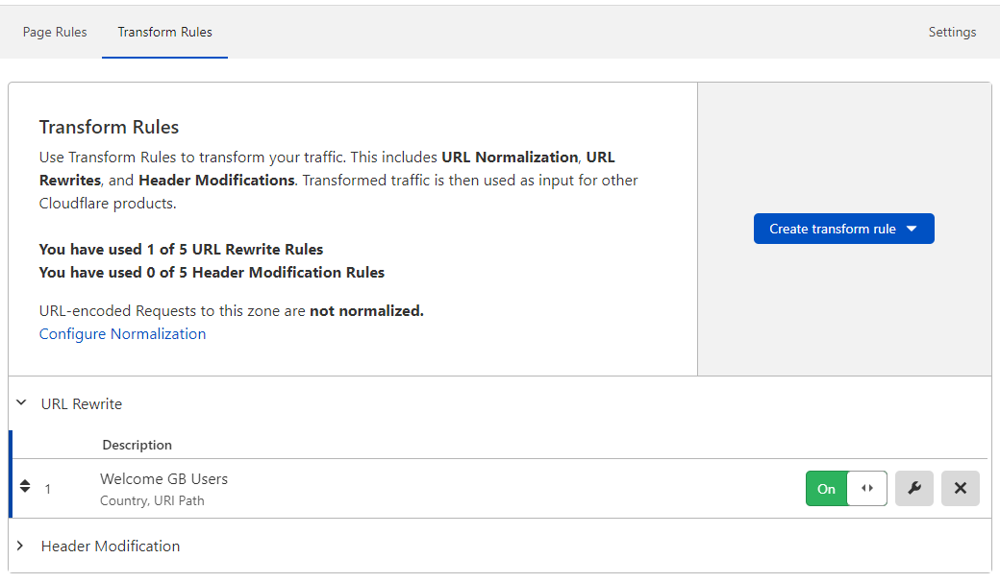

# Manage Transform Rules

<Aside type="warning" header="Important">

This feature is part of an early access experience for selected customers.

</Aside>

**Transform Rules** is a feature of **Rules** in the Cloudflare dashboard.

As depicted in the image below, the **Transform Rules** dashboard interface lets you:

- **Create** new Transform Rules.
- See a list of existing rules (both active and paused).
- Activate or pause rules (turn on or off).
- **Edit** rules.
- **Delete** rules.
- Reorder rules.

## Create, edit, and delete rules

The Create Transform Rule page in the **Rules** app is a good guide to the parts of a Transform Rule. When a given property of an incoming HTTP request matches the expression in a Transform Rule, the specified actions occur:

You can specify the match expression using the Expression Builder or using the Expression Editor. Check [Expression Builder and Editor](https://developers.cloudflare.com/firewall/cf-dashboard/create-edit-delete-rules#expression-builder-and-editor) in the Firewall documentation for more information.

## Create a Transform Rule

To create a new Transform Rule:

1. Log in to the Cloudflare dashboard.

1. Select the **Websites** tab and choose the site for which you want to create a new Transform Rule.

1. To open Transform Rules from the dashboard, click the **Rules** tile in the app bar, and then click the **Transform Rules** tab.

1. Click **Create a transform rule**.

1. In the Create Transform Rule page that displays, enter a descriptive name for the rule in **Rule name**. The rule name in this example is _Welcome GB Users_.

1. Under **When incoming requests match...**, use the **Field** drop-down list to choose an HTTP property. For each request, the value of the property you choose for **Field** is compared to the value you specify for **Value**.

    

1. Use the **Operator** drop-down list to choose a comparison operator. For an expression to match, the value of the request **Field** and the value specified in the **Value** input must satisfy the comparison operator.

    

    In the screenshot above, note that the **Expression Editor** area displays a text-only version of your expression. For more information on the Expression Editor, see [Edit rule expressions](https://developers.cloudflare.com/firewall/cf-dashboard/expression-preview-editor) in the Firewall documentation.

1. Specify the value to match. If the value is an enumeration, then the **Value** control will be a drop-down list. Otherwise, it will be a text input. In this example the value _United Kingdom_ is set using the **Country** drop-down list.

    

1. To define the action for your Transform Rule, select either one of the available options displayed as radio buttons, and then a value from the drop-down list, depending on the action.

    In this example, the path rewrite _Static_ action tells Cloudflare to rewrite the original path changing it to the provided path, _/welcome-gb.html_.

    

    If you do not want to change the value of a component of the original request (for example, the URL query string), choose _Preserve_ as the action for that component.

1. To save and deploy your rule, click **Deploy**. If you are not ready to deploy your rule, click **Save as draft**.

After you choose an option, you return to the **Rules List**, which displays your new rule:

If you choose to deploy your new Transform Rule, the toggle switch associated with the rule will be _On_. If you save the rule as a draft, the toggle will be _Off_.

## Manage Transform Rules

You can manage your existing Transform Rules at any time using the buttons located on the right of the rule you want to change, or by using the handle located on the left of the rule. 

### Enable or disable a rule

Use the on/off toggle switch associated with a Transform Rule to enable or disable it.

### Edit a rule

Click the **Edit** button (wrench icon) to open the **Edit Rule** panel and make the changes you want.

### Delete a rule

Use the **Delete** button (X icon) associated with the existing rule you want to remove to delete it. In the confirmation dialog that appears, click **Delete** to confirm and complete the operation.

### Order rules

Cloudflare evaluates Transform Rules in list order, where rules are evaluated in the order they appear in the Rules List. You can drag and drop Transform Rules into position to reorder them using the handle on the left of the rule.
