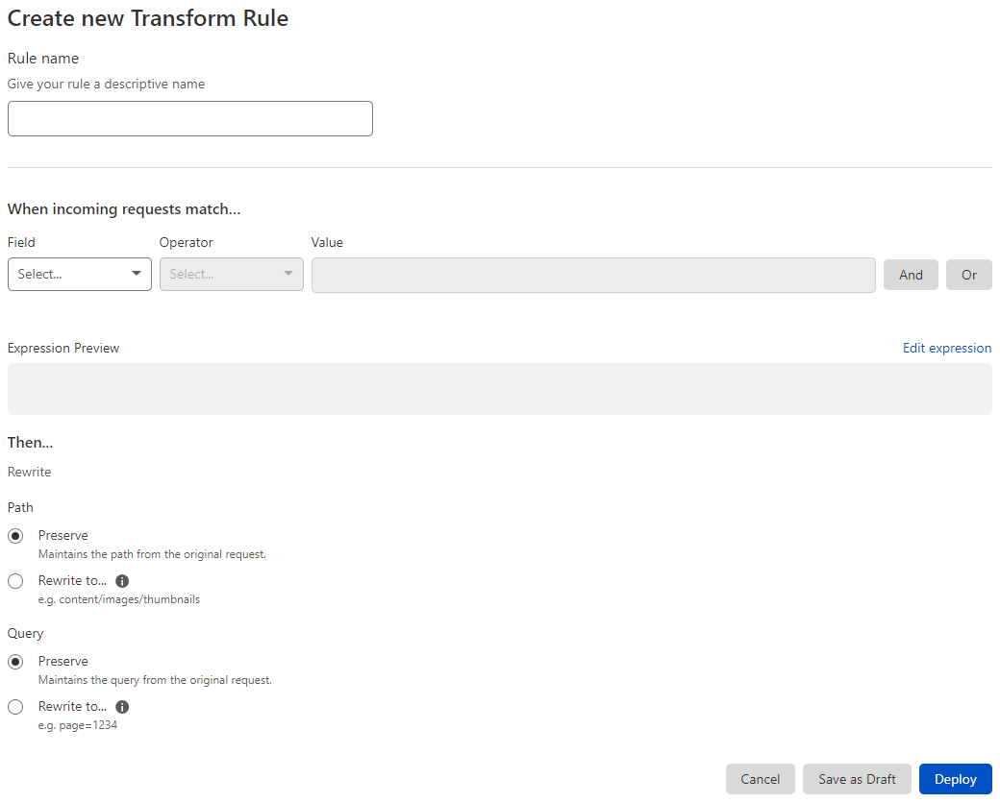

# Create a URL Rewrite Rule in the dashboard

Create URL Rewrite Rules in the **Transform Rules** tab under Rules. Refer to [URL rewrite examples](/transform/url-rewrite/examples) for examples of rule definitions.

1. Log in to the [Cloudflare dashboard](https://dash.cloudflare.com/), and select your account and website.

1. Go to **Rules** > **Transform Rules**.

    

1. Click **Create transform rule** > **Rewrite URL**.

    

1. In the page that displays, enter a descriptive name for the rule in **Rule name**. The rule name in this example is _Welcome GB Users_.

1. Under **When incoming requests match**, use the **Field** drop-down list to choose an HTTP property. For each request, the value of the property you choose for **Field** is compared to the value you specify for **Value**.

    

1. Select a comparison operator in the **Operator** drop-down list.

    

    The **Expression Editor** area displays a text-only version of your expression. For more information on the Expression Editor, refer to [Edit rule expressions](https://developers.cloudflare.com/firewall/cf-dashboard/expression-preview-editor) in the Firewall documentation.

1. Specify the value to match. If the value is an enumeration, the **Value** control will be a drop-down list. Otherwise, it will be a text input. In this example the value _United Kingdom_ is set using the **Country** drop-down list.

    

1. Add any other filters to the rule expression. The example defines an additional filter for the _URI Path_, which must be equal to `/welcome.html`.

1. To define the action for your URL Rewrite Rule, select one of the available options displayed as radio buttons and then a value from the drop-down list, depending on the action.

    In this example, the _Static_ action tells Cloudflare to rewrite the original path to the provided path, `/welcome-gb.html`.

    

    If you do not want to change the value of a component of the original request (for example, the URL query string), choose _Preserve_ as the action for that component.

1. To save and deploy your rule, click **Deploy**. If you are not ready to deploy your rule, click **Save as Draft**.

After you choose an option, you return to the **Transform Rules** dashboard interface, which displays your new rule:

If you choose to deploy your URL Rewrite Rule, the new rule will be enabled. If you save the rule as a draft, the new rule will be disabled.
