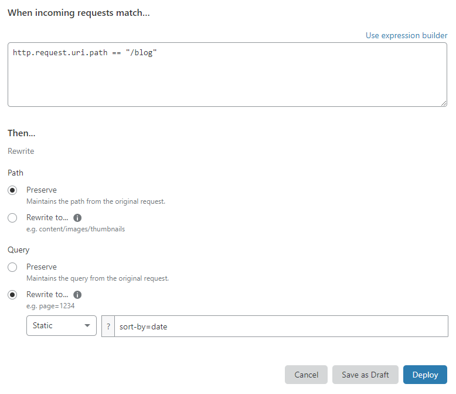

# Common use cases

This page includes examples of URL Rewrite Rules and HTTP Request Header Modification Rules that address common use cases.

---

## URL rewrite examples

The following use cases illustrate how to perform URL rewrites with Transform Rules:

* [Rewrite path of welcome page for visitors in specific countries](#rewrite-path-of-welcome-page-for-visitors-in-specific-countries)
* [Rewrite URL query string of blog visitors](#rewrite-url-query-string-of-blog-visitors)
* [Rewrite path of archived blog posts](#rewrite-path-of-archived-blog-posts)
* [Rewrite path of moved section of a website](#rewrite-path-of-moved-section-of-a-website)
* [Rewrite blog archive URLs to support a new URL format](#rewrite-blog-archive-urls-to-support-a-new-url-format)

### Rewrite path of welcome page for visitors in specific countries

To have a welcome page in two languages, create two URL Rewrite Rules with a static rewrite of the path component:

**URL Rewrite Rule #1**

<Example>

Text in **Expression Editor**:

```txt
http.request.uri.path == "/welcome.html" && ip.geoip.country == "GB"
```

Text after **Path** > **Rewrite to...** > _Static_:

```txt
/welcome-gb.html
```

</Example>

**URL Rewrite Rule #2**

<Example>

Text in **Expression Editor**:

```txt
http.request.uri.path == "/welcome.html" && ip.geoip.country == "PT"
```

Text after **Path** > **Rewrite to...** > _Static_:

```txt
/welcome-pt.html
```

</Example>

### Rewrite URL query string of blog visitors

To rewrite a request to the `/blog` path to `/blog?sort-by=date`, create a URL Rewrite Rule with the following settings:

<Example>

Text in **Expression Editor**:

```txt
http.request.uri.path == "/blog"
```

Text after **Query** > **Rewrite to...** > _Static_: 

```txt
sort-by=date
```

</Example>

Additionally, set the path rewrite action of the same rule to _Preserve_ so that the URL path doesn’t change.



### Rewrite path of archived blog posts

To rewrite all requests to `/news/2012/...` to `/archive/news/2012/...` you must add a reference to the content of the original URL. Create a new URL Rewrite Rule and define a dynamic URL path rewrite using an expression:

<Example>

Text in **Expression Editor**:

```txt
starts_with(http.request.uri.path, "/news/2012/")
```

Text after **Path** > **Rewrite to...** > _Dynamic_:

```txt
concat("/archive", http.request.uri.path)
```

</Example>

The filter uses the `starts_with()` function all paths starting with `/news/2012/`. The dynamic path rewrite uses the `concat()` function to concatenate a prefix to the original URL path of the HTTP request.

### Rewrite path of moved section of a website

To rewrite everything under `/blog/<x>` to `/marketing/<x>` you must modify the first component of the path (`/blog/`). Create a URL Rewrite Rule and use the `regex_replace()` function for this purpose:

<Example>

Text in **Expression Editor**:

```txt
starts_with(http.request.uri.path, "/blog/")
```

Text after **Path** > **Rewrite to...** > _Dynamic_:

```txt
regex_replace(http.request.uri.path, "^/blog/", "/marketing/")
```

</Example>

The `regex_replace()` function matches the path component on a regular expression (`^/blog/`) and then provides a replacement for that match (`/marketing/`).

### Rewrite blog archive URLs to support a new URL format

To rewrite the URLs of a blog archive that follow the URL format `/posts/<YYYY>-<MM>-<DD>-<title>` to the new format `/posts/<YYYY>/<MM>/<DD>/<title>`, create the following URL Rewrite Rule:

<Example>

Text in **Expression Editor**:

```txt
http.request.uri.path ~ "^/posts/[0-9]+-[0-9]+-[0-9]+-.*"
```

Text after **Path** > **Rewrite to...** > _Dynamic_:

```txt
regex_replace(http.request.uri.path, "^/posts/([0-9]+)-([0-9]+)-([0-9]+)-(.*)$", "/posts/${1}/${2}/${3}/${4}")
```

</Example>

The function `regex_replace()` also allows you to extract parts of the URL using regular expressions' capture groups. Create capture groups by putting part of the regular expression in parentheses. Then, reference a capture group using `${<num>}` in the replacement string, where `<num>` is the number of the capture group.

<Aside type="warning" header="Notes">

Use only the fields under [`http.request.uri`](https://developers.cloudflare.com/firewall/cf-firewall-language/fields#uri-argument-and-value-fields) and [`http.request.headers`](https://developers.cloudflare.com/firewall/cf-firewall-language/fields#http-header-fields) in rewrite expressions.

The `concat()` and `regex_replace()` functions can appear only **once** in a rewrite expression. For more information on these functions, see [Transformation functions](https://developers.cloudflare.com/firewall/cf-firewall-language/functions#transformation-functions).

</Aside>

---

## HTTP request header modification examples

<Aside type="note">

HTTP Request Header Modification Rules are available in Beta.

</Aside>

The following examples illustrate how to perform header modifications with Transform Rules:

* [Add an HTTP request header with a static value](#add-an-http-request-header-with-a-static-value)
* [Add an HTTP request header with the current URI path](#add-an-http-request-header-with-the-current-uri-path)
* [Remove an HTTP request header](#remove-an-http-request-header)

### Add an HTTP request header with a static value

The following HTTP Request Header Modification Rule adds a header named `X-Source` with a static value (`Cloudflare`) to the request:

<Example>

Text in **Expression Editor**:

```txt
starts_with(http.request.uri.path, "/en/")
```

Selected operation under **Modify header**: _Set static_

**Header name**: `X-Source`

**Value**: `Cloudflare`

</Example>

### Add an HTTP request header with the current URI path

The following HTTP Request Header Modification Rule adds a header named `X-Path` with the current URI path to the request:

<Example>

Text in **Expression Editor**:

```txt
starts_with(http.request.uri.path, "/en/")
```

Selected operation under **Modify header**: _Set dynamic_

**Header name**: `X-Path`

**Value**: `http.request.uri.path`

</Example>

### Remove an HTTP request header

The following HTTP Request Header Modification Rule removes the `cf-connecting-ip` header from the request:

<Example>

Text in **Expression Editor**:

```txt
starts_with(http.request.uri.path, "/private/")
```

Selected operation under **Modify header**: _Remove_
 
**Header name**: `cf-connecting-ip`

</Example>
