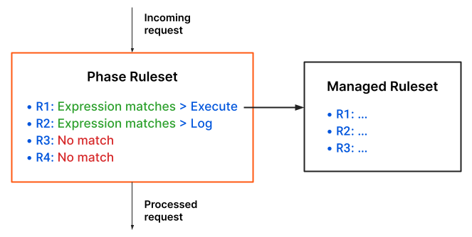

# About Ruleset Engine

The Cloudflare Ruleset Engine allows you to create and deploy rules and rulesets. The engine syntax, inspired by the Wireshark Display Filter language, is defined by the [Rules language](/rules-language). Cloudflare uses the Ruleset Engine in different products, allowing you to configure several products using the same basic syntax.

There are several elements involved in the configuration and use of the Ruleset Engine. These elements are:

* **Phase** — Defines a stage in the life of a request where you can execute rulesets.
* **Ruleset** — Defines a versioned set of rules. You deploy rulesets to a phase, where they execute.
* **Rule** — Defines a filter and an action to perform on incoming requests that match the filter expression. A rule with an `execute` action executes a ruleset.

## Phases

A phase defines a stage in the life of a request where you can execute rulesets. Phases are defined by Cloudflare and cannot be modified.

Phases exist at two levels: at the **account** level and at the **zone** level. For the same phase, rules defined at the account level are evaluated **before** the rules defined at the zone level.

<Aside type="note">

Currently, phases at the account level are only available in Enterprise plans.

</Aside>

The following diagram outlines the request handling process where requests go through the available phases:

Phases have an **entry point** ruleset at the account and zone levels. An entry point ruleset contains a list of ordered rules that run in the phase. You can define rules in an entry point ruleset that execute a different ruleset.

Cloudflare products are specific to one or more phases, and they add support for different features. Check the documentation for each Cloudflare product for details on the applicable phases.

## Rulesets

A ruleset is an ordered set of rules that you can apply to traffic at the edge. Rulesets belong to a phase and can only execute in the same phase. To deploy a ruleset to a phase, add a rule that executes the ruleset to the phase entry point.

Rulesets are versioned. Each ruleset modification creates a new version of the ruleset. You can have several versions of a ruleset in use at the same time. When you deploy a ruleset — that is, when you create a rule that executes the ruleset — the most recent version of the ruleset is selected by default.

There are several types of rulesets. Cloudflare provides **Managed Rulesets** that you can deploy. Additionally, you can create and manage your own **custom rulesets**. Specific Cloudflare products may provide other types of rulesets.

<Aside type="note" header="Note">

The `kind` field of phase entry point rulesets has one of the following values:

* `root` for phase entry point rulesets at the account level
* `zone` for phase entry point rulesets at the zone level

</Aside>

### Managed Rulesets

Managed Rulesets are preconfigured rulesets provided by Cloudflare that you can deploy to a phase. Only Cloudflare can modify these rulesets.

The rules in a Managed Ruleset have a default action and status. However, you can define **overrides** that change these defaults.

There are several Cloudflare products that provide you with Managed Rulesets. Check each product’s documentation for details on the available Managed Rulesets.

For more information on deploying Managed Rulesets and defining overrides, check [Work with Managed Rulesets](/managed-rulesets).

### Custom rulesets

<Aside type="warning" header="Important">

Currently, custom rulesets are only supported by the Cloudflare WAF.

</Aside>

Use custom rulesets to define your own sets of rules. After creating a custom ruleset, deploy it to a phase by creating a rule that executes the ruleset.

For more information on creating and deploying custom rulesets, check [Work with custom rulesets](/custom-rulesets).

## Rules

A **rule** defines a filter and an action to perform on the incoming requests that match the filter. The rule filter **expression** defines the scope of the rule and the rule **action** defines what happens when there’s a match for the expression. Rule filter expressions are defined using the [Rules language](/rules-language).

For example, consider the following ruleset with four rules (R1, R2, R3, and R4). For a given incoming request, the expression of the first two rules matches the request properties. Therefore, the action for these rules runs (_Execute_ and _Log_, respectively). The action of the first rule executes a Managed Ruleset, which means that every rule in the Managed Ruleset is evaluated. The action of the second rule logs an event associated with the current phase. There is no match for the expressions of rules 3 and 4, so their actions do not run. Since no rule blocks the request, it proceeds to the next phase.

Rules can have additional features through specific Cloudflare products. You may have more fields available for rule expressions, perform different actions, or configure additional behavior in a given phase.

### Rule evaluation and field values

While evaluating rules for a given request/response, the values of all request and response [fields](/rules-language/fields) are immutable within each phase. However, field values may change between phases.

For example:
* If a [URL Rewrite Rule](https://developers.cloudflare.com/rules/transform/url-rewrite) #1 updates the URI path or the query string of a request, URL Rewrite Rule #2 will not take these earlier changes into consideration.
* If a [HTTP Request Header Modification Rule](https://developers.cloudflare.com/rules/transform/request-header-modification) #1 sets the value of a request header, HTTP Request Header Modification Rule #2 will not be able to read or evaluate this new value.
* If a URL Rewrite Rule updates the URI path or query string of a request, the `http.request.uri`, `http.request.uri.*`, and `http.request.full_uri` fields will have a different value in phases after the `http_request_transform` phase (where URL Rewrite Rules are executed).

---

## Get started

To view existing rulesets and their properties, see [View rulesets](/basic-operations/view-rulesets).

For more information on deploying Managed Rulesets and defining overrides, check [Work with Managed Rulesets](/managed-rulesets).

For more information on creating and deploying custom rulesets, check [Work with custom rulesets](/custom-rulesets).
