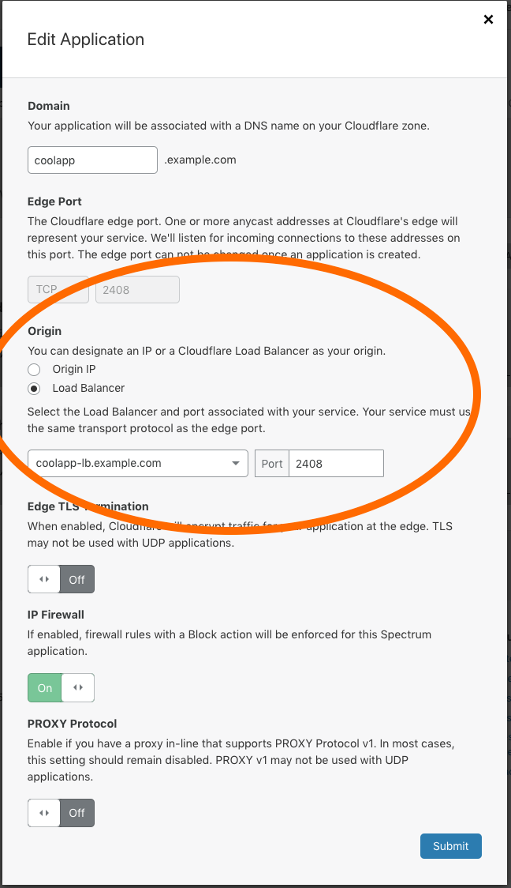

# Cloudflare Load Balancer

You can configure Spectrum and Cloudflare's Load Balancing to provide TCP healthchecks, failover, and traffic steering to bring resiliency to your Spectrum Applications.  However, to prevent issues with DNS resolution for a Spectrum application, do not use the same Spectrum hostname as a current Load Balancing hostname.

<Aside>

This feature requires an Enterprise plan.  If you would like to upgrade, please contact your customer success manager or the <a href="mailto:success@cloudflare.com">Customer Success Team</a>.

</Aside>

--------------------------------

## TCP health checks

Cloudflare's Load Balancer can be configured to probe any TCP port for an accepted connection. This is in addition to HTTP and HTTPS probing capabilities.

Health Checks are optional within a Load Balancer. However, without one the load balancer will distribute traffic to all the origins in the first pool. With the Health Check enabled, hosts that have gone into an error state will not receive traffic maintaining uptime. This allows you to enable intelligent failover within a pool of hosts or amongst multiple pools.

The below image will configure a TCP health check for an application running on port 2408 with a refresh rate every 30 seconds. This can be configured through the dashboard or through Cloudflare's API.

**Dashboard Example:**


**API Example:**

```bash
curl 'https://api.cloudflare.com/client/v4/organizations/{ORG_ID}/load_balancers/monitors'  \
-H 'Content-Type: application/json' \
-H 'X-Auth-Email: user@example.com' \
-H 'X-Auth-Key: 00000000000' \
-X POST --data '{"description":"Spectrum Health Check","type":"tcp","port":2048,"interval":30,"retries":2,"timeout":5,"method":"connection_established"}'
```

```json
{
  "description": "Spectrum Health Check",
  "type": "tcp",
  "port": 2048,
  "interval": 30,
  "retries": 2,
  "timeout": 5,
  "method": "connection_established",
}
```

Below is the procedure to enable a Cloudflare Load Balancer with Spectrum using the dashboard.

--------------------------------

## Weights

[Origin Weights](https://developers.cloudflare.com/load-balancing/understand-basics/weighted-load-balancing) allow you to have origins that do not have the same capacity or if you want to split traffic amongst hosts for any other reason.

Weight is configured within a load balancer pool will be honored with load balancing through Spectrum. If configured, Cloudflare will distribute traffic amongst the available origins within a pool according to the relative weights assigned to each origin.

--------------------------------

## Steering modes

All steering modes are available for transport load balancing through Spectrum:
- [Standard failover](https://developers.cloudflare.com/load-balancing/understand-basics/traffic-steering#off---standard-failover): Traffic goes from unhealthy pools to the next healthy pool in your configuration.
- [Dynamic steering](https://developers.cloudflare.com/load-balancing/understand-basics/traffic-steering#dynamic-steering): Traffic goes to the fastest pool for a given user.
- [Geo steering](https://developers.cloudflare.com/load-balancing/understand-basics/traffic-steering#geo-steering): Traffic goes to a specific geographic region or — for Enterprise customers only — specific data centers.
- [Proximity steering](https://developers.cloudflare.com/load-balancing/understand-basics/traffic-steering#proximity-steering): Traffic goes to the closest physical data center.

--------------------------------

## Load balancing rules

At the moment, you cannot use [load balancing custom rules](https://developers.cloudflare.com/load-balancing/understand-basics/load-balancing-rules) with Cloudflare Spectrum.

--------------------------------

## Example

<Aside>

You will need to have both Load Balancing and Spectrum Enabled in your account to use this functionality.

</Aside>

### Step 1: Create a Load Balancer

You will need to create a Load Balancer on your Cloudflare managed zone. You can follow instructions on how to do so by following this [tutorial](https://support.cloudflare.com/hc/en-us/articles/115000081911-Tutorial-How-to-Set-Up-Load-Balancing-Intelligent-Failover-on-Cloudflare).

### Step 2: Create the Spectrum Application

**Example using the Dashboard:**

Navigate to the Spectrum tab in the dashboard and select the `Add an Application` button. Under the Origin section, select the Load Balancer radio button and select your new load balancer:



**Example Curl using the API:**

```bash
curl -X POST 'https://api.cloudflare.com/client/v4/zones/{ZONE_ID}/spectrum/apps' \
-H "Content-Type: application/json" \
-H "X-Auth-Email: email" \
-H "X-Auth-Key: key" \
--data '{"dns":{"type":"CNAME","name":"spectrum-cname.example.com"},"ip_firewall":false,"protocol":"tcp/22","proxy_protocol":false,"tls":"off","origin_dns": {"name": "cname-to-origin.example.com", "ttl": 1200}, "origin_port": 22}'
```

**Example Data:**

```json
{
	"dns": {
		"type": "CNAME",
		"name": "spectrum-cname.example.com"
	},
	"ip_firewall": false,
	"protocol": "tcp/22",
	"proxy_protocol": false,
	"tls": "off",
	"origin_dns": {
		"name": "cname-to-origin.example.com",
		"ttl": 1200
	},
	"origin_port": 22
}
```
