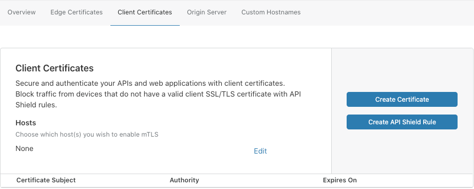
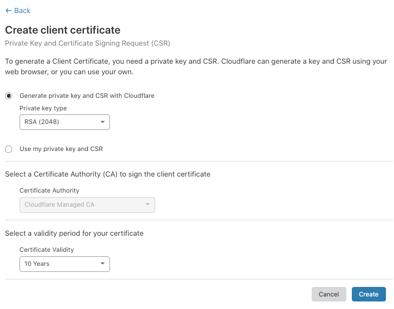
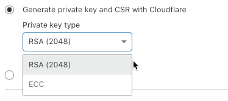
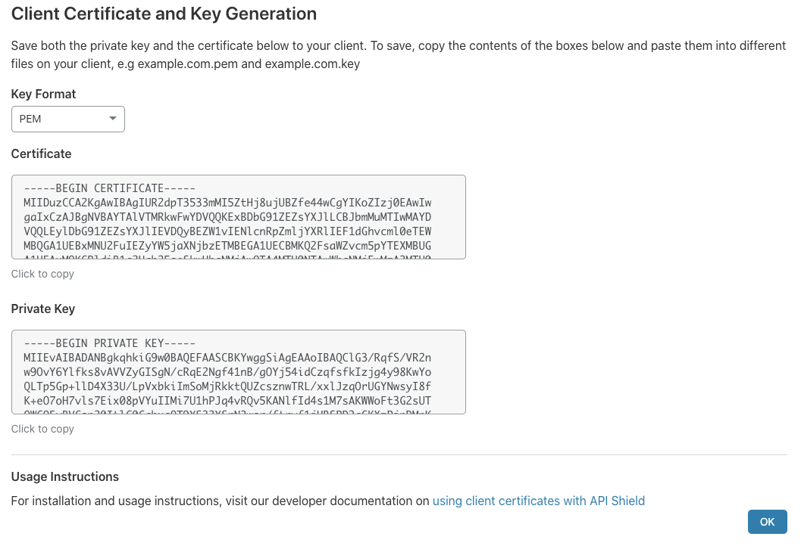

# Create a client certificate

To create a client certificate in the Cloudflare dashboard, use the **SSL** app and follow these steps:

1. Log in to the Cloudflare dashboard and click the **SSL** app.

  The SSL **Overview** displays.

  
  
1. Click the **Client Certificates** tab.

1. In the the **Client Certificates** card, click **Create Certificate**.

  

  The **Create client certificate** dialog displays.

  <Aside type='warning' header='Important'>

  You can only use API Shield with a certificate authority (CA) that is fully managed by Cloudflare. Cloudflare generates a unique CA for each zone.

  If you need to use a different CA, contact a Cloudflare customer success manager.

  </Aside>

  

1. To choose between RSA and ECC encryption, use the **Private key type** drop-down list.

  

1. To configure the validity period for your certificate, use the **Certificate Validity** drop-down list. The default value is 10 years. Available values include 1, 2, 3, 5, and 15 years.

1. To create the certificate, click **Create**.

  The **Client Certificate and Key Generation** page displays.

  

4. To copy the certificate or private key to your clipboard, use the **click to copy** link.

5. To close the dialog, click **OK**.

  The  **Client Certificates** card displays, and your new certificate is listed.

You can now embed the client certificate in your mobile app or IoT device. For an example, see [_Configure your mobile app or Internet-of-things device_](/client-certificates/configure-your-mobile-app-or-iot-device).
