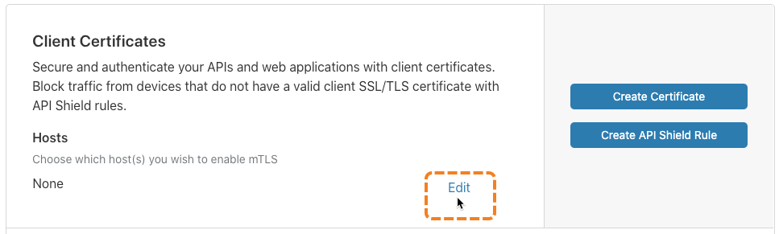
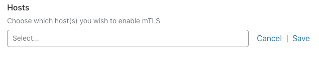
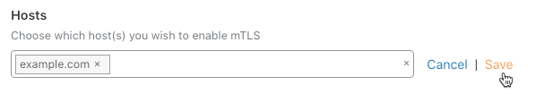

# Enable mTLS

To enable mutual Transport Layer Security (mTLS) for a host from the Cloudflare dashboard, follow these steps:

1. Log in to your Cloudflare account Home page and click the zone containing the host for which you want to enable mTLS.

2. In the Cloudflare dashboard, click the **SSL** app.

  The SSL **Overview** displays.

  
  
1. To enable mTLS for a host, click the **Edit** link in the **Hosts** section of the **Client Certificates** card.

  

  A text input and save controls display.

  

1. Use the input to enter the name of a host that is in the zone you selected in Step 1 and press `Enter`.

  A tag representing your host displays. In this example, the host is `example.com`

  

1. Click **Save**.

Now that you have enabled mTLS for your host, you can enforce mTLS with [API Shield™](https://developers.cloudflare.com/firewall/cf-firewall-rules/api-shield).
