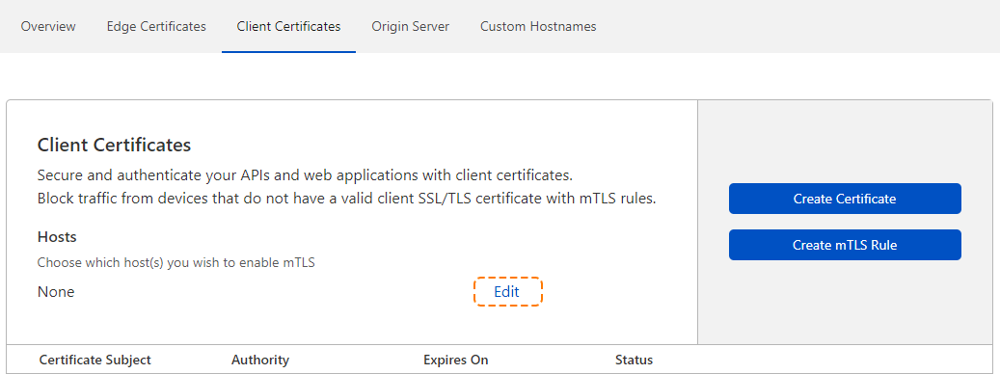

# Enable mTLS

To enable mutual Transport Layer Security (mTLS) for a host from the Cloudflare dashboard:

1. Log into the [Cloudflare dashboard](https://dash.cloudflare.com) and select your account and application.
1. Navigate to **SSL** > **Client Certificates**. 
1. To enable mTLS for a host, click the **Edit** link in the **Hosts** section of the **Client Certificates** card.

  

  A text input and save controls display.

  

1. Enter the name of a host in your current application and press `Enter`.

1. Click **Save**.

Now that you have enabled mTLS for your host, you can enforce mTLS with [API Shield™](https://developers.cloudflare.com/api-shield/products/mtls/configure).
