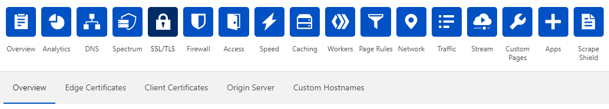

# Revoke a client certificate

You can revoke a client certificate you previously generated. 

1. Log in to the Cloudflare dashboard and click the **SSL** app.

    The SSL **Overview** displays.

    

1. Click the **Client Certificates** tab.

1. In the **Client Certificates** card, expand the certificate you want to revoke.

    

1. In the certificate details, click **Revoke** and confirm the operation.

<Aside type='warning' header='Important'>

After revoking a certificate, you must update any mTLS rules that check for the presence of a client certificate so that they block all requests that include a revoked certificate.

For more information, see [Check for revoked certificates](https://developers.cloudflare.com/firewall/cf-dashboard/create-mtls-rule#check-for-revoked-certificates).

</Aside>
