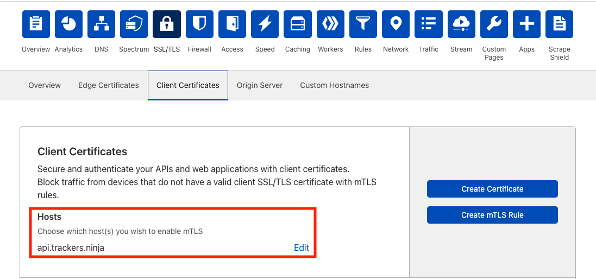
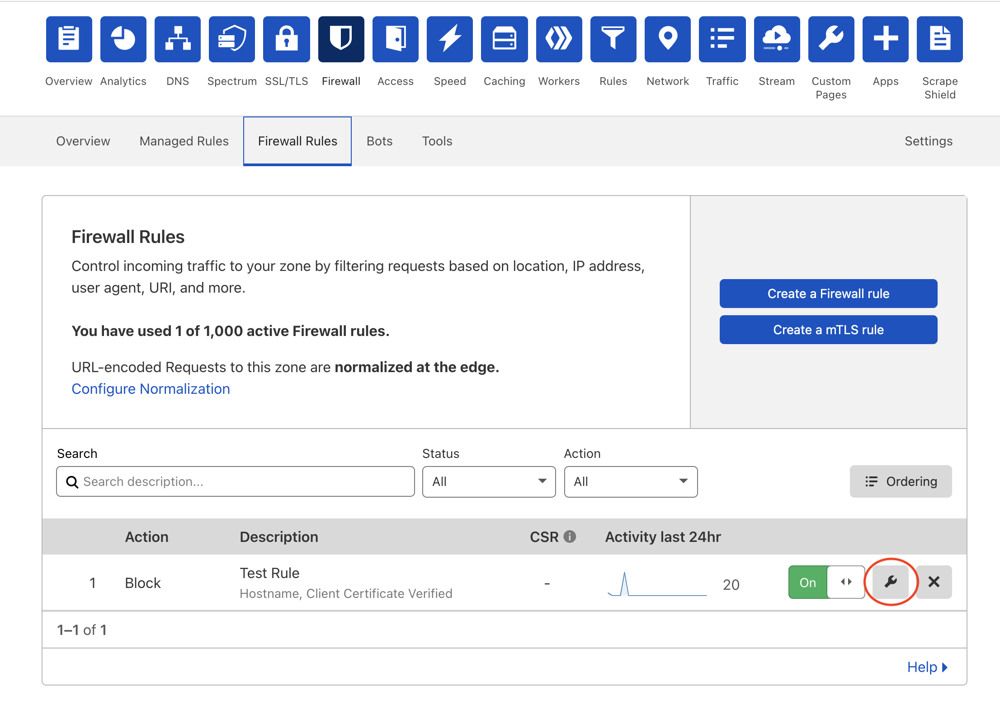

# Troubleshooting

If your query returns an error even after configuring and embedding the client SSL certificate, consider checking the following settings.

--------

## Check SSL/TLS handshake
On your terminal, use the following command to check whether an SSL/TLS connection can be established successfully between the client and the API endpoint.
```bash
curl -v --cert /path/to/certificate.pem --key /path/to/key.pem  https://your-api-endpoint.com
```
If the SSL/TLS handshake cannot be completed, check whether the certificate and the private key are correct.

--------

## Check mTLS host enablement 
On your dashboard, click the **SSL/TLS** tab, and then click **Client Certificates**. Check whether mTLS has been enabled for the correct host. The host should match the API endpoint that you want to protect. For example, if your API endpoint is "api.trackers.ninja/time", then you should add "api.trackers.ninja" under "Hosts".
    

--------

## Check mTLS rules
You may check the mTLS rules by clicking the **Firewall** tab on your dashboard before clicking **Firewall Rules**.
    

Click the edit button (circled in red in the screenshot above) on a Firewall rule to check whether the Expression Preview is correct and whether the hostname matches your API endpoint. For example, for the API endpoint ``api.trackers.ninja/time``, the rule should look like this:
```
(http.host in {"api.trackers.ninja"} and not cf.tls_client_auth.cert_verified) 
```
To edit the rule, either use the user interface or click "Edit expression".
    