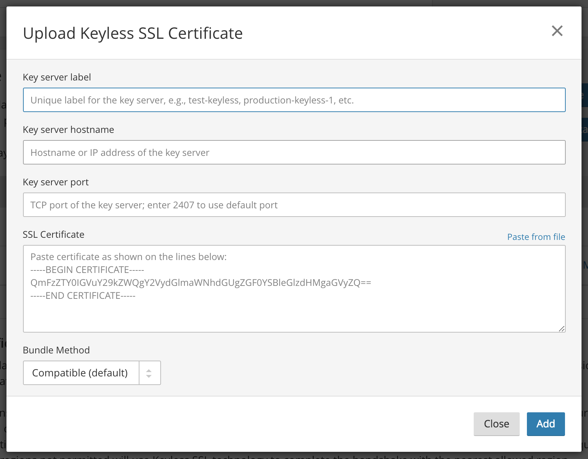

# Configuration

--------

## Prerequisites

### Supported platform

Keyless has been tested on `amd64` and `arm` architectures. The key server binary will likely run on all architectures that Go supports. Code support may exist for other CPUs too, but these other architectures have not been tested.

In addition to running on bare metal, the key server should run without issue in a virtualized or containerized environment. Care will need to be taken to configure i) ingress access to the appropriate TCP port; and ii) file system access to private keys (if filesystem storage is being used).

### Supported operating system

You will need to be running a supported operating system (OS) to run Keyless. Supported operating systems include:

* Ubuntu 12.04.5 LTS, 14.04 LTS, 15.10, 16.04, 17.10
* Debian 7, 8, 9
* RHEL and CentOS 6, 7
* Amazon Linux 1, 2

We strongly recommend that you use an operating system still supported by the vendor (i.e., one that receives security updates) as your key server will have access to your private keys.

### DNS record created within zone

<Aside type='warning' header='Important'>

You need to create a public DNS record for your key server. If you are using Cloudflare, this record **cannot yet be orange clouded**. As a security measure, you should obfuscate the hostname of your key server.

</Aside>

1. Use `openssl rand 24 -hex` to generate a long, random hostname such as `11aa40b4a5db06d4889e48e2f738950ddfa50b7349d09b5f.example.com`
2. Add this record via your DNS provider’s interface as an ‘A’ record pointing to the IP address of your Keyless SSL server
3. Use this hostname as the server hostname during initialization of your Keyless SSL server

--------

## Uploading “Keyless” SSL Certificates

Before your key server(s) can be configured, you must next upload the corresponding SSL certificates to Cloudflare’s edge. During TLS termination, Cloudflare will present these certificates to connecting browsers and then (for non-resumed sessions) communicate with the specified key server to complete the handshake.

It is recommended that you upload certificates to Cloudflare with only SANs that you wish to use with Cloudflare Keyless SSL. All hostnames you wish to use with Keyless SSL must be “orange clouded” (proxied) on Cloudflare.

For each certificate you wish to use with Keyless SSL:

1. Log in to the [Cloudflare dashboard](https://dash.cloudflare.com) and select your zone.
2. Navigate to the Crypto app.
3. Scroll down to the Edge Certificates section, click the dropdown arrow next to “Upload Custom SSL Certificate” and then click  “Upload Keyless SSL Certificate”.


4. Fill in the upload modal with the certificate and other details and click “Add”


Label | Description | Example Values
------|-------------|---------------
Key server label|Any unique identifier for your key server|“test-keyless”, “production-keyless-1”
Key server hostname|The hostname of your key server that holds the key for this certificate (i.e., the random hostname generated earlier)|11aa40b4a5db06d4889e48e2f738950ddfa50b7349d09b5f.example.com
Key server port|Set to 2407 unless you have changed this on the key server|2407
SSL Certificate|The valid X509v3 SSL certificate (in PEM form) for which you hold the private key.| (PEM bytes)
Bundle method|This should almost always be Compatible. See [Uploading Custom Certificates](/custom-certificates/bundling-methodologies) for more details|Compatible

--------

## Key server

The final step in deploying Cloudflare’s Keyless SSL technology is installing the key server on your infrastructure, populating it with the SSL keys of the certificates you wish to use to terminate TLS at Cloudflare’s edge, and activating the key server so it can be mutually authenticated.

### Installation

1. Add the Cloudflare Package Repository as per https://pkg.cloudflare.com/.
1. Amazon Linux customers need to manually set the yum `$releasever` value:
  1. Amazon Linux 1: `sudo sed -i 's/$releasever/6/' /etc/yum.repos.d/cloudflare.repo`
  1. Amazon Linux 2: `sudo sed -i 's/$releasever/7/' /etc/yum.repos.d/cloudflare.repo`
1. Update your OS’ package listings, e.g., `apt-get update` or `yum makecache`.
1. Install the gokeyless server (min version used should be 1.5.3):
  1. Debian/Ubuntu: `sudo apt-get install gokeyless`
  1. RHEL/CentOS: `sudo yum install gokeyless`
  1. Amazon Linux: `sudo yum install rsyslog shadow-utils && sudo yum install gokeyless`

### Configuration

Add your Cloudflare account details to the configuration file located at `/etc/keyless/gokeyless.yaml`:

1. Set the hostname of the key server, e.g. `11aa40b4a5db06d4889e48e2f.example.com`
1. Set the Zone ID (can be found on the Cloudflare dashboard’s ‘Overview’ tab)
1. [Set the Origin CA API key](https://dash.cloudflare.com/profile)

### Key population

1. Install your private keys in `/etc/keyless/keys/` and set the user and group to keyless with 400 permissions. Keys must be in PEM or DER format and have an extension of `.key`:

    ```bash
    $ ls -l /etc/keyless/keys
    -r-------- 1 keyless keyless 1675 Nov 18 16:44 example.com.key
    ```
    Note: when running multiple key servers, you must make sure that all required keys are distributed to each key server. Customers typically will either use a configuration management tool such as Salt, Puppet, etc. to distribute keys or mount `/etc/keyless/keys` to a network location that is accessible only by your key servers. Keys are read on boot into memory, so if using a network path it must be accessible during the gokeyless process start/restart.

### Activation

Restart your keyless instance:

* systemd: `sudo service gokeyless restart`
* upstart/sysvinit: `sudo /etc/init.d/gokeyless restart`

If this command fails, try troubleshooting by [checking the logs](/keyless-ssl/troubleshooting/).

### Network access control

During TLS handshakes, Cloudflare’s keyless client will initiate connections to the key server hostname or IP address you specify during certificate upload. By default, the keyless client will use a destination TCP port of 2407, but this can be changed during certificate upload or by editing the certificate details after upload.

Create firewall rules that allow your key server to accept connections from only Cloudflare. We publish our IPv4 and IPv6 addresses via our API.