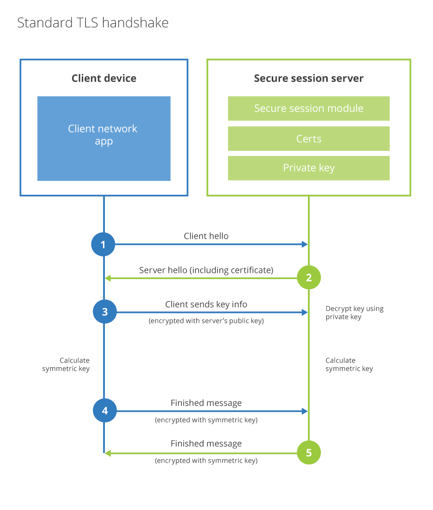

# Authenticated origin pull

Authenticated origin pulls add an extra layer of security to your domain.

This authentication becomes particularly important with the Cloudflare Web Application Firewall (WAF). Together with the WAF, you can make sure that **all traffic** is evaluated before reaching your origin server.

<ButtonGroup>
    <Button type="primary" href="#set-up-authenticated-origin-pulls">Get started</Button>
    <Button type="secondary" href="#how-authenticated-origin-pulls-work">Learn more</Button>
</ButtonGroup>

<Aside type='warning' header='Important'>

Authenticated Origin Pull is incompatible with Railgun.

</Aside>

## How authenticated origin pulls work

### Simple explanation

When visitors request content from your domain, Cloudflare first attempts to serve content from the cache. Failing that, Cloudflare sends a request — or an `origin pull` — back to your origin web server to get the content.

Authenticated origin pulls make sure that all of these `origin pulls` come from Cloudflare. Put another way, authenticated origin pulls ensure that any HTTPS requests outside of Cloudflare are blocked from reaching your origin.

<Aside type='note' header='Note'>

Requests to gray-clouded records within Cloudflare DNS are also blocked.

</Aside>

### Detailed explanation

Cloudflare enforces authenticated origin pulls by adding an extra layer of TLS client certificate authentication when connecting between Cloudflare and the origin web server.

**Standard TLS handshake**



**TLS handshake with authenticated origin pulls**


## Set up authenticated origin pulls

Set up authenticated origin pulls via one of the following options:

- [Zone-Level Authenticated Origin Pull using **Cloudflare** certificates](#zone-level--cloudflare-certificates)
- [Zone-Level Authenticated Origin Pull using **customer** certificates](#zone-level--customer-certificates)
- [Per-Hostname Authenticated Origin Pull using customer certificates](#per-hostname--customer-certificates)

Client certificates are not deleted from Cloudflare upon expiration unless a [delete](https://api.cloudflare.com/#zone-level-authenticated-origin-pulls-delete-certificate) or [replace](https://api.cloudflare.com/#zone-level-authenticated-origin-pulls-upload-certificate) request is sent to the Cloudflare API.  However, requests are dropped at your origin if your origin only accepts a valid client certificate.

Authenticated Origin Pull does not work in **SSL** mode _Off_ (not secure) or _Flexible_.

--------

### Zone-Level — Cloudflare certificates

Cloudflare uses the following CA to sign certificates for the Authenticated Origin Pull service:
<details>
<summary>Certificate value</summary>
<div>

```text
-----BEGIN CERTIFICATE-----
MIIGCjCCA/KgAwIBAgIIV5G6lVbCLmEwDQYJKoZIhvcNAQENBQAwgZAxCzAJBgNV
BAYTAlVTMRkwFwYDVQQKExBDbG91ZEZsYXJlLCBJbmMuMRQwEgYDVQQLEwtPcmln
aW4gUHVsbDEWMBQGA1UEBxMNU2FuIEZyYW5jaXNjbzETMBEGA1UECBMKQ2FsaWZv
cm5pYTEjMCEGA1UEAxMab3JpZ2luLXB1bGwuY2xvdWRmbGFyZS5uZXQwHhcNMTkx
MDEwMTg0NTAwWhcNMjkxMTAxMTcwMDAwWjCBkDELMAkGA1UEBhMCVVMxGTAXBgNV
BAoTEENsb3VkRmxhcmUsIEluYy4xFDASBgNVBAsTC09yaWdpbiBQdWxsMRYwFAYD
VQQHEw1TYW4gRnJhbmNpc2NvMRMwEQYDVQQIEwpDYWxpZm9ybmlhMSMwIQYDVQQD
ExpvcmlnaW4tcHVsbC5jbG91ZGZsYXJlLm5ldDCCAiIwDQYJKoZIhvcNAQEBBQAD
ggIPADCCAgoCggIBAN2y2zojYfl0bKfhp0AJBFeV+jQqbCw3sHmvEPwLmqDLqynI
42tZXR5y914ZB9ZrwbL/K5O46exd/LujJnV2b3dzcx5rtiQzso0xzljqbnbQT20e
ihx/WrF4OkZKydZzsdaJsWAPuplDH5P7J82q3re88jQdgE5hqjqFZ3clCG7lxoBw
hLaazm3NJJlUfzdk97ouRvnFGAuXd5cQVx8jYOOeU60sWqmMe4QHdOvpqB91bJoY
QSKVFjUgHeTpN8tNpKJfb9LIn3pun3bC9NKNHtRKMNX3Kl/sAPq7q/AlndvA2Kw3
Dkum2mHQUGdzVHqcOgea9BGjLK2h7SuX93zTWL02u799dr6Xkrad/WShHchfjjRn
aL35niJUDr02YJtPgxWObsrfOU63B8juLUphW/4BOjjJyAG5l9j1//aUGEi/sEe5
lqVv0P78QrxoxR+MMXiJwQab5FB8TG/ac6mRHgF9CmkX90uaRh+OC07XjTdfSKGR
PpM9hB2ZhLol/nf8qmoLdoD5HvODZuKu2+muKeVHXgw2/A6wM7OwrinxZiyBk5Hh
CvaADH7PZpU6z/zv5NU5HSvXiKtCzFuDu4/Zfi34RfHXeCUfHAb4KfNRXJwMsxUa
+4ZpSAX2G6RnGU5meuXpU5/V+DQJp/e69XyyY6RXDoMywaEFlIlXBqjRRA2pAgMB
AAGjZjBkMA4GA1UdDwEB/wQEAwIBBjASBgNVHRMBAf8ECDAGAQH/AgECMB0GA1Ud
DgQWBBRDWUsraYuA4REzalfNVzjann3F6zAfBgNVHSMEGDAWgBRDWUsraYuA4REz
alfNVzjann3F6zANBgkqhkiG9w0BAQ0FAAOCAgEAkQ+T9nqcSlAuW/90DeYmQOW1
QhqOor5psBEGvxbNGV2hdLJY8h6QUq48BCevcMChg/L1CkznBNI40i3/6heDn3IS
zVEwXKf34pPFCACWVMZxbQjkNRTiH8iRur9EsaNQ5oXCPJkhwg2+IFyoPAAYURoX
VcI9SCDUa45clmYHJ/XYwV1icGVI8/9b2JUqklnOTa5tugwIUi5sTfipNcJXHhgz
6BKYDl0/UP0lLKbsUETXeTGDiDpxZYIgbcFrRDDkHC6BSvdWVEiH5b9mH2BON60z
0O0j8EEKTwi9jnafVtZQXP/D8yoVowdFDjXcKkOPF/1gIh9qrFR6GdoPVgB3SkLc
5ulBqZaCHm563jsvWb/kXJnlFxW+1bsO9BDD6DweBcGdNurgmH625wBXksSdD7y/
fakk8DagjbjKShYlPEFOAqEcliwjF45eabL0t27MJV61O/jHzHL3dknXeE4BDa2j
bA+JbyJeUMtU7KMsxvx82RmhqBEJJDBCJ3scVptvhDMRrtqDBW5JShxoAOcpFQGm
iYWicn46nPDjgTU0bX1ZPpTpryXbvciVL5RkVBuyX2ntcOLDPlZWgxZCBp96x07F
AnOzKgZk4RzZPNAxCXERVxajn/FLcOhglVAKo5H0ac+AitlQ0ip55D2/mf8o72tM
fVQ6VpyjEXdiIXWUq/o=
-----END CERTIFICATE-----
```

</div>
</details>

To enable Authenticated Origin Pull globally on a zone:

1. Install the above certificate at the origin web server to authenticate all connections.
1. For your [SSL/TLS encryption mode](https://dash.cloudflare.com/?to=/:account/:zone/ssl-tls), select **Full**.
1. Configure the origin web server to accept client certificates.
1. Enable **Authenticated Origin Pulls**:
    - In the [dashboard](https://dash.cloudflare.com/?to=/:account/:zone/ssl-tls/origin), go to **Authenticated Origin Pulls** and select **On**.
    - For the API, [change the TLS Client Auth setting](https://api.cloudflare.com/#zone-settings-change-tls-client-auth-setting):

        ```bash
        curl -X PATCH https://api.cloudflare.com/client/v4/zones/:zone/settings/tls_client_auth \
        -H "X-Auth-Email: {email}" -H "X-Auth-Key: {key}" \
        -H "Content-Type: application/json" \
        --data '{"value":"on"}'
            
        {
            "result": {
                "id": "tls_client_auth",
                "value": "on",
                "modified_on": "2020-01-15T17:57:27.363409Z",
                "editable": true
            },
            "success": true,
            "errors": []
        }
        ```

--------

### Zone-Level — customer certificates

1. For your [SSL/TLS encryption mode](https://dash.cloudflare.com/?to=/:account/:zone/ssl-tls), select **Full**.

1. If using an ECC key generated by OpenSSL, first remove `-----BEGIN EC PARAMETERS-----...-----END EC PARAMETERS-----` from the certificate file.

1. Ensure the certificate and key are in the following format before uploading to Cloudflare:

    ```bash
    $ cat app_example_com.pem
    -----BEGIN CERTIFICATE-----
    MIIFJDCCBAygAwIBAgIQD0ifmj/Yi5NP/2gdUySbfzANBgkqhkiG9w0BAQsFADBN
    MQswCQYDVQQGEwJVUzEVMBMGA1UEChMMRGlnaUNlcnQgSW5jMScwJQYDVQQDEx5E
    ...
    SzSHfXp5lnu/3V08I72q1QNzOCgY1XeL4GKVcj4or6cT6tX6oJH7ePPmfrBfqI/O
    OeH8gMJ+FuwtXYEPa4hBf38M5eU5xWG7
    -----END CERTIFICATE-----
    ```

1. Replace line endings with the string “\n”:

    ```bash
    $ MYCERT="$(cat app_example_com.pem|perl -pe 's/\r?\n/\\n/'|sed -e 's/..$//')" $ MYKEY="$(cat app_example_com.key|perl -pe 's/\r?\n/\\n/'|sed -e's/..$//')"

    $ echo $MYCERT -----BEGIN CERTIFICATE-----\nMIIFJDCCBAygAwIBAgIQD0ifmj/Yi5NP/2gdUySbfzANBgkqhkiG9w0BAQsFADBN\nMQswCQYDVQQGEwJVUzEVMBMGA1UEChMMRGlnaUNlcnQgSW5jMScwJQYDVQQDEx5E...SzSHfXp5lnu/3V08I72q1QNzOCgY1XeL4GKVcj4or6cT6tX6oJH7ePPmfrBfqI/O\nOeH8gMJ+FuwtXYEPa4hBf38M5eU5xWG7\n-----END CERTIFICATE-----\n
    ```

1. Build the payload:

    ```bash
    $ request_body=$(< <(cat <<EOF
    {
    "certificate": "$MYCERT",
    "private_key": "$MYKEY"
    }
    EOF
    ))
    ```

1. [Upload the client certificate and private key via the Cloudflare API](https://api.cloudflare.com/#zone-level-authenticated-origin-pulls-upload-certificate):

    ```bash
    curl -X POST https://api.cloudflare.com/client/v4/zones/:zone/origin_tls_client_auth \
 	-H "X-Auth-Email: {email}" -H "X-Auth-Key: {key}" \
    -H Content-Type: application/json' \
    -d "$request_body"

    {
        "success": true,
        "errors": [],
        "messages": [],
        "result": {
            "id": "38bffaf9-6da7-4230-8bd4-a7b57136cf99",
            "status": "pending_deployment",
            "issuer": "CN=example ECC,OU=example,L=San Francisco,ST=California,C=US",
            "signature": "ECDSA-SHA256",
            "serial_number": "649698018354122709790786741470479045506643347777",
            "certificate": "-----BEGIN CERTIFICATE-----\nMIICd...-----END CERTIFICATE-----",
            "uploaded_on": "2020-04-06T14:12:50.186877Z",
            "updated_at": "2020-04-06T14:12:50.186877Z",
            "expires_on": "2030-04-04T13:31:00Z"
        }
    }
    ```

1. Enable **Authenticated Origin Pulls**:
    - In the [dashboard](https://dash.cloudflare.com/?to=/:account/:zone/ssl-tls/origin), go to **Authenticated Origin Pulls** and select **On**.
    - For the API, [set the enablement for a zone](https://api.cloudflare.com/#zone-level-authenticated-origin-pulls-set-enablement-for-zone):

        ```bash
        curl -X PUT https://api.cloudflare.com/client/v4/zones/:zone/origin_tls_client_auth/settings \
        -H "X-Auth-Email: {email}" -H "X-Auth-Key: {key}" \
        -H "Content-Type: application/json" \
        --data '{"enabled":true}'
        
        {
            "success": true,
            "errors": [],
            "messages": [],
            "result": {
                "enabled": true
                }
        }
        ```

--------

### Per-Hostname — customer certificates

When enabling Authenticated Origin Pull per hostname, all proxied traffic to the specified hostname is authenticated at the origin web server. Customers can use client certificates from their Private PKI to authenticate connections from Cloudflare.

To upload a client certificate in Cloudflare:

1. If using an ECC key generated by OpenSSL, first remove `-----BEGIN EC PARAMETERS-----...-----END EC PARAMETERS-----` from the certificate file.

1. Ensure certificate is in the following format before uploading to Cloudflare:

    ```bash
    $ cat app_example_com.pem
    -----BEGIN CERTIFICATE-----
    MIIFJDCCBAygAwIBAgIQD0ifmj/Yi5NP/2gdUySbfzANBgkqhkiG9w0BAQsFADBN
    MQswCQYDVQQGEwJVUzEVMBMGA1UEChMMRGlnaUNlcnQgSW5jMScwJQYDVQQDEx5E
    ...
    SzSHfXp5lnu/3V08I72q1QNzOCgY1XeL4GKVcj4or6cT6tX6oJH7ePPmfrBfqI/O
    OeH8gMJ+FuwtXYEPa4hBf38M5eU5xWG7
    -----END CERTIFICATE-----
    ```

1. Replace line endings with the string “\n”:

    ```bash
    $ MYCERT="$(cat app_example_com.pem|perl -pe 's/\r?\n/\\n/'|sed -e 's/..$//')" $ MYKEY="$(cat app_example_com.key|perl -pe 's/\r?\n/\\n/'|sed -e's/..$//')"

    $ echo $MYCERT -----BEGIN CERTIFICATE-----\nMIIFJDCCBAygAwIBAgIQD0ifmj/Yi5NP/2gdUySbfzANBgkqhkiG9w0BAQsFADBN\nMQswCQYDVQQGEwJVUzEVMBMGA1UEChMMRGlnaUNlcnQgSW5jMScwJQYDVQQDEx5E...SzSHfXp5lnu/3V08I72q1QNzOCgY1XeL4GKVcj4or6cT6tX6oJH7ePPmfrBfqI/O\nOeH8gMJ+FuwtXYEPa4hBf38M5eU5xWG7\n-----END CERTIFICATE-----\n
    ```

1. Build the payload:

    ```bash
    $ request_body=$(< <(cat <<EOF
    {
    "certificate": "$MYCERT",
    "private_key": "$MYKEY"
    }
    EOF
    ))
    ```

1. Upload the [client certificate and private key via the Cloudflare API](https://api.cloudflare.com/#per-hostname-authenticated-origin-pull-upload-a-hostname-client-certificate):

  ```bash
  curl -sX POST https://api.cloudflare.com/client/v4/zones/:zone/origin_tls_client_auth/hostnames/certificates \
  -H "X-Auth-Email: {email}" -H "X-Auth-Key: {key}" \
  -H Content-Type: application/json' \
  -d "$request_body"

  {
      "success": true,
      "errors": [],
      "messages": [],
      "result": {
          "id": "38bffaf9-6da7-4230-8bd4-a7b57136cf99",
          "status": "pending_deployment",
          "issuer": "CN=example ECC,OU=example,L=San Francisco,ST=California,C=US",
          "signature": "ECDSA-SHA256",
          "serial_number": "649698018354122709790786741470479045506643347777",
          "certificate": "-----BEGIN CERTIFICATE-----\nMIICd...-----END CERTIFICATE-----",
          "uploaded_on": "2020-04-06T14:12:50.186877Z",
          "updated_at": "2020-04-06T14:12:50.186877Z",
          "expires_on": "2030-04-04T13:31:00Z"
      }
  }
  ```

  <Aside type='note' header='Note'>

  Save the certificate ID <code>id</code> since it is required for the next step.
  </Aside>

1. [Enable Authenticated Origin Pull on specified hostname via Cloudflare API](https://api.cloudflare.com/#per-hostname-authenticated-origin-pull-enable-or-disable-a-hostname-for-client-authentication):

    ```bash
    curl -sX PUT https://api.cloudflare.com/client/v4/zones/:zone/origin_tls_client_auth/hostnames \
    -H "X-Auth-Email: {email}" -H "X-Auth-Key: {key}" \
    -H Content-Type: application/json' \
    -d '{"config":[{"hostname":"app.example.com","cert_id":"2458ce5a-0c35-4c7f-82c7-8e9487d3ff60","enabled":true}]}'

    {
        "success": true,
        "errors": [],
        "messages": [],
        "result": [
            {
                "hostname": "app.example.com",
                "cert_id": "9b98f1cd-b844-4411-ac87-bf3f4de16e32",
                "enabled": true,
                "status": "pending_deployment",
                "created_at": "0001-01-01T00:00:00Z",
                "updated_at": "2020-04-23T19:23:57.402656Z",
                "cert_status": "active",
            "issuer": "CN=example ECC,OU=example,L=San Francisco,ST=California,C=US",
            "signature": "ECDSA-SHA256",
            "serial_number": "649698018354122709790786741470479045506643347777",
            "certificate": "-----BEGIN CERTIFICATE-----\nMIICd...-----END CERTIFICATE-----",
            "uploaded_on": "2020-04-06T14:12:50.186877Z",
            "updated_at": "2020-04-06T14:12:50.186877Z",
            "expires_on": "2030-04-04T13:31:00Z"
        }
        ]
    }
    ```

#### To replace a client cert without downtime

For hostname:

1. [Upload the new certificate using the Cloudflare API](https://api.cloudflare.com/#per-hostname-authenticated-origin-pull-upload-a-hostname-client-certificate).

2. Link the new certificate id and hostname and enabled values using [Cloudflare API](https://api.cloudflare.com/#per-hostname-authenticated-origin-pull-enable-or-disable-a-hostname-for-client-authentication).

For global:

1. [Upload the new certificate using the Cloudflare API](https://api.cloudflare.com/#zone-level-authenticated-origin-pulls-upload-certificate).

2. [Check that new certificate is in Active static using the Cloudflare API](https://api.cloudflare.com/#zone-level-authenticated-origin-pulls-get-certificate-details).

3. Once certificate is active, then [delete the old certificate using the Cloudflare API](https://api.cloudflare.com/#zone-level-authenticated-origin-pulls-delete-certificate).

--------

#### To apply a different client certificate simultaneously at both the zone and hostname level

1. Upload a certificate following steps in [Zone-Level Authenticated Origin Pull](#zone-level--customer-certificates)

2. Upload multiple certificates following the steps in [Per-Hostname Authenticated Origin Pull](#per-hostname--customer-certificates)

  <Aside type='note' header='Note'>

  Hostname certificates take precedence over zone certificates.

  </Aside>
