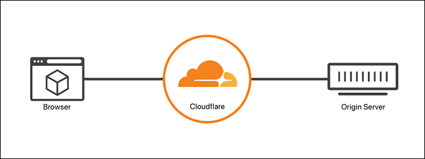
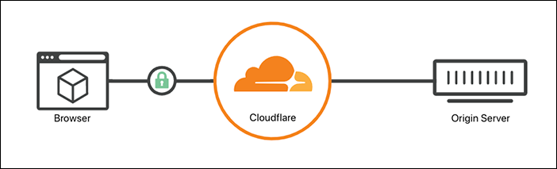
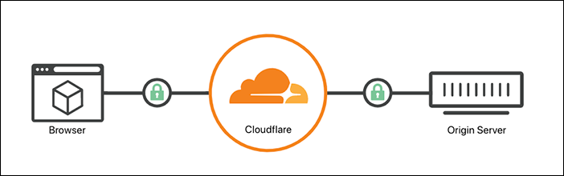
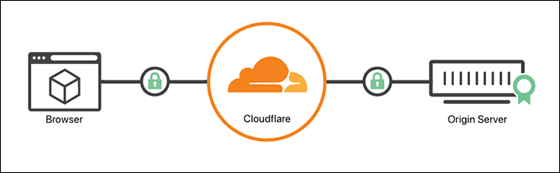

import SSLModeErrors from "../_partials/_ssl-mode-errors.md"

# Encryption modes

The modes listed below control the scheme (`http://` or `https://`) that Cloudflare uses to connect to your origin web server and how SSL certificates presented by your origin will be validated.

If possible, Cloudflare strongly recommends using [**Full**](#full) or [**Full (strict)**](#full-strict) modes to prevent malicious connections to your origin.

For more details about how your encryption mode fits into the bigger picture of SSL/TLS protection, refer to [Get started](/get-started).

<Aside type="note" header="Tip:">

If you are not sure which encryption mode to use, enable the [SSL/TLS Recommender](../ssl-tls-recommender).

</Aside>

---

## Update your encryption mode

To change your encryption mode:

1. Log into the [Cloudflare dashboard](https://dash.cloudflare.com) and select your account and application.
1. Navigate to **SSL/TLS**.
1. Choose a new encryption mode.

---

## Off

Setting your encryption mode to **Off (not recommended)** redirects any HTTPS request to plaintext HTTP.

### Use when

Cloudflare does **not recommend** setting your encryption mode to **Off**.

### Required setup

There is no required set up for this option.

### Limitations

When you set your encryption mode to **Off**, your application:

- Leaves your visitors and your application [vulnerable to attacks](https://www.cloudflare.com/learning/ssl/why-use-https/).
- Will be marked as "not secure" by Chrome and other browsers, reducing visitor trust.
- Will be penalized in [SEO rankings](https://webmasters.googleblog.com/2014/08/https-as-ranking-signal.html).

<Aside type="note">

When you set your SSL/TLS encryption mode to **Off**, you will not see the options for [**Always Use HTTPS**](/edge-certificates/additional-options/always-use-https) or [**Onion Routing**](https://support.cloudflare.com/hc/articles/203306930).

</Aside>

---

## Flexible

Setting your encryption mode to **Flexible** makes your site partially secure. Cloudflare allows HTTPS connections between your visitor and Cloudflare, but all connections between Cloudflare and your origin are made through HTTP. As a result, an SSL certificate is not required on your origin.

### Use when

Choose this option when you cannot set up an SSL certificate on your origin or your origin does not support SSL/TLS.

### Required setup

<SSLModeErrors/>

### Limitations

If your application contains sensitive information (personalized data, user login), use [**Full**](#full) or [**Full (Strict)**](#full-strict) modes instead.

--------

## Full

When you set your encryption mode to **Full**, Cloudflare allows HTTPS connections between your visitor and Cloudflare and makes connections to the origin using the scheme requested by the visitor. If your visitor uses `http`, then Cloudflare connects to the origin using plaintext HTTP and vice versa.

### Use when

Choose **Full** mode when your origin can support an SSL certification, but — for various reasons — it cannot support a valid, publicly trusted certificate.

### Required setup

Before enabling **Full** mode, make sure your origin allows HTTPS connections on port 443 and presents a certificate (self-signed, [Cloudflare Origin CA](/origin-configuration/origin-ca), or purchased from a Certificate Authority). Otherwise, your visitors may experience a [525 error](https://support.cloudflare.com/hc/articles/115003011431#525error).

<SSLModeErrors/>

### Limitations

The certificate presented by the origin will **not be validated in any way**. It can be expired, self-signed, or not even have a matching CN/SAN entry for the hostname requested.

Without using [**Full (strict)**](#full-strict), a malicious party could technically hijack the connection and present their own certificate.

---

## Full (strict)

When you set your encryption mode to **Full (strict)**, Cloudflare does everything in [Full mode](#full) but also enforces more stringent requirements for origin certificates.

### Use when

For the best security, choose **Full (strict)** mode whenever possible (unless your are an [Enterprise customer](#strict-ssl-only-origin-pull)). 

Your origin needs to be able to support an SSL certificate that is:

- Unexpired, meaning the certificate notBeforeDate < now() < notAfterDate.
- Issued by a [publicly trusted certificate authority](https://github.com/cloudflare/cfssl_trust) or [Cloudflare’s Origin CA](/origin-configuration/origin-ca).
- Contains a Common Name (CN) or Subject Alternative Name (SAN) that matches the requested or target hostname.

### Required setup

Before enabling **Full (strict)** mode, make sure your origin allows HTTPS connections on port 443 and presents a certificate matching the requirements above. Otherwise, your visitors may experience a [526 error](https://support.cloudflare.com/hc/articles/115003011431#526error).

### Limitations

<SSLModeErrors/>

---

## Strict (SSL-Only Origin Pull)

*This method is only available for Enterprise zones.*

Connections to the origin will always be made using SSL/TLS, regardless of the scheme requested by the visitor.

The certificate presented by the origin will be validated the same as with [Full (strict) mode](#full-strict).

### Use when

You want the most secure configuration available for your origin, you are an Enterprise customer, and you meet the requirements for [**Full (strict)** mode](#full-strict).

### Required setup

The setup is the same as [**Full (strict)** mode](#full-strict), but you select **Strict (SSL-Only Origin Pull)** for your encryption mode.

### Limitations

<SSLModeErrors/>

## ERR_SSL_VERSION_OR_CIPHER_MISMATCH

If you are experiencing `ERR_SSL_VERSION_OR_CIPHER_MISMATCH` errors, refer to this [community thread](https://community.cloudflare.com/t/community-tip-fixing-err-ssl-version-or-cipher-mismatch-in-google-chrome/42162).