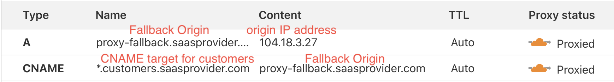
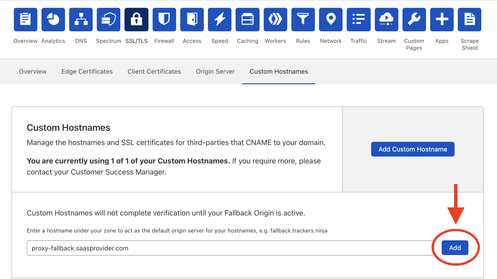

import IssueCertsPreamble from "../_partials/_issue-certs-preamble.md"
import CreateCustomHostname from "../_partials/_create-custom-hostname.md"
import CreateCustomHostnameAPI from "../_partials/_create-custom-hostname-api.md"

# Get started

--------

## Configure zone with proxy fallback origin
The fallback origin is where the traffic of your Custom Hostnames will be routed to. The fallback record is the value of the DNS record you set up via step 2.

1. Sign up your desired zone at [www.cloudflare.com](https://www.cloudflare.com) and select the Free plan.
1. Click **DNS**.
1. Add a DNS record pointing to the origin IP address (fallback origin) for Cloudflare to send custom hostname traffic. This hostname is not provided to customers. Name the hostname according to your naming convention. For example: `proxy-fallback.saasprovider.com`.
3. Set up an additional DNS CNAME record to serve as the CNAME target for your end customers. CNAME this record to your fallback origin and use a more user-friendly CNAME target for customers. This record can optionally be a wildcard, e.g. `*.customers.saasprovider.com`.

4. Upgrade your zone to an Enterprise plan and contact your Customer Success Manager to enable **SSL for SaaS Certificates**.
5. Set the **Fallback Origin** via either the dashboard or API.
    * Via the dashboard: Go to **SSL/TLS** > **Custom Hostnames**, add your fallback origin defined in step 2 above, and click **Add**.
    

    * Via API: Retrieve your [Global API Key and Zone ID](#api-key-and-zone-id). Then, set the fallback origin via API (change `proxy-fallback.saasprovider.com` to the fallback origin record you configured in Cloudflare DNS):

        ```bash
        $ curl -XPUT \
        "https://api.cloudflare.com/client/v4/zones/<ZONE_ID>/custom_hostnames/fallback_origin"\
        -H "X-Auth-Email: {email}" -H "X-Auth-Key: {key}"\
        -H "Content-Type: application/json"\
        -d '{"origin":"proxy-fallback.saasprovider.com"}'
        ```

--------

## Certificate Validation vs Hostname Verification
Each Custom Hostname requires successful Certificate Validation and Hostname Verification.

* [Certificate Validation](../certificate-validation-methods): Upon successful validation, the certificates are deployed to Cloudflare’s edge network.
* [Hostname Verification](../hostname-verification/): Upon successful validation, Cloudflare proxies traffic for this hostname.

[Create Custom Hostnames via the custom_hostnames API endpoint](https://api.cloudflare.com/#custom-hostname-for-a-zone-create-custom-hostname).

--------

## API key and zone ID

Your API key can be found in the Cloudflare dashboard under ‘My Profile → API Tokens → Global API Key’.


The zone tag and API key can also be found in the **Overview** tab of the dashboard:


Additionally, you can retrieve a list of user’s zones and their associated IDs via an API call. List all zones for a user: https://api.cloudflare.com/#zone-list-zones.

--------

## Issuing your first certificate

Once your account has been provisioned, you are ready to issue certificates.

<IssueCertsPreamble/>


<details>
<summary>Using the dashboard</summary>
<div>

<CreateCustomHostname/>

</div>
</details>

<details>
<summary>Using the API</summary>
<div>

<CreateCustomHostnameAPI/>

</div>
</details>


---

## Monitor and view certificates

Once you issue certificates, Cloudflare will initiate the domain validation process using the method you specified.

With a CNAME in place, the entire process — from validation to issuance to edge deployment — completes in approximately 90 seconds.

### Monitor certificate status

For help tracking a certificate's status, refer to [Monitor certificates](/ssl-for-saas/common-tasks/issuing-certificates).

### View certificates

Once domain validation has been completed, the certificates will be issued and distributed to Cloudflare’s edge. 

To view these certificates, use `openssl` or your browser. The command below can be used in advance of your customer pointing the `app.example.com` hostname to the edge ([provided validation was completed](/ssl-for-saas/certificate-validation-methods)).

```sh
$ openssl s_client -servername app.example.com -connect $CNAME_TARGET:443 </dev/null 2>/dev/null | openssl x509 -noout -text | grep app.example.com
```

--------

## Setting CNAME at customer domain
Your customer needs to set up a CNAME record at their DNS provider, pointing to your CNAME target configured in [a previous step](#configure-zone-with-proxy-fallback-origin). For example:
```txt
app CNAME john.customers.saasprovider.com
```
This routes traffic from `app.customer.com` to your origin.
