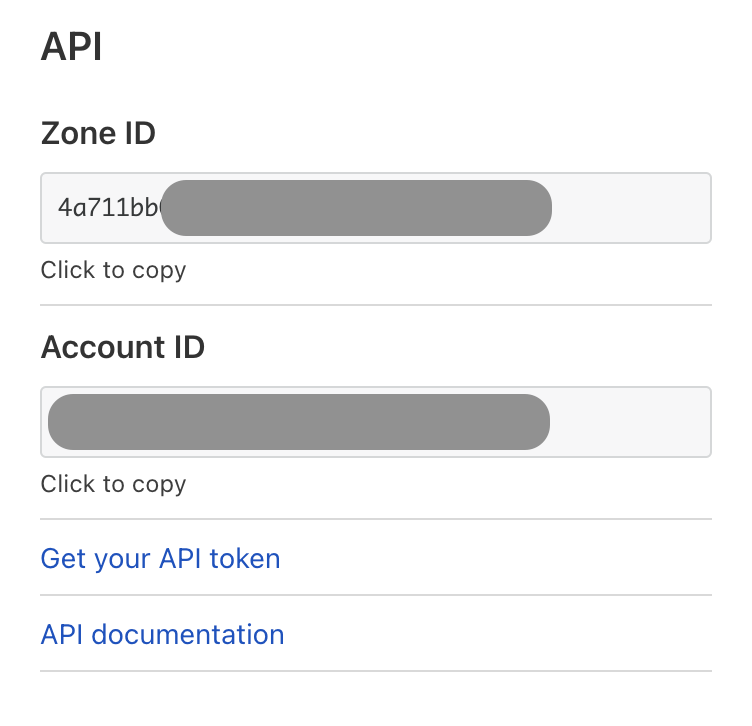

# Getting started

--------

## Configure zone with proxy fallback origin
The fallback origin is used to route the traffic of your Custom Hostnames.  The fallback record is the value of the DNS record you set up via step 2 below.

1. Sign up your desired zone at [www.cloudflare.com](https://www.cloudflare.com) and select the Free plan.
2. Add a DNS record pointing to the origin (fallback origin) for Cloudflare to send custom hostname traffic. This hostname is not provided to customers.  Name the hostname according to your naming convention.  For example: `proxy-fallback.saasprovider.com`.
3. Set up an additional DNS CNAME record to serve as the CNAME target for your end customers.  CNAME this record to your fallback origin, and use a more user-friendly CNAME target for customers.  This record can optionally be a wildcard, e.g. `*.customers.saasprovider.com`.
4. Notify your Cloudflare Account Team of:
    * The zone you set up, and
    * The fallback DNS record created in step 2.
5. Wait for your Account Team to upgrade the zone to the Enterprise plan.
6. Retrieve your zone’s
    * __[Global API Key](https://support.cloudflare.com/hc/articles/200167836#12345682)__, and
    * __Zone ID__ (via the __Overview__ app of the Cloudflare dashboard). Alternatively, [retrieve a user’s zones and associated Zone IDs](https://api.cloudflare.com/#zone-list-zones) via the Cloudflare API.
7. Set the fallback origin via API (change `proxy-fallback.saasprovider.com` to the fallback origin record you configured in Cloudflare DNS):

```bash
$ curl -XPUT
"https://api.cloudflare.com/client/v4/zones/<ZONE_ID>/custom_hostnames/fallback_origin"\
-H "X-Auth-Email: {email}" -H "X-Auth-Key: {key}"\
-H "Content-Type: application/json"\
-d '{"origin":"proxy-fallback.saasprovider.com"}'
```

--------

## Certificate Validation vs Hostname Verification
Each Custom Hostname requires successful Certificate Validation and Hostname Verification.

* __[Certificate Validation](https://developers.cloudflare.com/ssl/ssl-for-saas/validation-methods/)__: Upon successful validation, the certificates are deployed to Cloudflare’s edge network.
* __[Hostname Verification](https://developers.cloudflare.com/ssl/ssl-for-saas/hostname-verification/)__: Upon successful validation, Cloudflare proxies traffic for this hostname.

[Create Custom Hostnames via the custom_hostnames API endpoint](https://api.cloudflare.com/#custom-hostname-for-a-zone-create-custom-hostname).

--------

## API key and zone ID

Your API key can be found in the Cloudflare dashboard under ‘My Profile → Global API Key’.


The zone tag and API key can also be found in the ‘Overview’ tile of the UI:



Additionally you can retrieve a list of user’s zones and their associated IDs via an API call. List all zones for a user: https://api.cloudflare.com/#zone-list-zones.

--------

## Issuing your first certificate

Once your account has been provisioned, you are ready to issue certificates. The call below will provision a request for certificates to be issued for `app.customer.com`, which represents your end customer.

In this example, HTTP based validation is used ("method":"http") to issue this certificate. This requires HTTP traffic to be proxied through Cloudflare’s edge already, i.e., the CNAME from `app.customer.com` must be in place to your zone. If the CNAME is not yet in place, Cloudflare will ask its CA partner to retry until the request can be completed; see the [Validation Backoff Schedule](/ssl-for-saas/validation-backoff-schedule/) for specific timings.

```bash
$ curl -XPOST "https://api.cloudflare.com/client/v4/zones/:zone_id/custom_hostnames"\
       -H "X-Auth-Email: {email}" -H "X-Auth-Key: {key}"\
       -H "Content-Type: application/json"\
       -d '{"hostname":"app.example.com", "ssl":{"method":"http","type":"dv"}}'
```

Note that it’s possible to serve these HTTP records from your own web servers, in advance of placing the CNAME. The payload returned includes the path where the CA will look for the challenge along with the body that should be returned.

Once domain validation has been completed, the certificates will be issued and distributed to Cloudflare’s edge. With a CNAME in place, the entire process—from validation to issuance to edge deployment—completes in approximately 90 seconds.
