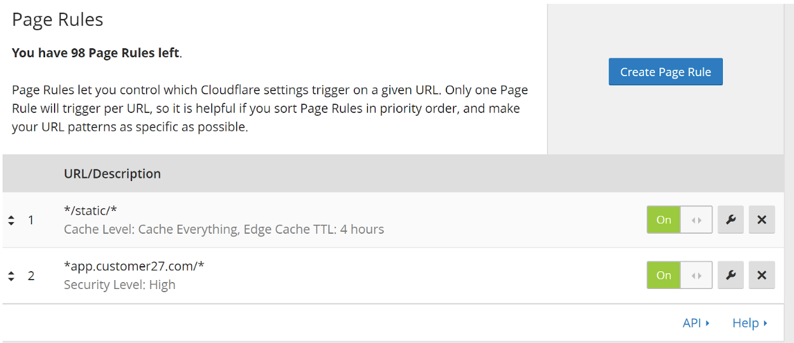
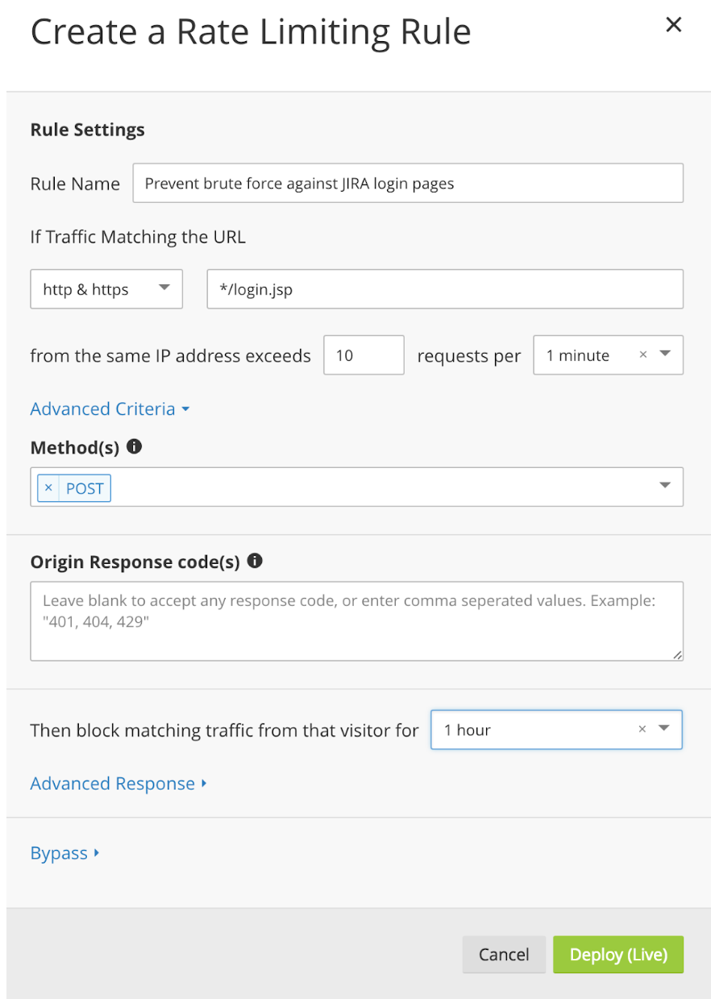
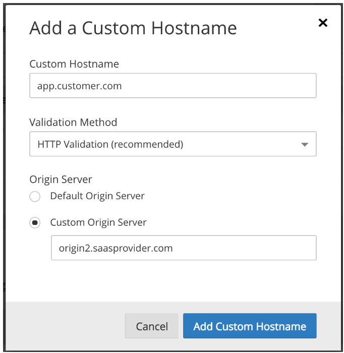

# Hostname specific behavior

--------

## For less than 125 hostnames

### Page Rules
You can set custom behavior per-hostname (customer), or per path with a wildcard, using Page Rules. For example, the rules below modify Cache behavior on paths containing /static/ on any hostname; and set a higher security level on one particular hostname.

Page Rules are an easy way to quickly create rules to modify request behavior, but they are limited in quantity to 125. If you would like to create additional rules, please review the Custom Metadata detail below.



### Rate Limiting

Rate limiting rules can match Custom Hostnames on a per-path or per-hostname basis.



--------

## For more than 125 hostnames

### Custom origin server

If your zone has been granted the Custom Origin Server entitlement, you have the option of specifying a per-hostname origin via the API or UI. In the API example below we PATCH an existing custom hostname to use a custom origin server rather than the default proxy fallback. You can also [specify a `custom_origin_server` during issuance](/ssl-for-saas/issuing-certificates/).

```sh
$ curl -sX PATCH "https://api.cloudflare.com/client/v4/zones/{zone_id}/custom_hostnames/{hostname_id}" \
     -H "X-Auth-Email: {email}" -H "X-Auth-Key: {key}" \
     -H "Content-Type: application/json" \
     -d '{"ssl":{"method":"http","type":"dv"},"custom_origin_server":"origin2.example.com"}'
```

The `custom_origin_server` value must be a valid hostname that's been added to your DNS zone as an A, AAAA, or CNAME record; you cannot use an IP address.

This value can also be set in the UI, where the same validation rules apply:



### Supported protocols

In this API example, we PATCH an existing custom hostname to enable HTTP/2 (specifically), enforce a minimum TLS version of 1.1, and enable TLS v1.3:

```sh
$ curl -sX PATCH "https://api.cloudflare.com/client/v4/zones/{zone_id}/custom_hostnames/{hostname_id}" \
     -H "X-Auth-Email: {email}" -H "X-Auth-Key: {key}" \
     -H "Content-Type: application/json" \
     -d '{"ssl":{"method":"http","type":"dv","settings":{"http2":"on","min_tls_version":"1.1","tls_1_3":"on"}}}'
```

Any PATCH must be nested in the `ssl` parent attribute.

The currently available options and values are:

Key | Accepted Values
-------------|-------------
ssl.settings.http2|"on", "off"
ssl.settings.min_tls_version|"1.0", "1.1", "1.2", "1.3"
ssl.settings.tls_1_3|"on", "off"
