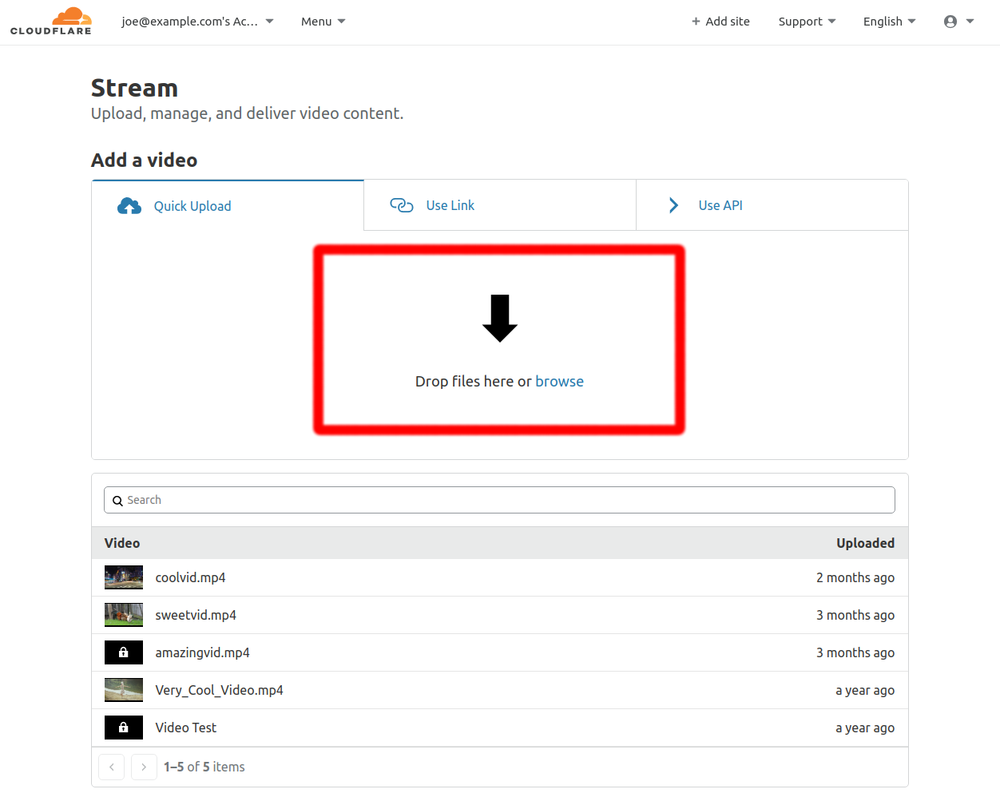
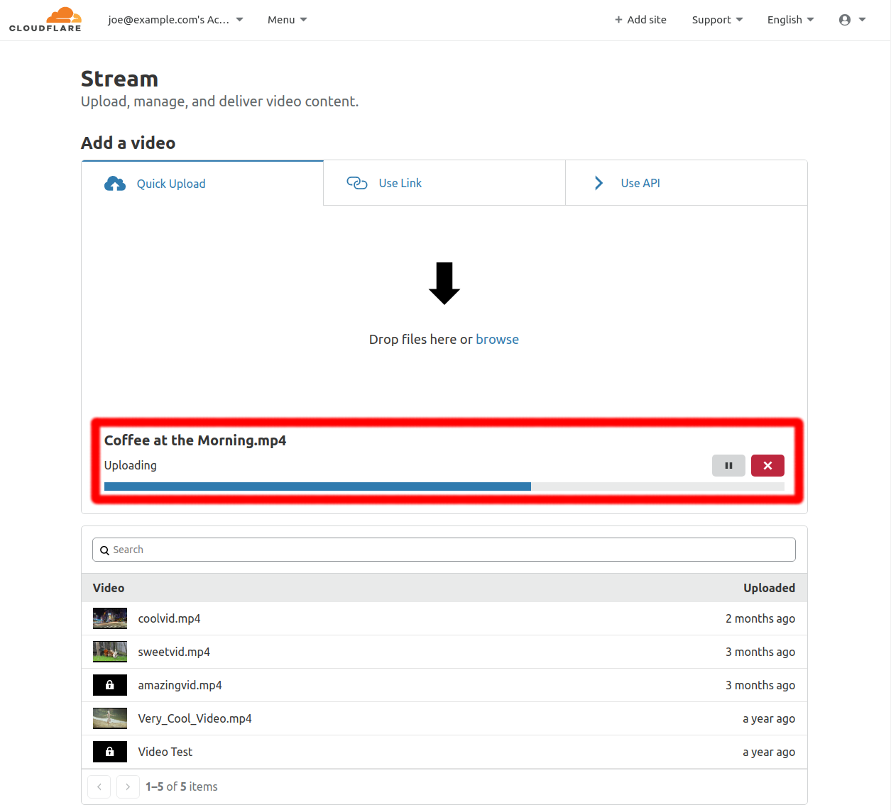
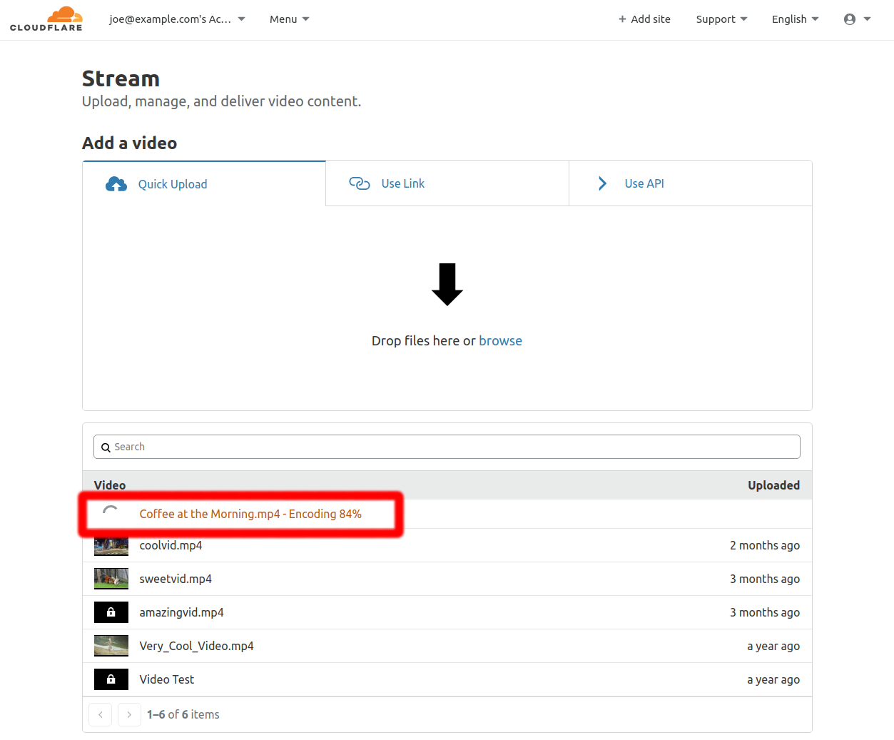

# Uploading with the dashboard

Stream is a video-on-demand platform for developers and content teams building video applications. With Stream, it's easy and fast to upload a video and get an embed code. In the background, Cloudflare encodes it, stores it, delivers it, and takes care of optimizing the right format and bitrate for every device and network connection.

Below are instructions for getting started with Stream using the Stream tab on the Cloudflare Dashboard.

## Uploading your video

Use the drag-n-drop field to upload your video.

## Uploading progress

## Processing

## Get the embed code

## Embed your video

Embed your video! Your embed code will work on domains both on and off Cloudflare.
