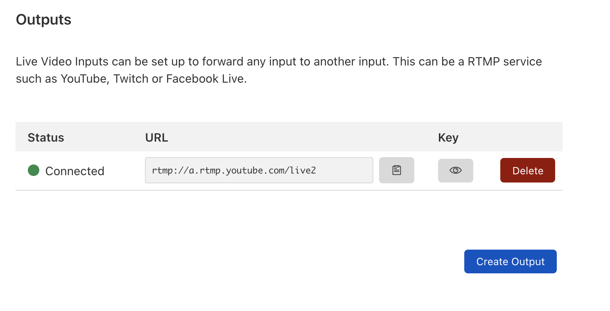

# Simulcasting

Simulcasting lets you redistribute your live stream to 3rd party platforms such as YouTube and Facebook. To begin simulcasting, select an input and add one or more Outputs:



## Add an Output using the API

Add an Output to start retransmitting live video. You can add or remove Outputs at any time during a broadcast to start and stop retransmitting.

```bash
curl -X POST \
--data '{"url": "rtmp://a.rtmp.youtube.com/live2","streamKey": "<redacted>"}' \
-H "Authorization: Bearer $TOKEN" \
https://api.cloudflare.com/client/v4/accounts/$ACCOUNT/stream/live_inputs/$INPUT_UID/outputs
```

​Example response:

```json
{
  "result": {
    "uid": "6f8339ed45fe87daa8e7f0fe4e4ef776",
    "url": "rtmp://a.rtmp.youtube.com/live2",
    "streamKey": "<redacted>"
  },
  "success": true,
  "errors": [],
  "messages": []
}
```

## Listing or deleting outputs

To get a list of outputs, call the /outputs endpoint:

```bash
curl -H "Authorization: Bearer $TOKEN" \ https://api.cloudflare.com/client/v4/accounts/$ACCOUNT/stream/live_inputs/$INPUT_UID/outputs
```

To delete an output, make a DELETE request to the /output endpoint with the output id:

```bash
curl -X DELETE \ -H "Authorization: Bearer $TOKEN" \https://api.cloudflare.com/client/v4/accounts/$ACCOUNT/stream/live_inputs/$INPUT_UID/outputs/$OUTPUT_UID
```

Note that if the associated live input is already retransmitting to this output when delete is called, that output will be disconnected within 30 seconds.