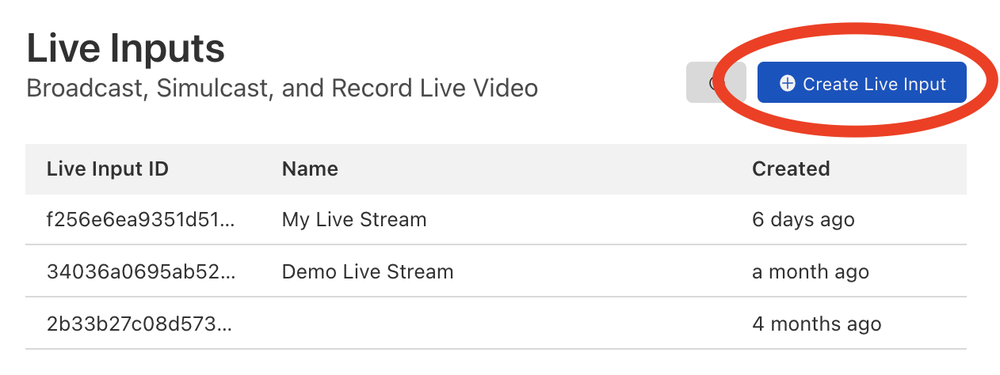
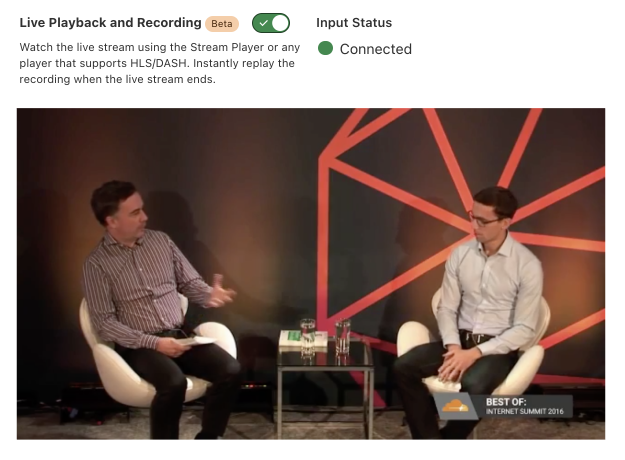

# Start a live stream

You can start a live stream using the Stream Dashboard or the API. After you subscribe to Stream, you can create Live Inputs and begin sending your live video to Cloudflare Stream using RTMPS.

## Using the Dashboard

1. To start a live stream using the Stream Dashboard, click the **Live Inputs** tab.

  

1. Next, click **Create Live Input**.

  

1. Give your Live Input a name and click **Create Live Input**.

  

1. Once you have created a Live Input, you can retrieve the RTMPS URL and Key.

  

Within seconds of you pushing your live stream to Cloudflare Stream, you should see the live video stream:



## Using the API

To start a live stream programmatically, make a `POST` request to the `/live_inputs` endpoint:

```bash
curl -X POST \ -H "Authorization: Bearer $TOKEN" \https://api.cloudflare.com/client/v4/accounts/$ACCOUNT/stream/live_inputs \--data '{"meta": {"name":"test stream 1"},"recording": { "mode": "automatic", "timeoutSeconds": 10, "requireSignedURLs": false, "allowedOrigins": ["*.example.com"] }}'
```

* When the mode property is set to `automatic`, it means the live stream will be automatically available for viewing using HLS/DASH. In addition, the live stream will be automatically recorded for later replays.
* The `timeoutSeconds` property specifies how long a live feed can be disconnected before it results in a new video being created.
* The `requireSignedURLs` property indicates if signed URLs are required to view the video. This setting is applied by default to all videos recorded from the input. In addition, if viewing a video via the live input ID, this field takes effect over any video-level settings.
* The `allowedOrigins` property can optionally be invoked to provide a list of allowed origins. This setting is applied by default to all videos recorded from the input. In addition, if viewing a video via the live input ID, this field takes effect over any video-level settings.

A successful response will return information about the live input:

```json
{
  "uid": "f256e6ea9341d51eea64c9454659e576",
  "rtmps": {
    "url": "rtmps://live.cloudflare.com:443/live/",
    "streamKey": "MTQ0MTcjM3MjI1NDE3ODIyNTI1MjYyMjE4NTI2ODI1NDcxMzUyMzcf256e6ea9351d51eea64c9454659e576"
  },
  "created": "2021-09-23T05:05:53.451415Z",
  "modified": "2021-09-23T05:05:53.451415Z",
  "meta": {
    "name": "My Live Stream"
  },
  "status": null,
  "live": {
    "mode": "automatic",
    "requireSignedURLs": false,
    "allowedOrigins": ["*.example.com"]
  }
}
```

## Managing live inputs

You can update live inputs by making a `PUT` request:

```bash
curl -X PUT \ -H "Authorization: Bearer $TOKEN" \https://api.cloudflare.com/client/v4/accounts/$ACCOUNT/stream/live_inputs/:input_id \--data '{"meta": {"name":"test stream 1"},"recording": { "mode": "automatic", "timeoutSeconds": 10 }}'
```

Delete a live input by making a `DELETE` request:

```bash
curl -X DELETE \ -H "Authorization: Bearer $TOKEN" \https://api.cloudflare.com/client/v4/accounts/$ACCOUNT/stream/live_inputs/:input_id
```

## Requirements and known limitations 

### Requirements

* Stream Live requires input GOP duration (keyframe interval) to be between 4 to 10 seconds.
* Closed GOPs required. This means that if there are any B frames in the video, they should always refer to frames within the same GOP. This setting is default in most encoder software such as OBS.
* Stream Live only supports H.264 video and AAC audio codecs as inputs. This requirement does not apply to inputs that are relayed to Stream Connect outputs.
* Clients must be configured to reconnect when a disconnection occurs. Stream Live is designed to handle reconnection gracefully by continuing the live stream.

### Known limitations (will be solved in coming weeks without any changes required from you): 

* Watermarks cannot yet be used with live videos.
* The live videos feature does not yet work on older iOS versions: iOS 10, launched in 2016, and below.
* Hardware video encoding on Apple devices is not yet supported. When using encoder software such as OBS, x264 software encoding is required.
* If a live video exceeds 7 days in length, the recording will be truncated to 7 days and not be viewable.