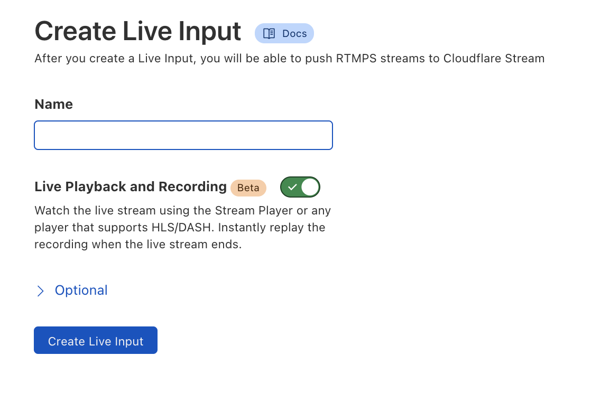

# Start a live stream

You can start a live stream using the Stream Dashboard or the API. If you already have a Stream subscription, you can create live inputs and begin sending your live video to Cloudflare Stream using RTMPS.

## Using the Dashboard

1. To start a live stream using the Stream Dashboard, click the **Live Inputs** tab.

  

1. Next, click **Create Live Input**.

  

1. Give your Live Input a name and click **Create Live Input**.

  

1. Once you have created a Live Input, you can retrieve the RTMPS URL and Key.

  

Within seconds of you pushing your live stream to Cloudflare Stream, you should see the live video stream:


## Using the API

To start a live stream programmatically, simply make a POST request to the /live_inputs endpoint:

```bash
curl -X POST \ -H "Authorization: Bearer $TOKEN" \https://api.cloudflare.com/client/v4/accounts/$ACCOUNT/stream/live_inputs \--data '{"meta": {"name":"test stream 1"},"live": { "mode": "automatic", "timeoutSeconds": 10 }}'
```

* When the mode property is set to `automatic`, it means the live stream will be automatically available for viewing using HLS/DASH. In addition, the live stream will be automatically recorded for later replays.
* The `timeoutSeconds` property specifies how long a live feed can be disconnected before it results in a new video being created.

A successful response will return information about the live input:

```json
{
    "uid": ...,
    "rtmps": ...,
    "created": ...,
    "modified": ...,
    "meta": ...,
    "status": ...,
    "manifests": {
        "hls": "https://...",
        "dash": "https://..."
    }
    "live": {
        "mode": "automatic",
        "timeoutSeconds": 10,
    }
}
```

## Updating and deleting live inputs

You can update live inputs by making a PUT request:

```bash
curl -X PUT \ -H "Authorization: Bearer $TOKEN" \https://api.cloudflare.com/client/v4/accounts/$ACCOUNT/stream/live_inputs/:input_id \--data '{"meta": {"name":"test stream 1"},"live": { "mode": "automatic", "timeoutSeconds": 10 }}'
```

You can delete live inputs by making a DELETE request:

```bash
curl -X DELETE \ -H "Authorization: Bearer $TOKEN" \https://api.cloudflare.com/client/v4/accounts/$ACCOUNT/stream/live_inputs/:input_id 
```

## Requirements and Known Limitations 

### Requirements

* Stream Live requires input GOP duration to be constant during a RTMP broadcast  (OBS automatic GOP setting does not work) and between 4 to 10 seconds.
* Stream Live supports H264 video and AAC-LC audio codecs.

### Known limitations

* Resolution up to 720p is supported (we’re working on improving 1080p support).
* MP4 download creation from videos created from live streaming is not yet available.
* Watermarks cannot yet be used with live videos.
* Thumbnails cannot yet be generated for live videos.
* Live videos does not yet work on old iOS versions (iOS 10 launched 2016 and below).