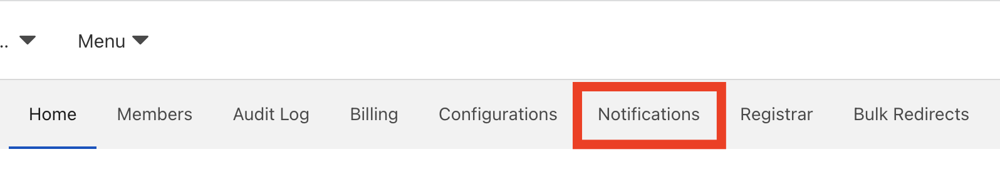
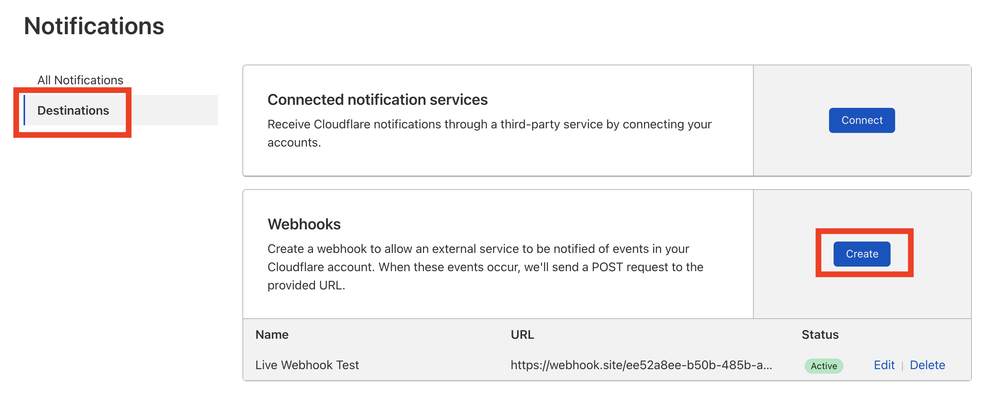
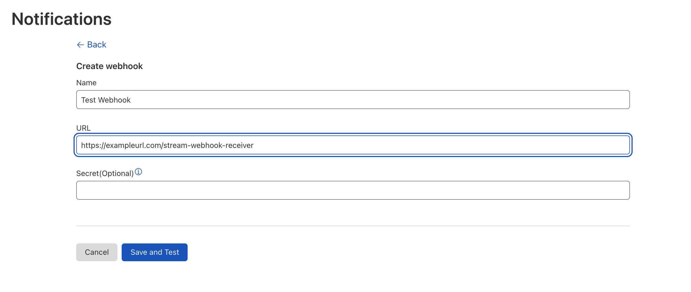
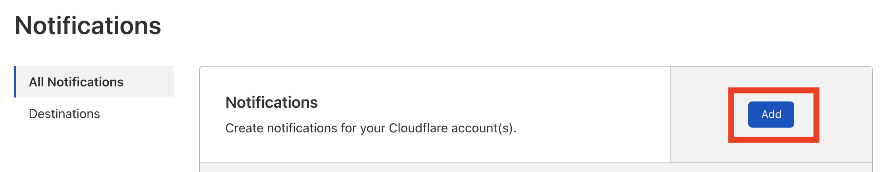
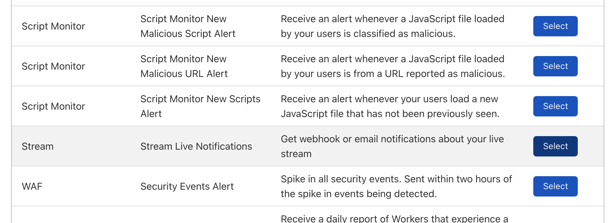
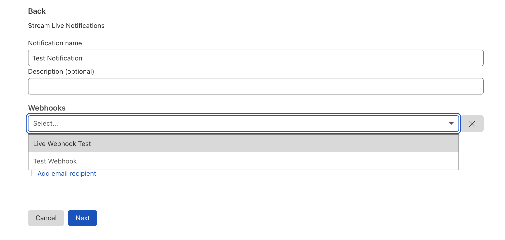
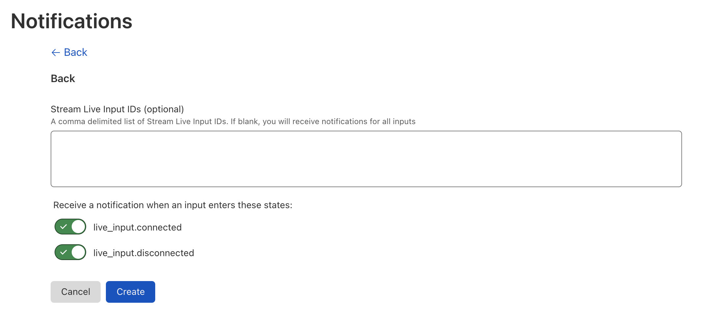

# Getting Live Webhooks

Stream Live supports webhooks that notify your service when an Input connects or disconnects to Stream Live. 

## Example Webhook Payload

The webhook payload will look similar to this:

```json
{
  "name": "Live Webhook Test",
  "text": "Notification type: Stream Live Input\nInput ID: eb222fcca08eeb1ae84c981ebe8aeeb6\nEvent type: live_input.disconnected\nUpdated at: 2022-01-13T11:43:41.855717910Z",
  "data": {
    "notification_name": "Stream Live Input",
    "input_id": "eb222fcca08eeb1ae84c981ebe8aeeb6",
    "event_type": "live_input.disconnected",
    "updated_at": "2022-01-13T11:43:41.855717910Z"
  },
  "ts": 1642074233
}
```

The `event_type` property of the data object will either be `live_input.connected` or `live_input.disconnected`.

## Subscribe to Stream Live Webhooks

1. Log in to your Cloudflare account and click  **Notifications**.



1. From the **Notifications** page, click the **Destinations** tab.


1.  On the **Destinations** page under **Webhooks**, click **Create**.

1. Enter the information for your webhook and click **Save and Test**.


1. To create the notification, from the **Notifications** page, click the **All Notifications** tab.

1. Next to **Notifications**, click **Add**.


1. Under the list of products, locate **Stream** and and click **Select**.


1. Enter a name and optional description.
1. Under **Webhooks**, click **Add webhook** and click your newly created webhook.
1. Click **Next**.


1. By default, you will receive webhook notifications for all Live Inputs. If you only wish to receive webhooks for certain inputs, enter a comma delimited list of Input IDs in the text field.


1. When you are done, click **Create**. 
