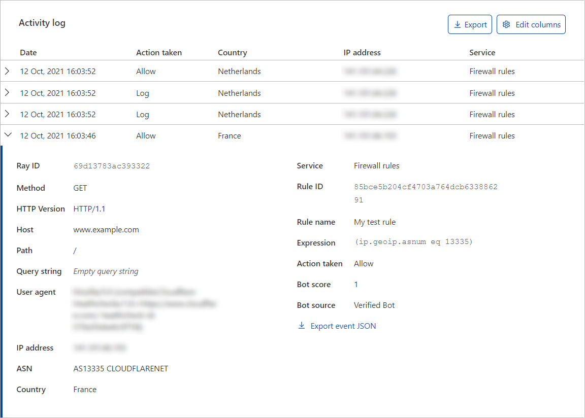

The **Activity log** summarizes Firewall events by date to show the action taken and the applied Cloudflare security feature.

Firewall Events are shown by individual event rather than by request.  For example, if a single request triggers three different Firewall features, the Firewall Events will show three individual events in the **Activity log**.

Expand each event to see its details, and define filters and exclusions based on the event's field values. Click the **Filter** or **Exclude** button when hovering a field to add the field value to the filters or exclusions list of the displayed analytics. To download the event data in JSON format, click **Export event JSON**.

### Displayed columns

To configure the columns displayed in the **Activity log**, click **Edit columns**. This gives you flexibility depending on the type of analysis that you need to perform.

For example, if you are diagnosing a bot-related issue, you may want to see the **User agent** and the **Country** columns. On the other hand, if you are trying to identify a DDoS attack, you may want to see **IP address**, **ASN**, and **Path** columns.

### Event actions

For a description of the actions that may appear in the **Activity Log**, refer to [Actions](https://developers.cloudflare.com/ruleset-engine/rules-language/actions).

When the _Connection Close_ action appears in the **Activity Log**, it means the existing request is unaffected, but the client is instructed to establish a new connection instead of reusing the existing connection.

The [_Managed Challenge (Recommended)_](https://support.cloudflare.com/hc/articles/200170136#managed-challenge) action that may appear in the **Activity Log** is available in the following security products: Firewall Rules, IP Access Rules, User Agent Blocking, Rate Limiting, Custom Rules, and Bot Fight Mode.
