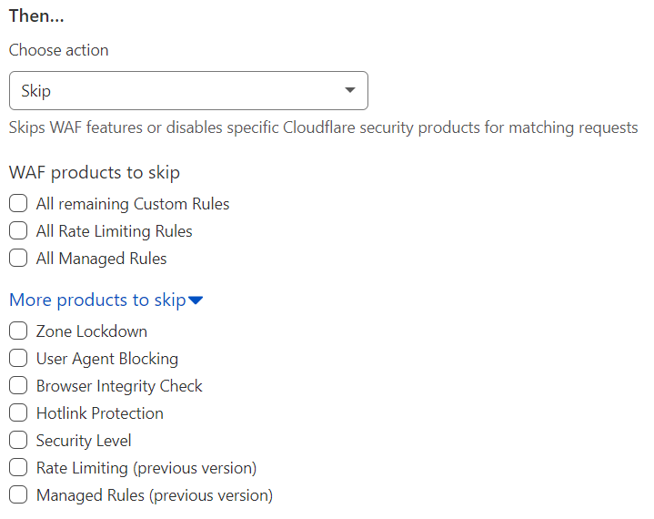

# Configure a Custom Rule with the Skip action

Use the _Skip_ action in a Custom Firewall rule to skip one or more security features. A rule configured with the _Skip_ action is also known as a skip rule.

For more information on the available options, refer to [Available skip options](/custom-rules/custom-firewall/skip/options).

## Using the dashboard

1. Log in to the [Cloudflare dashboard](https://dash.cloudflare.com), and select your account and website.

1. Go to **Firewall** > **Custom Rules**.

1. [Create a Custom Firewall rule](/custom-rules/custom-firewall/create-dashboard) by clicking **Create custom rule** > **Firewall rule**, or edit an existing Custom Firewall rule.

1. Define the rule name and the rule expression.

1. Under **Choose action**, select _Skip_ from the dropdown.

  

1. Configure the desired [skip options](/custom-rules/custom-firewall/skip/options).

1. Save your changes.

## Using the API

Use the [Rulesets API](https://developers.cloudflare.com/ruleset-engine/rulesets-api) to configure Custom Rules via API.

Refer to [API examples](/custom-rules/custom-firewall/skip/api-examples) for example API requests.
