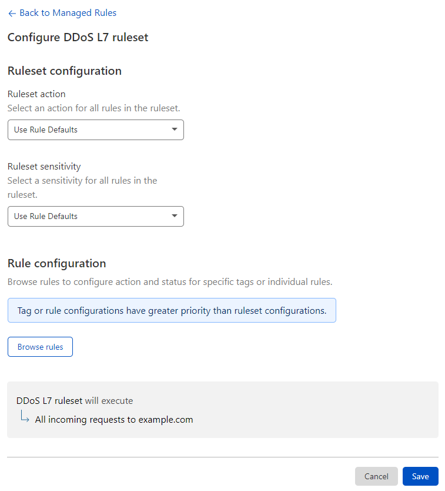

# Configure the HTTP DDoS Managed Ruleset in the dashboard

You can customize the **action** and **sensitivity** of the rules in the Cloudflare HTTP DDoS Managed Ruleset in the following ways:

* Configure all the rules in the ruleset
* Configure one or more rules

For more information on the available parameters and allowed values, see [Managed Ruleset parameters](/ddos-l7-mitigation/override-parameters).

## Configure all the rules in the ruleset

1. Log in to the Cloudflare dashboard and select your account.
1. Select your website.
1. Go to **Security** > **DDoS**.
1. On the right of the **HTTP DDoS attack protection** Managed Ruleset, click **Configure**.
1. Under **Ruleset configuration**, select the action and sensitivity values for all the rules in the HTTP DDoS Managed Ruleset.

    

1. Click **Save**.

## Configure one or more rules

1. Log in to the Cloudflare dashboard and select your account.
1. Select your website.
1. Go to **Security** > **DDoS**.
1. On the right of the **HTTP DDoS attack protection** Managed Ruleset, click **Configure**.
1. Under **Rule configuration**, click **Browse rules**.
1. Search for the rules you wish to configure using the available filters. You can search for tags.
1. To configure a single rule, select the desired value for a field in the displayed drop-down lists on the right of the rule.

    To configure more than one rule, select the rules using the checkboxes on the left and update the fields for the selected rules using the drop-down lists displayed above the table. For more information, refer to [Configure rules in bulk in a Managed Ruleset](https://developers.cloudflare.com/waf/managed-rulesets/deploy-zone-dashboard#configure-rules-in-bulk-in-a-managed-ruleset).

1. Click **Next**.
1. Click **Save**.