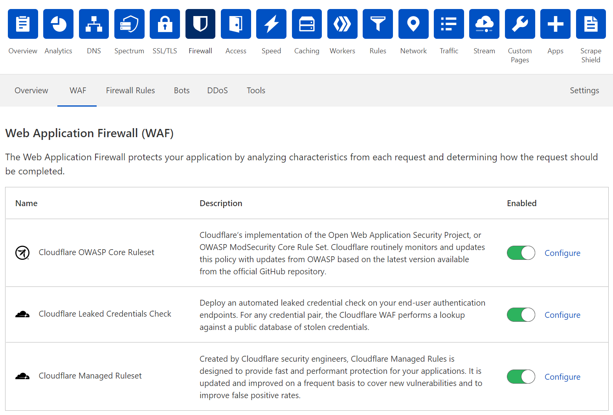
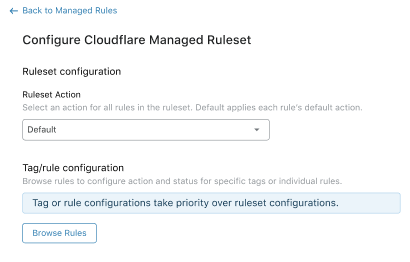
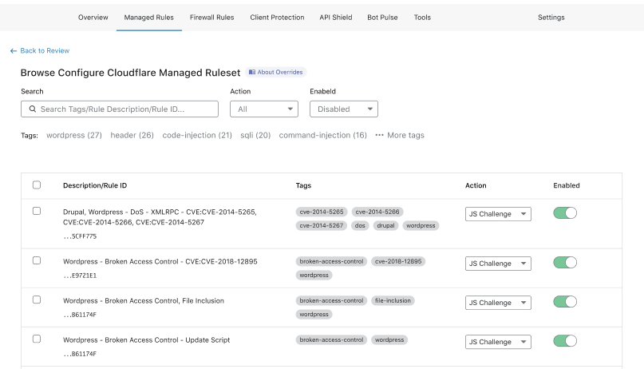
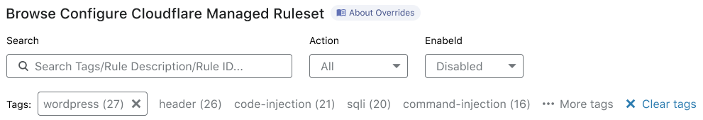
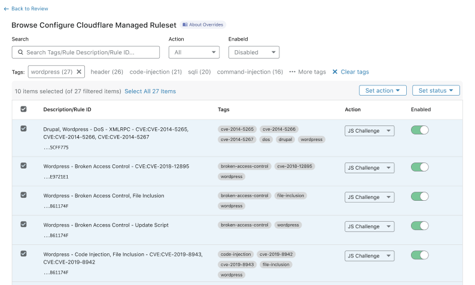
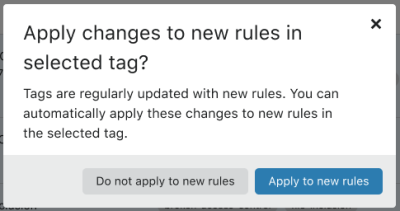

# Deploy Managed Rulesets for a zone in the dashboard

You can enable and configure Managed Rulesets for a zone in the **Managed Rules** tab of the Firewall app.

<Aside type='note' header='Note'>

When you enable a Managed Ruleset in the **Managed Rules** tab under Firewall, you are deploying that Managed Ruleset to the zone-level `http_request_firewall_managed` Phase.

</Aside>

## Enable or disable a Managed Ruleset

In the Web Application Firewall (WAF) interface, click the on/off toggle on the right of a Managed Ruleset to enable or disable all the rules in that ruleset.

## Configure a Managed Ruleset

### Configure an action for all the rules

To configure an action for all the rules in a Managed Ruleset:

1. Open the **Firewall Rules** tab of the **Firewall** tile.

1. On the right of the Managed Ruleset you want to configure, click **Configure**.

1. Select the action to perform for all the rules in the ruleset from the **Ruleset Action** drop-down list.

    

1. Click **Save**.

### View the rules of a Managed Ruleset

You can browse the available rules in a Managed Ruleset and search for individual rules or tags.

Use the available filters in the Browse Managed Ruleset interface.

To view the rules of a Managed Ruleset:

1. Open the **Firewall Rules** tab of the **Firewall** tile.

1. On the right of the Managed Ruleset you want to browse, click **Configure**.

1. Click **Browse Rules**.

    The Browse Managed Ruleset interface displays.

    

### Configure a single rule in a Managed Ruleset

You can configure one or more rules in the Browse Managed Ruleset interface.

Do the following:

1. Search for a rule using the available filters. You can search for tags.

1. Find the rule you want to configure in the results list.

1. In the result line for the rule you want to change, select the action for the rule in the **Action** dropdown, or change the status of the rule using the toggle available on the right.

    

1. Click **Next**.

    The Configure Managed Ruleset interface displays, listing the configuration you just defined.

1. Click **Save**.

### Configure rules in bulk in a Managed Ruleset

You can configure several rules at once in the Browse Managed Ruleset interface.

Do the following:

1. Enter search terms in the available input to find the rules you want to configure. You can search for tags.

    

1. In the results list, click the checkbox on the left of all the rules you want to configure.

    Alternatively, click a tag name under the search input to filter the rules with that tag, and then click the checkboxes for the rules you want to configure.

1. To change the action or the status for the selected rules, select one of the options in the **Set action** and **Set status** drop-down lists, displayed in the top right corner of the table.

    

1. Click **Next**.

    <Aside type='note' header='Note'>

    If you selected a tag, you get a dialog asking you if any new rules with the selected tag should be configured with the action and status you selected.

    

    Select **Do not apply to new rules** to apply your configurations to the selected rules only.

    Select **Apply to new rules** if you want to apply your configurations to any new rules with the select tag.

    </Aside>

1. Click **Save**.
