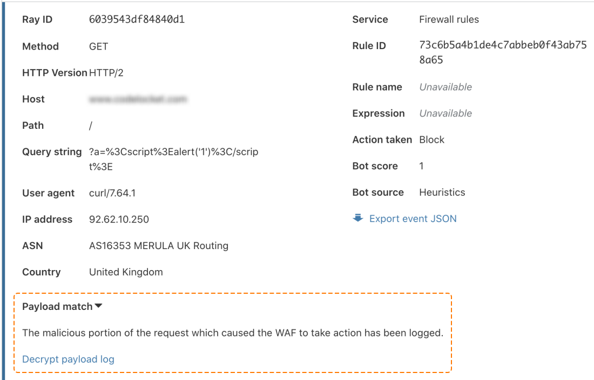
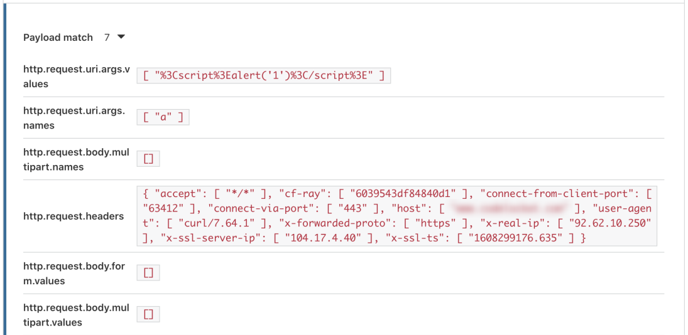

# View the payload content in the dashboard

View the content of the matched rule payload in the dashboard by entering your private key.

1. Open **Firewall** > **Overview**.

1. Under **Activity log**, expand the details of an event triggered by a rule whose ruleset has payload logging enabled.

1. Under **Payload match**, select **Decrypt payload log**.

    

1. Enter your private key in the pop-up window and select **Decrypt**.

    <Aside type='note'>

    The private key is not sent to a Cloudflare server. The decryption occurs entirely in the browser.

    </Aside>

If the private key you entered decrypts the encrypted payload successfully, the **Payload match** card displays the payload content in clear text.

