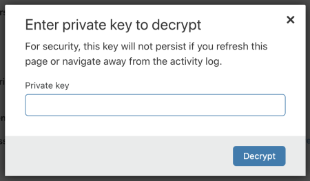

# View the payload content in the dashboard

View the content of the matched rule payload in the dashboard by entering your private key.

1. Open **Firewall** > **Overview**.

1. Under **Activity log**, expand the details of an event triggered by a rule whose ruleset has payload logging enabled.

1. Under **Payload match**, select **Decrypt payload log**.

    

1. Enter your private key in the pop-up window and select **Decrypt**. The decryption occurs in the browser without any server-side processing.

    

If the private key you entered can decrypt the payload successfully, the **Payload match** card displays the matched payload content in clear text.

