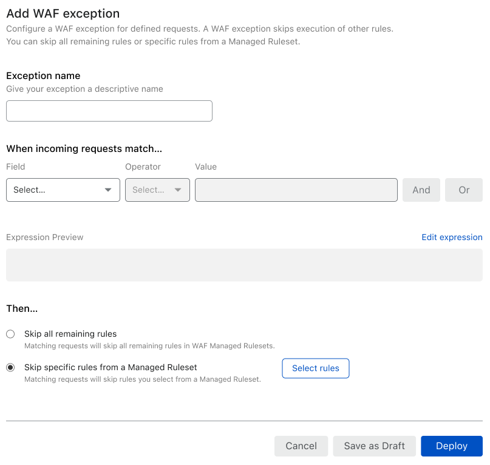

# Define WAF exceptions in the dashboard

1. Log in to the [Cloudflare dashboard](https://dash.cloudflare.com), and select your account and website.
1. Go to **Firewall** > **WAF**.
1. Click **Add WAF exception**.
1. Enter a name for the exception.

    

1. Specify a filter expression that defines when the WAF exception applies. The filter expression uses the same language as the [Firewall Rules language](https://developers.cloudflare.com/firewall/cf-firewall-language).
1. Under **Then**, select the [WAF exception type](/managed-rulesets/waf-exceptions#types-of-waf-exceptions) that determines which rules to skip:

    * _Skip everything after this rule_ — Skips all remaining rules of WAF Managed Rulesets.
    * _Skip specific rules from a Managed Ruleset_ — Click **Select rules** to select the specific rules to skip. Learn more about [searching and selecting Managed Ruleset rules](https://developers.cloudflare.com/waf/managed-rulesets/deploy-zone-dashboard#configure-rules-in-bulk-in-a-managed-ruleset).

1. To save and deploy your WAF exception, click **Deploy**. If you are not ready to deploy your exception, click **Save as Draft**.
