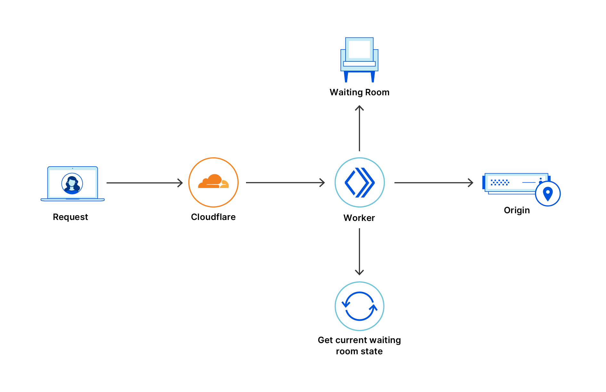

# About

Cloudflare Waiting Room protects websites from surges in legitimate traffic that may otherwise bring an application down.

## Benefits

Waiting rooms protect **your origin server** by preventing surges in legitimate traffic that may overload your origin.

Waiting Rooms also benefit **your visitors** by:
- Keeping your application online and preventing them from reaching error pages.
- Showing estimated wait times that are continuously updated.
- Opening up new spots more quickly by tracking dynamic inflow and [outflow](/reference/configuration-settings#session-duration).
- Remembering each visitor's status to prevent someone from losing their place in line or having to re-queue if they leave your site.
- Appearing in your own [branding and style](/additional-options/customize-waiting-room), which enhances trust and lets you provide additional information as needed.

## How it works

Once you have [created and activated a waiting room](/get-started) for a specific application page:

- If a page is not experiencing heavy traffic, a visitor accesses the page directly.
- If page traffic crosses a [user-defined threshold](/reference/configuration-settings#session-duration), a visitor enters a virtual waiting room until it's their turn to access the page:
    - Each user receives a [cookie](/reference/waiting-room-cookie) to manage the dynamic outflow of requests from the waiting room to the origin website in First In First Out (FIFO) order.
    - While in the waiting room, the user's browser automatically refreshes every 20 seconds to give them updated information about their estimated wait time.
    - When a user exits the waiting room and reaches your application, they can leave and re-enter without waiting for the length of time specified by the [session duration](/reference/configuration-settings#session-duration).
    - Because waiting rooms support dynamic inflow and [outflow](/reference/configuration-settings#session-duration), new spots appear more quickly and estimated wait times are lower and more accurate.

## Availability

The following customers have access to Cloudflare Waiting Room:
- Those qualified under [Project Fair Shot](https://www.cloudflare.com/fair-shot/)
- Business customers

Access to certain features depends on a customer's [plan type](plans).

## Prerequisites

* Cloudflare’s CDN is required to use the waiting room feature.
* Configure a [proxied DNS record](https://support.cloudflare.com/hc/articles/360019093151) or a [proxied load balancer](https://developers.cloudflare.com/load-balancing/understand-basics/proxy-modes/) for the waiting room’s hostname. A DNS record is not auto-configured after a waiting room is created.
* Visitors must enable cookies. Refer to [Waiting room cookie](/reference/waiting-room-cookie) for information on how cookies are used in Cloudflare Waiting Rooms.

## Get started

To learn how to use Cloudflare Waiting Rooms, check out:
- The [setup guide](/get-started)
- Various [how-to guides](/how-to)
