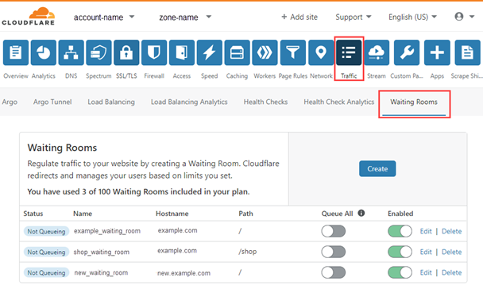

# Control Waiting Room traffic

You can suspend or enable your waiting rooms, and force all traffic to a waiting room using the [user interface](/how-to/waiting-room-dashboard) or the [API](/how-to/use-waiting-room-api).

Open the **Waiting Rooms** dashboard to view the list of your waiting rooms.

Use the **Queue All** and **Enabled** switches in the dashboard to manage the status of your waiting rooms.

<table style="width:100%">
  <thead>
    <tr>
      <td colspan="2" style="width:50%"><strong>Waiting Rooms Dashboard</strong></td>
      <td colspan="2" style="width:50%"><strong>Waiting Room API</strong></td>
    </tr>
    <tr>
      <td style="width:20%"><strong>Dashboard Setting</strong></td>
      <td style="width:30%"><strong>Notes</strong></td>
      <td style="width:20%"><strong>Parameter</strong></td>
      <td style="width:30%"><strong>API Notes</strong></td>
    </tr>
  </thead>
  <tbody>
    <tr>
      <td><strong>Enabled</strong></td>
      <td>
          <ul>
              <li>Default is <strong>On</strong>.</li>
              <li>When activated, the waiting room is available.</li>
              <li>When deactivated, the waiting room is suspended: all traffic goes to the origin, even if <strong>Queue All</strong> is activated.</li>
          </ul>
      </td>
      <td><code>suspended</code></td>
      <td>
        <ul>
          <li>Default is <code>false</code>.</li>
          <li>When <code>suspended</code> is <code>false</code>, the waiting room is available.</li>
          <li>When <code>suspended</code> is <code>true</code>, the waiting room is suspended: all traffic goes to the origin, even if <code>queue_all</code> is true.</li>
        </ul>
      </td>
    </tr>
    <tr>
      <td><strong>Queue All</strong></td>
      <td>
          <ul>
              <li>Default is <strong>Off</strong>.</li>
              <li>When activated, all new visitors are diverted to the enabled waiting room, and do not enter the origin. Only known visitors with a valid <code>__cfwaitingroom</code> cookie can re-enter the origin.</li>
              <li>When deactivated, new visitors are diverted to the enabled waiting room only if traffic is above the threshold.</li>
          </ul>
      </td>
      <td><code>queue_all</code></td>
      <td>
        <ul>
          <li>Default is <code>false</code>.</li>
          <li>When <code>queue_all</code> is <code>true</code>, all new visitor traffic is forced to the enabled waiting room. Only known visitors with a valid <code>__cfwaitingroom</code> cookie can re-enter the origin.</li>
          <li>When <code>queue_all</code> is <code>false</code>, visitors are diverted to the enabled waiting room only if traffic is above the threshold.</li>
      </ul>
    </td>
    </tr>
  </tbody>
</table>

<Aside type='note' header='Note'>

Activating **Queue All** suspends access to the origin: new visitors queue indefinitely in an enabled waiting room until **Queue All** is deactivated.  Once **Queue All** is deactivated, Cloudflare respects the waiting room configuration.

</Aside>

The following table summarizes how **Enabled** and **Queue All** settings affect requests to `host/path`.

<table style="width:100%">
  <thead>
    <tr>
      <td style="width:30%"><strong>Enabled</strong></td>
      <td style="width:30%"><strong><strong>Queue All</strong></strong></td>
      <td style="width:40%"><strong>Status</strong></td>
    </tr>
  </thead>
  <tbody>
    <tr>
      <td><strong>On</strong>&nbsp;<code>suspended</code> = <code>false</code></td>
      <td><strong>Off</strong>&nbsp;<code>queue_all</code> = <code>false</code></td>
      <td>
        This is the default state. New visitors are diverted to the enabled waiting room only if traffic exceeds a configured threshold.
      </td>
    </tr>
    <tr>
      <td><strong>On</strong>&nbsp;<code>suspended</code> = <code>false</code></td>
      <td><strong>On</strong>&nbsp;<code>queue_all</code> = <code>true</code></td>
      <td>All non-known traffic queues in the waiting room indefinitely: it cannot access the origin.</td>
    </tr>
    <tr>
      <td><strong>Off</strong>&nbsp;<code>suspended</code> = <code>true</code></td>
      <td><strong>Off</strong>&nbsp;<code>queue_all</code> = <code>false</code></td>
      <td>All traffic goes to the origin.
      </td>
    </tr>
    <tr>
      <td><strong>Off</strong>&nbsp;<code>suspended</code> = <code>true</code></td>
      <td><strong>On</strong>&nbsp;<code>queue_all</code> = <code>true</code></td>
      <td>All traffic goes to the origin.</td>
    </tr>
  </tbody>
</table>
