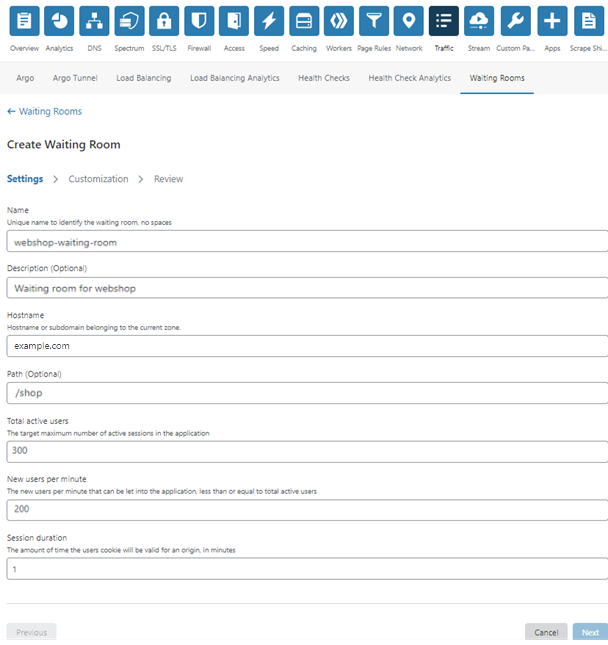

# Configure settings from the Cloudflare dashboard

To configure settings for a waiting room, select the **Settings** tab in the **Create Waiting Room** page.

The table below describes the **Settings** fields that you can configure in the dashboard, and indicates the equivalent Waiting Room API parameter for each setting.

<table style="width:100%">
  <thead>
    <tr>
      <td colspan="2" style="width:40%"><strong>Settings</strong></td>
      <td colspan="2" style="width:60%"><strong>Notes</strong></td>
    </tr>
    <tr>
      <td style="width:20%"><strong>Dashboard Setting</strong></td>
      <td style="width:20%"><strong>API parameter</strong></td>
      <td style="width:20%"><strong>Required or optional</strong></td>
      <td style="width:40%"><strong>Description</strong></td>
    </tr>
  </thead>
  <tbody>
    <tr>
      <td>Name</td>
      <td><code>name</code></td>
      <td>Required</td>
      <td>Unique waiting room name.</td>
    </tr>
    <tr>
      <td>Hostname</td>
      <td><code>host</code></td>
      <td>Required</td>
      <td>Host name for which the waiting room will be applied (no wildcards).Do not include http:// or https://.</td>
    </tr>
    <tr>
      <td>Path</td>
      <td><code>path</code></td>
      <td>Optional</td>
      <td>Specific path within the host where the waiting room will be applied. The waiting room will be enabled for all subpaths. Wildcards and query parameters are not supported.</td>
    </tr>
    <tr>
      <td>Total active users</td>
      <td><code>total_active_users</code></td>
      <td>Required</td>
      <td>The maximum number of active sessions allowed in <code>host/path</code> at a given time. The maximum recommended value is 80% to 85% of the traffic capacity that your origin can handle.</td>
    </tr>
    <tr>
      <td>New users per minute</td>
      <td><code>new_users_per_minute</code></td>
      <td>Required</td>
      <td>Amount of new users per minute that can be allowed into <code>host/path</code>: less than or equal to target concurrent users.</td>
    </tr>
    <tr>
      <td>Session duration</td>
      <td><code>session_duration</code></td>
      <td>Optional</td>
      <td>The amount of time in minutes that a user who left <code>host/path</code> can come directly back without having to go into the Waiting Room.</td>
    </tr>
    <tr>
      <td>Description</td>
      <td><code>description</code></td>
      <td>Optional</td>
      <td>Description of the Waiting Room.</td>
    </tr>
  </tbody>
</table>

<Aside type='note' header='Note'>

You can configure only one Waiting Room per `host/path` combination.
</Aside>

## Next steps

Click **Next** or the **Customization** tab to modify the waiting room page design.
