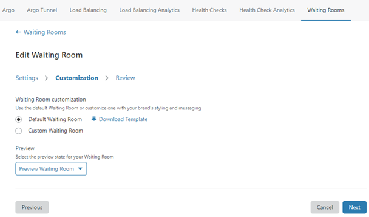
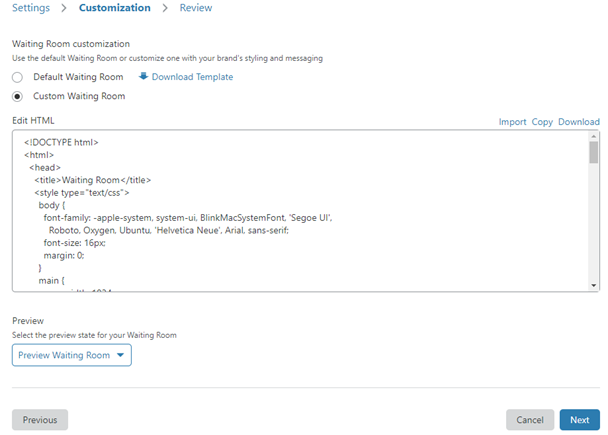

# Customize a Waiting Room

To design and preview the appearance of a waiting room, select the **Customization** tab in the **Create Waiting Room** page.

Cloudflare offers options to customize the appearance of your waiting room:
* [Default waiting room](#default-waiting-room): An unbranded waiting room that displays an estimated waiting time to visitors.
* [Custom waiting room](#custom-waiting-room): Edit template text or create your own HTML code:
  * You can edit the HTML content in a text box within the **Customization** page.
  * Alternatively, you can import a HTML file.

## Default waiting room
To choose the default, unbranded waiting room, click **Default Waiting Room**.



## Custom waiting room

To customize a waiting room, click **Custom Waiting Room**. A text box containing editable template text displays.



You can edit the HTML code directly in the text box.

* Click **Download Template** to download a HTML file containing the default template content to your computer.
* Click **Download** to download a HTML file containing the text box content to your computer.
* Click **Copy** to copy the text from the text box to your clipboard, then paste it into an editor of your choice.

The template text contains [code to display the wait time](#display-wait-time). If you want to display the estimated wait time to visitors, do not delete this content.

### Upload a Waiting Room HTML file

1. Click **Import** to upload a HTML file from your computer.
1. Select the file in the dialog and click **Open**.
The file displays in the text box. You can make further edits in the text box. Include the [code to display the wait time](#display-wait-time) to display the estimated queue time on the waiting room page.

### Display wait time

The following content in the `<main>` section of the template HTML code displays the wait time:

```html
     <h2 id="time-remaining">
        <noscript>
          {{#waitTimeKnown}}Your estimated wait time is {{waitTime}}
          minutes...{{/waitTimeKnown}} {{^waitTimeKnown}}Your estimated wait
          time is unavailable.{{/waitTimeKnown}}
        </noscript>
     </h2>
```

The following script within the `<body>` section after `<main>` fetches the wait time:

```html
   <script type="text/javascript">
      var remainingEl = document.getElementById('time-remaining');
      var waitTime = {{waitTime}};
      var waitTimeKnown = {{waitTimeKnown}};

      var remainingString = 'Your estimated wait time is ';

      if (!waitTimeKnown) {
        remainingString += 'unavailable.'
      } else {
        if (waitTime === 1) {
          remainingString += waitTime + ' minute...';
        } else {
          remainingString += waitTime + ' minutes...';
        }
      }

      remainingEl.innerText = remainingString;
    </script>
```

## Preview waiting room

Click **Preview Waiting Room** to preview the waiting room.
* Choose **Queueing** to display the waiting room appearance when it is enabled on the dashboard and **Queue all** is disabled.
* Choose **Queue All** to display the waiting room appearance when it is enabled on the dashboard and **Queue all** is enabled. When **Queue all** is enabled for a waiting room, the estimated wait time is not displayed.

## Next steps

Click **Next** or the **Review** tab to review and save your waiting room.
