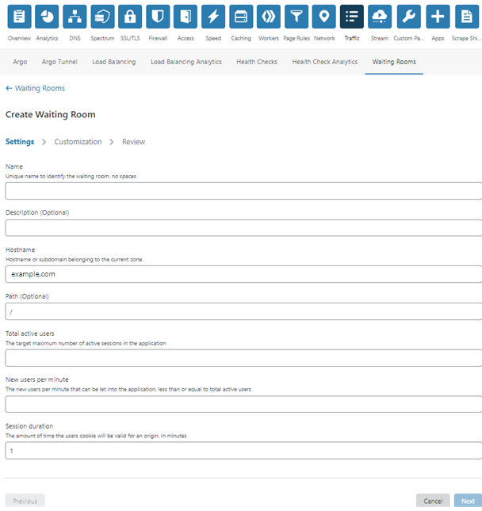

# Create a Waiting Room via the Cloudflare dashboard

1. Click the [Waiting Rooms](/how-to/waiting-room-dashboard) tab in the **Traffic** app.

2. To create a new Waiting Room, click **Create**.
The **Create Waiting Room** page displays.

There are three tabs in the **Create Waiting Room** page.

1. Click the [Settings](/how-to/create-waiting-room/create-waiting-room-dashboard/configure-settings/) tab to configure the settings for the waiting room.
1. Select the [Customization](/how-to/create-waiting-room/create-waiting-room-dashboard/customize-waiting-room/) tab to modify and preview the waiting room appearance.
Cloudflare provides an editable template for a default waiting room page. Alternatively, you can upload your own HTML file.
1. [Review](/how-to/create-waiting-room/create-waiting-room-dashboard/review-waiting-room/): Review the settings for your waiting room and preview the waiting room webpage.

4. Click **Save** to save your Waiting Room.
