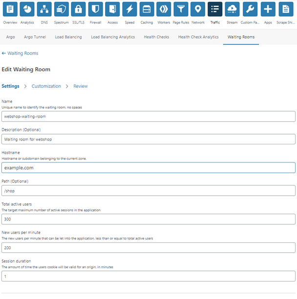
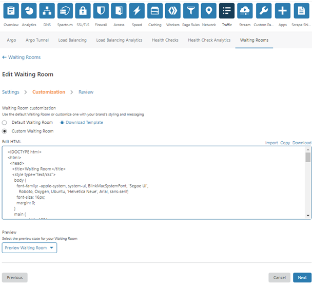

# Update and delete Waiting Rooms

You can manage your waiting rooms using the [Waiting Rooms dashboard](/how-to/waiting-room-dashboard) or the API.

## Edit a waiting room in the Cloudflare dashboard

1. Open the **Waiting Rooms** dashboard.
A list of your waiting rooms displays.


2. Click **Edit** in the waiting room that you want to edit.
The **Edit Waiting Room** page displays.
1. Click on the **Settings** tab in the **Edit Waiting Room** page.
A list of the settings for your waiting room displays.




4. Edit the settings. Refer to [_Configure Settings_](/how-to/create-waiting-room/create-waiting-room-dashboard/configure-settings/) for a description of waiting room settings.
1. Click **Next** or **Customization**.
The **Customization** tab in the **Edit Waiting Room** page displays.





6. Edit the text in the textbox or upload a HTML file to customize the appearance of the waiting room. Refer to [Customize a waiting room](/how-to/create-waiting-room/create-waiting-room-dashboard/customize-waiting-room/) for more information.
1. Click **Next** or **Review**.
The **Review** tab in the **Edit Waiting Room** page displays.


8. [Review](/how-to/create-waiting-room/create-waiting-room-dashboard/review-waiting-room/) the settings for your Waiting Room, and preview how the Waiting Room will appear to visitors.
9. Click **Save** to save the changes to your Waiting Room.

## Delete a waiting room in the Cloudflare dashboard

1. Open the **Waiting Rooms** dashboard.
A list of your waiting rooms displays.
1. To delete a waiting room, click **Delete** in your list of waiting rooms.
Click **Delete** in the dialog to confirm.

## Edit a waiting room using the Cloudflare Waiting Room API

[Replace](https://api.cloudflare.com#waiting-room-update-waiting-room) a configured waiting room by appending the following endpoint to the Cloudflare API base URL.

```bash
PUT zones/{zone_identifier}/waiting_rooms/{identifier}
```

[Update](https://api.cloudflare.com#waiting-room-patch-waiting-room) a configured waiting room by appending the following endpoint to the Cloudflare API base URL.

```bash
PATCH zones/{zone_identifier}/waiting_rooms/{identifier}
```

You only need to include the parameters that you want to update in the `data` field of the PATCH request.

## Delete a waiting room using the Cloudflare Waiting Room API

Delete a waiting room by appending the following endpoint in the [Waiting Room API](https://api.cloudflare.com#waiting-room-delete-waiting-room) to the Cloudflare API base URL.

```bash
DELETE zones/{zone_identifier}/waiting_rooms/{identifier}
```
