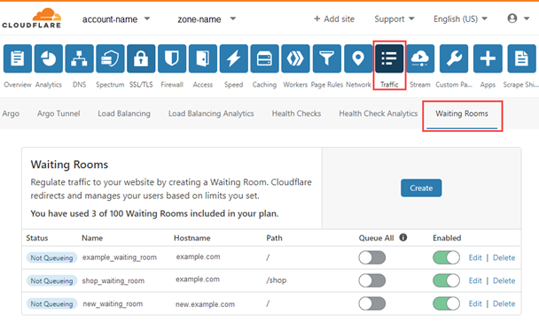

# Monitor Waiting Room status

You can monitor the status of your waiting rooms using the [user interface](/how-to/waiting-room-dashboard) or the API.

## Monitor waiting room status in the Waiting Rooms dashboard

Open the **Waiting Rooms** dashboard to view the list of your waiting rooms.



The **Status** column displays the current state of the waiting room:

* **Not Queueing**: The waiting room is activated, but traffic has not reached the threshold to divert visitors to the waiting room.
* **Queueing**: Traffic is exceeding the configured threshold and visitors are diverted to the waiting room.
* **Disabled**: The waiting room is suspended.
* **Queue All**: All traffic is forced to queue in the waiting room.

## Monitor your waiting rooms using the Waiting Rooms API

[Check whether traffic is queueing in a configured waiting room](https://api.cloudflare.com/#waiting-room-get-waiting-room-status) by appending the following endpoint to the Cloudflare API base URL:

```bash
GET zones/{zone_identifier}/waiting_rooms/{identifier}/status
```

The response is:
*  `queueing` if visitors are currently queueing in the waiting room
*  `not_queueing` if the room is empty or if the waiting room is suspended.

To check whether a configured waiting room is suspended or whether the traffic is force-queued to the waiting room, append the following endpoint to the Cloudflare API base URL.

```bash
GET zones/{zone_identifier}/waiting_rooms/{identifier}
```

The endpoint above [fetches all settings](https://api.cloudflare.com/#waiting-room-waiting-room-details) for a configured waiting room:

```
  "success": true,
  "errors": [],
  "messages": [],
  "result": {
    "id": "REDACTED",
    "created_on": "2014-01-01T05:20:00.12345Z",
    "modified_on": "2014-01-01T05:20:00.12345Z",
    "name": "shop_waiting_room",
    "description": "Waiting room for webshop",
    "suspended": false,
    "host": "shop.example.com",
    "path": "/shop",
    "queue_all": true,
    "new_users_per_minute": 200,
    "total_active_users": 300,
    "session_duration": 1,
  }
}
```

The value of `suspended` indicates whether a waiting room is activated or suspended:
* `false`: The waiting room is activated.
* `true`: The waiting room is suspended.

The value of  `queue_all` indicates whether all traffic is forced to queue in the waiting room:
* `false`: Visitors are diverted to the waiting room only if traffic exceeds the configured threshold.
* `true`: All traffic is forced to queue in the waiting room, and no traffic passes from the waiting room to the origin.
