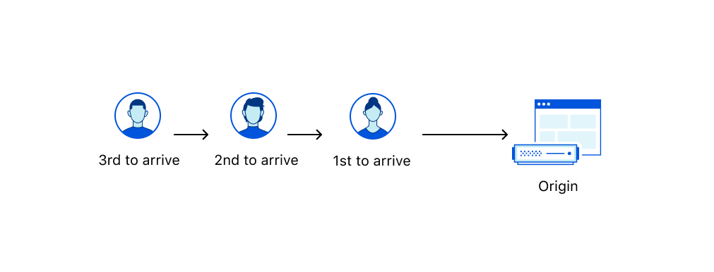

import ChangeQueueMethod from "../_partials/_change-queueing-method.md"

# Queueing methods

The **queueing method** determines the order that visitors exit an active waiting room and reach your application.

<Aside type="note">

Only certain customers can use queue methods besides First In First Out (FIFO). For more details, refer to <a href="/plans">Plans</a> page.

</Aside>

## First In First Out (FIFO)

Your waiting room orders visitors according to when they entered the waiting room.

Technically, each user receives a [cookie](/reference/waiting-room-cookie) that contains a timestamp of when their request first hit an actively queueing waiting room. Cloudflare uses that timestamp to order visitors and provide the estimated wait time.

Use this method when you want to reward visitors who get in the queue first and wait longer, such as for sneaker drops, memorabilia sales, etc.

## Random

When your application has open spots, your waiting room chooses visitors at random to exit the waiting room and enter your application.

Use this method when you want to distribute products or services more equitably. Earlier users have a better chance of exiting the waiting room before the estimated wait time because they have more chances to be selected.

## Changing queueing methods

<ChangeQueueMethod/>