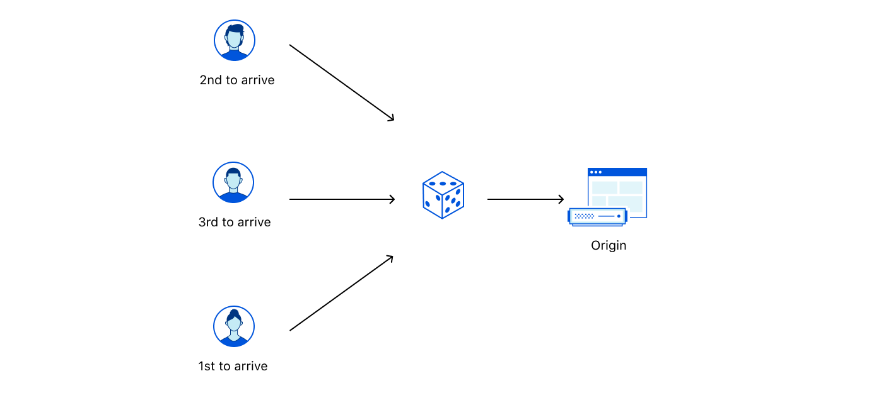

import ChangeQueueMethod from "../_partials/_change-queueing-method.md"

# Queueing method

The **queueing method** determines the order that visitors exit an active waiting room and reach your application.

<Aside type="note">

Only certain customers can use queue methods besides First In First Out (FIFO). For more details, refer to <a href="/plans">Plans</a> page.

</Aside>

## First In First Out (FIFO)

Your waiting room orders visitors according to when they entered the waiting room.

Technically, each user receives a [cookie](/reference/waiting-room-cookie) that contains a timestamp of when their request first hit an actively queueing waiting room. Cloudflare uses that timestamp to order visitors and provide the estimated wait time.

Use this method when you want to reward visitors who get in the queue first and wait longer.

## Random

When your application has open spots, your waiting room chooses visitors at random to exit the waiting room and enter your application.

Use this method when you want to distribute products or services more equitably. Earlier users have a better chance of exiting the waiting room before the estimated wait time because they have more chances to be selected.

## Event-specific queueing methods

The following queueing methods are commonly used when you [create an event](/additional-options/create-events). Additionally, these queueing methods are only available when using the API.

<Aside type="note" header="Note:">

If your waiting room is set to **Queue All**, all visitors will be queued, regardless of the chosen method.

</Aside>

### Passthrough

Allow all traffic to pass through your waiting room and into your application by setting `queueing_method` to **passthrough**. Use this setup when you only want to use your waiting room for events — where you can update the queueing method — and otherwise avoid queuing during low-traffic hours.

### Reject

Prevent any traffic from reaching your application unless an event is active by setting `queueing_method` to **reject**. Use this setup for event-only endpoints or to perform application maintenance.

## Changing queueing methods

<ChangeQueueMethod/>