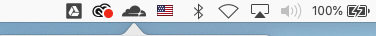

# macOS Desktop Client

## Installation Requirements
<table border="1">
    <tr>
        <th>OS Ver</th>
        <td>High Sierra, Catalina</td>
    </tr>
    <tr>
        <th>OS Type</th>
        <td>64bit only</td>
    </tr>
    <tr>
        <th>HD Space</th>
        <td>75MB</td>
    </tr>
        <tr>
        <th>Memory</th>
        <td>35MB</td>
    </tr>
    <tr>
        <th>Network Types</th>
        <td>WIFI or LAN</td>
    </tr>
</table>

## Steps to download
1. [Click here](https://1.1.1.1/Cloudflare%20WARP.zip) to download Cloudflare WARP.zip.
1. Navigate to the downloads folder and double-click on ```Cloudflare WARP.zip```.
1. Double click on the ```Cloudflare_WARP.pkg``` file that is extracted.
1. Follow instructions in the installer to complete installation.
   * Cloudflare WARP will automatically launch and appear in your menu bar with the Cloudflare logo.



## What we place on your device


#### Cloudflare WARP.app
The main GUI application that you interact with. 
* Location: `/Applications/Cloudflare WARP.app`

#### Cloudflare WARP Daemon
This is daemon service responsible for establishing the wireguard tunnel and all interaction between our service endpoint and the Cloudflare WARP application. 
* Service: `/Applications/Cloudflare WARP.app/Contents/Resources/CloudflareWARP`
* Definition: `/Library/LaunchDaemons/com.cloudflare.1dot1dot1dot1.macos.warp.daemon.plist`

#### Log files
The macOS application places log files in two locations based on what part of the app is logging information. These logs are included during feedback submission when the "Share debug information" checkbox is checked in the Feedback UI.
* Daemon and Install Logs: `/Library/Application Support/Cloudflare`
* Application GUI Logs: `/Users/<your local username>/Library/Logs/Cloudflare` 

## How to remove the application
We include an uninstall script as part of the macOS package that you originally used. To find and run it, run the following steps in a terminal window:

```
% cd /Applications/Cloudflare\ WARP.app/Contents/Resources
% ./uninstall.sh
```
* Note you may be prompted for your credentials to remove the application

