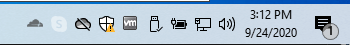

# Windows desktop client

## Installation requirements
<table>
  <tbody>
    <tr>
      <td><strong>OS Ver</strong></td>
      <td>Windows 8, Windows 10</td>
    </tr>
    <tr>
      <td><strong>OS Type</strong></td>
      <td>64bit only</td>
    </tr>
    <tr>
      <td><strong>HD Space</strong></td>
      <td>184MB</td>
    </tr>
    <tr>
      <td><strong>Memory</strong></td>
      <td>3MB</td>
    </tr>
    <tr>
      <td><strong>Network Types</strong></td>
      <td>WIFI or LAN</td>
    </tr>
  </tbody>
</table>

## Steps to download
1. [Download __Cloudflare_WARP_Release-x64.msi__](https://www.cloudflarewarp.com/Cloudflare_WARP_Release-x64.msi).
1. Navigate to Downloads folder and double-click on `Cloudflare_WARP_Release-x64.msi`.
1. Follow the instructions in the installer to complete installation.
  - Cloudflare WARP will automatically launch and appear in your menu bar with the Cloudflare logo.
  

## What we place on your device

### Cloudflare WARP GUI
The main GUI application that you interact with.
* Start Menu: `Start Menu->Cloudflare`
* On Disk: `C:\Program Files\Cloudflare\Cloudflare WARP\Cloudflare WARP.exe`

### Cloudflare WARP service
Windows service that is responsible for establishing the wireguard tunnel and all interaction between our service endpoint and the client application
* Service: `C:\Program Files\Cloudflare\Cloudflare WARP\warp-svc.exe`

### Log files
The Windows application places log files in two locations based on what part of the app is logging information. These logs are included during feedback submission when "Share debug information" checkbox is checked in the Feedback UI.
* WARP Service: `C:\ProgramData\Cloudflare`
* Application GUI Logs: `C:\Users\<your username>\AppData\Local\Cloudflare`

## How to remove application
1. Navigate to **Windows Settings** (Windows Key + I).
1. Click **Apps**.
1. Click **App & Features**.
1. Scroll down to Cloudflare WARP and click **Uninstall**.
