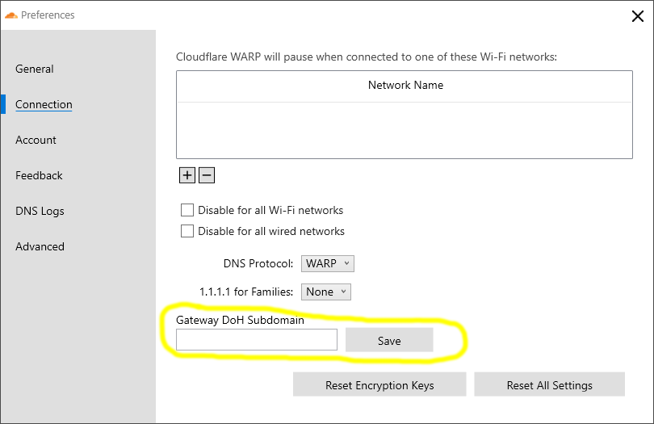

# Windows

<Aside type='warning' header='⚠️ THIS PAGE IS OUTDATED'>

We're no longer maintaining this page. **It will be deleted on Feb 8, 2021**. Please visit the new [Cloudflare for Teams documentation](https://developers.cloudflare.com/cloudflare-one/teams-docs-changes) instead.

</Aside>

<Aside>

**Before you start**  

Visit the [Requirements section](../requirements) to review the system requirements for Windows and to download the Windows installer.

Next, choose how you want to deploy the WARP Client in your organization:
* [Automated configuration](#automated-install-via-command-prompt) (Intune, Command Prompt)
* [Manual configuration](#manual-configuration), with end users manually configuring the client on their own device

</Aside>

## Automated configuration (Intune, Command Prompt)

The WARP Client for Windows allows for an automated install via tools like Intune, AD, or any script or management tool that can execute a `.msi` file.

* Example command line to **install** the client:

 ```bash
 Cloudflare_WARP_Release-x64.msi /quiet ORGANIZATION="exampleorg" SERVICE_MODE="warp" ENABLE="true" GATEWAY_UNIQUE_ID="fmxk762nrj" SUPPORT_URL="http://support.example.com"
 ```
 See the [deployment parameters](/teams/parameters/) for a description of each argument.

* Example command line to **uninstall** the client:
 ```bash
 msiexec /x Cloudflare_WARP_Release-x64.msi /quiet
 ```

### Example configuration with Microsoft Intune
Below are the minimum required steps to deploy Cloudflare WARP with Intune:

1. Login to your Microsoft Intune account.
1. Navigate to **Apps** > **All Apps**.
1. Click **+Add**.
1. As **App type**, select *Line-of-business app* from the drop-down menu.
1. Click **Select**.
1. Click **Select app package file** and upload the ```Cloudflare_WARP_Release-x64.msi``` installer you downloaded previously.
1. Click **OK**.
1. In the **Name** field, we recommend entering the version number of the package being uploaded.
1. In the **Publisher** field, we recommend entering `Cloudflare, Inc`.
1. In the **Command-line arguments** field enter a valid set of command line arguments as describe above
    - Example: `/quiet ORGANIZATION="exampleorg" SERVICE_MODE="warp" ENABLE="true" GATEWAY_UNIQUE_ID="fmxk762nrj" SUPPORT_URL="http://support.example.com"`
1. You don't need to fill other optional fields. Once you've entered all the necessary values, click **Next**. 
1. Add the users or groups who require Cloudflare WARP.
1. Click **Next**.
1. Review your configuration.
1. Click **Create**.

Intune is now configured to deploy the Cloudflare WARP Client.

## Manual configuration

If you plan to direct your users to manually download and configure the Cloudflare WARP Client application, they can do so in two ways, depending on your organization's Teams configuration:

* If your organization uses Gateway DNS filtering, users will need to [configure a Gateway DoH Subdomain](#manually-configure-a-gateway-doh-subdomain).
* If your organization uses Access policies to control device registration, or Gateway L7 Filtering, users will need to [configure a Cloudflare for Teams device registration](#manually-configure-a-cloudflare-for-teams-device-registration).

### Manually configure a Gateway DoH Subdomain
If your organization uses Gateway DNS filtering, you will need to instruct your users to configure the Gateway DoH Subdomain field. Follow [these instructions](https://developers.cloudflare.com/gateway/getting-started/troubleshooting-policies/#find-a-location-doh-subdomain) to find this value for your Teams configuration.

Then ask your users to complete the following steps:

1. Click on the Cloudflare Logo in the System Tray.
1. Select the gear icon.
1. Next, click **Preferences**.
1. Select the **Connection** tab.
1. Enter a value for *Gateway DoH Subdomain* (example: `fmxk762nrj`).
1. Click **Save**.



### Manually configure a Cloudflare for Teams device registration
If your organization uses Teams Access policies to control device registration, or is using the Gateway L7 Filtering and user or device specific Gateway policies, your users will need to login to Cloudflare for Teams by following these instructions:

1. Click on the Cloudflare Logo in the System Tray.
1. Select the gear icon.
1. Next, click **Preferences**.
1. Select the **Account** tab.
1. Click **Login with Cloudflare for Teams**.
1. Enter your organization name (if your auth domain were `https://example.cloudflareaccess.com`, you would enter `example`).
1. Complete the authentication steps required by your organization.


