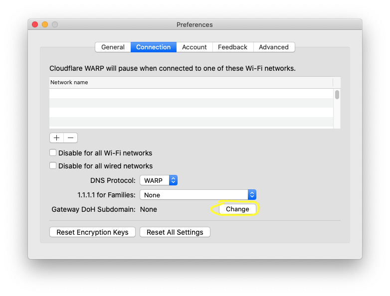
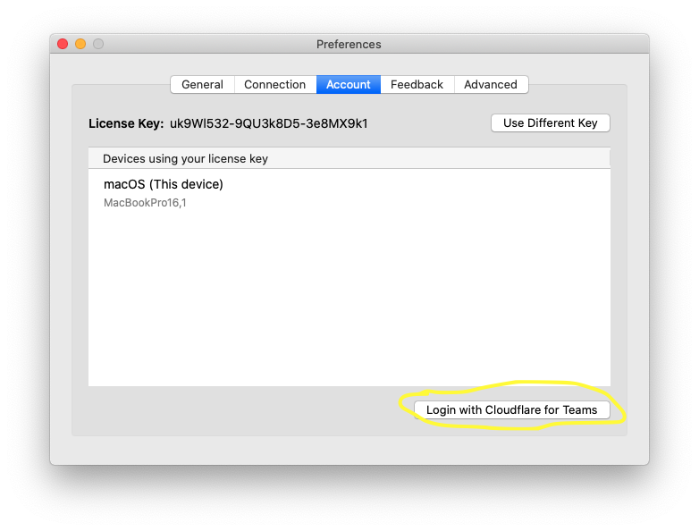

# macOS

<Aside type='warning' header='⚠️ THIS PAGE IS OUTDATED'>

We're no longer maintaining this page. **It will be deleted on Feb 8, 2021**. Please visit the new [Cloudflare for Teams documentation](https://developers.cloudflare.com/cloudflare-one/teams-docs-changes) instead.

</Aside>

<Aside>

**Before you start**  

Visit the [Requirements section](../requirements) to review the system requirements for macOS and to download the macOS installer.

Next, choose how you want to deploy the WARP Client in your organization:
* [Automated configuration](#automated-configuration) (Jamf, Intune, Script)
* [Manual configuration](#manual-configuration), with end users manually configuring the client on their own device

</Aside>

## Automated configuration (Jamf, Intune, Script)

The Cloudflare WARP macOS client allows for an automated install via tools like Jamf, Intune, or any script or management tool that can place a `com.cloudflare.warp.plist` file in `/Library/Managed Preferences` on a supported macOS device.

Here is an example plist file with the accepted arguments: 

```xml
<?xml version="1.0" encoding="UTF-8"?>
<!DOCTYPE plist PUBLIC "-//Apple//DTD PLIST 1.0//EN" "http://www.apple.com/DTDs/PropertyList-1.0.dtd">
<plist version="1.0">
<dict>
    <key>organization</key>
    <string>yourorganization</string>
    <key>enable</key>
    <true />
    <key>gateway_unique_id</key>
    <string>your_gateway_doh_subdomain</string>
    <key>service_mode</key>
    <string>warp</string>
    <key>support_url</key>
    <string>https://support.example.com</string>
</dict>
</plist>
```

For a description of each argument and what it means, see [deployment parameters](/teams/parameters/).

[Click here](../static/com.cloudflare.warp.plist) to download this example plist. If you manually plan to download the plist file and place it in `/Library/Managed Preferences`, convert the plist into into binary format first. To do that:
1. Open a Terminal window.
2. Run the following command:

```bash
% plutil -convert binary1 com.cloudflare.warp.plist
```

### Example configuration in Jamf

With Jamf, the WARP Client deployment is performed in three distinct steps: 
1. Upload the WARP Client `pkg` file.
1. Create a policy that deploys the WARP Client `pkg` file.
1. Create a configuration profile with the settings you want pushed down. 

The following sections will walk you through each of these steps.

#### Upload the package
1. Login to your `jamfcloud.com` account.
1. Navigate to **Computer**.
1. Click the **All Settings** (gear) in the upper right corner.
1. Click **Computer Management**.
1. Click **Packages**.
1. Select **New**.
1. Upload the `Cloudflare_WARP.pkg` file.
  For *Display name*, we recommend entering the version number of the package being uploaded.
1. Click **Save** to complete the upload.

#### Create the policy
1. Select **Computers** > **Policies** on the menu to your left.
1. Click **+ New**.
1. Enter a Display name such as "Cloudflare WARP Client".  
 For *Triggers*, our recommendation is to select *Startup*, *Login*, *Enrollment Complete* and *Recurring Check-in*, but you can select the value that works best for your organization.
1. Navigate to **Packages**.
1. Click **Configure**.
1. Click **Add** next to the package you previously uploaded.
1. Click **Save**.

#### Add Configuration Profile
1. Navigate to **Configuration Profiles**.
1. Click **New**.
1. Enter a name for your new profile, such as *Cloudflare for Teams*.
1. Scroll down the options list and click on **Application & Custom Settings**.
1. Click **Configure**.
1. Upload a valid plist file. You can start with our example above and modify for your organization.
1. Click **Save**.
1. Navigate to **Scope** to configure which devices in your organization should receive this profile.
1. Click **Save**.

Jamf is now configured to deploy the Cloudflare WARP Client.

## Manual configuration

If you plan to direct your users to manually download and configure the Cloudflare WARP Client application, they can do so in two ways, depending on your organization's Teams configuration:
* If your organization uses Gateway DNS filtering, users will need to [configure a Gateway DoH Subdomain](#manually-configure-a-gateway-doh-subdomain).
* If your organization uses Access policies to control device registration, or Gateway L7 Filtering, users will need to [configure a Cloudflare for Teams device registration](#manually-configure-a-cloudflare-for-teams-device-registration).

### Manually configure a Gateway DoH Subdomain
If your organization uses Gateway DNS filtering, you will need to instruct your users to configure the Gateway DoH Subdomain field. Follow [these instructions](https://developers.cloudflare.com/gateway/getting-started/troubleshooting-policies/#find-a-location-doh-subdomain) to find this value for your Teams configuration.

Then ask your users to complete the following steps:

1. Click on the Cloudflare Logo in the Menu Bar.
1. Select the gear icon.
1. Navigate to **Preferences**.
1. Select the **Connect** tab.
1. Click **Change** next to *Gateway DoH Subdomain*, and enter your DoH Subdomain.



### Manually configure a Cloudflare for Teams device registration
If your organization uses Teams Access policies to control device registration, or is using the Gateway L7 Filtering and user or device specific Gateway policies, your users will need to login to Cloudflare for Teams by following these instructions:

1. Click on the Cloudflare Logo in the Menu Bar.
1. Select the gear icon.
1. Navigate to **Preferences**.
1. Select the **Account** tab.
1. Click **Login with Cloudflare for Teams**.
1. Enter your organization name (if your auth domain were `https://example.cloudflareaccess.com`, you would enter `example`).
1. Complete the authentication steps required by your organization.


