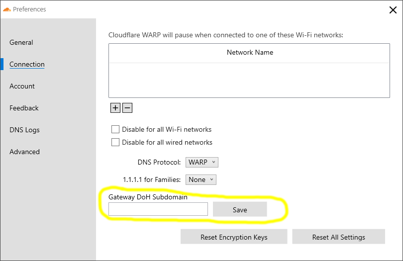
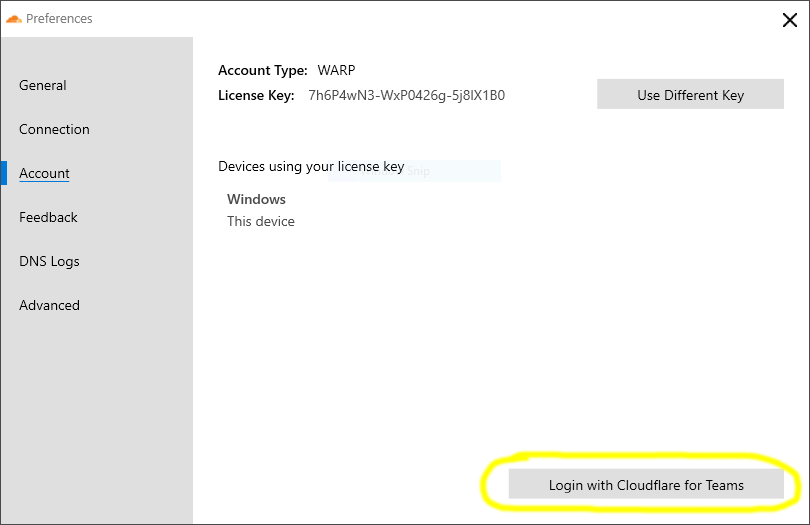

# Windows Deployment

<Aside>

Before you get started please visit [Windows Desktop Client](/setting-up/windows/) to review the system requirements and download the Windows installer.

Once you are ready, choose how you are going to deploy the client in your organization:
* [Automated](#automated-install) (Intune, AD, Scripting, etc.)
* [Manual Configuration](#manual-configuration) (End users manually configure client on their own device)

</Aside>

<div id="automated-install">

## Automated Install via Command Prompt
---------------------
</div>

The Cloudflare WARP Windows client allows for an automated install via tools like Intune, AD or any script or management tool that can execute a .msi file.

Example command line (for a description of each key and what it means, see [Deployment parameters](/teams/parameters/)):

An Example command line to install the product
```shell
Cloudflare_WARP_Release-x64.msi /quiet ORGANIZATION="exampleorg" SERVICE_MODE="warp" ENABLE="true" GATEWAY_UNIQUE_ID="fmxk762nrj" SUPPORT_URL="http://support.example.com"
```

An Example command line to uninstall the product
```shell
msiexec /x Cloudflare_WARP_Release-x64.msi /quiet
```


### Example Configuration with Microsoft Intune
Below are the minimum required steps to deploy Cloudflare WARP with Intune:

#### Add a new App
1. Login to your Microsoft Intune account.
1. Navigate to **Apps** > **All Apps**.
1. Click **+ Add**.
1. For App type, select **Line-of-business app** from the drop down.
1. Click **Select**.
1. Click **Select app package file** and upload the ```Cloudflare_WARP_Release-x64.msi``` installer you downloaded previously.
1. Click **OK**.
1. In the **Name** field we recommend including the version number of the package being uploaded.
1. In the **Publisher** field we recommend `Cloudflare, Inc`
1. In the **Command-line arguments** field enter a valid set of command line arguments as describe above
    - Example: `/quiet ORGANIZATION="exampleorg" SERVICE_MODE="warp" ENABLE="true" GATEWAY_UNIQUE_ID="fmxk762nrj" SUPPORT_URL="http://support.example.com"`
1. All other fields are optional, once complete click **Next**.
1. Add the users or groups who required Cloudflare WARP.
1. Click **Next**.
1. Review your configuration
1. Click **Create**.

Congratulations! Intune is now configured to deploy the Cloudflare WARP client.

<div id="manual-configuration">

## Manual Configuration
---------------------
</div>

If you plan to direct your users to manually download and configure the Cloudflare WARP client application, they can do so from two places in the UI:

#### Manually configure a Gateway DoH Subdomain
If your organization uses Teams Gateway DNS filtering then you will need to instruct your users to configure the Gateway DoH Subdomain field. You can <a href="https://developers.cloudflare.com/gateway/connecting-to-gateway/with-client">click here to find this value</a> for your Teams Gateway configuration. Then complete the following steps:
1. Click on the Cloudflare Logo in the System Tray.
1. Select the gear icon and then choose **Preferences**.
1. Select the **Connection** tab.
1. Enter a value for Gateway DoH Subdomain (example: fmxk762nrj) and click **Save**.


#### Manually configure a Cloudflare for Teams device registration
If your organization uses Teams Access policies to control device registration, or is using the Gateway L7 Filtering and user or device specific Gateway policies, then you will need to instruct your users to login to Cloudflare for Teams.
1. Click on the Cloudflare Logo in the System Tray.
1. Select the gear icon and then choose Preferences.
1. Select the **Account** tab.
1. Click **Login with Cloudflare for Teams**.
1. Enter your auth domain (if your auth domain is https://example.cloudflareaccess.com you would enter **example**)
1. Complete authentication steps required by your organization.

