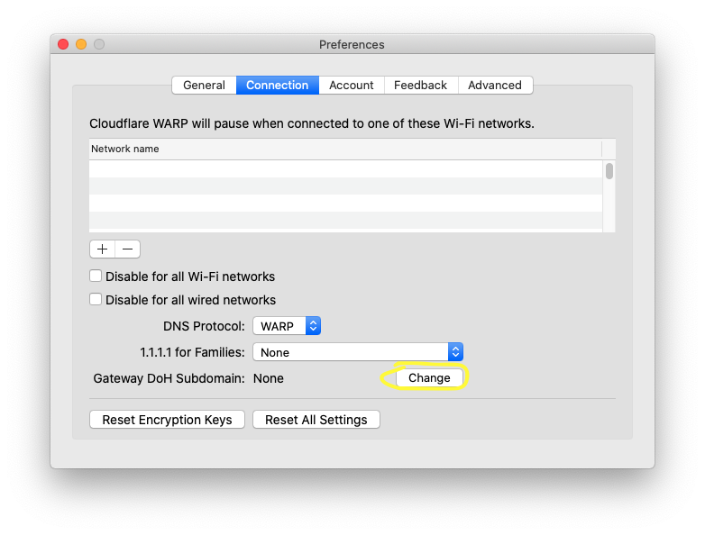
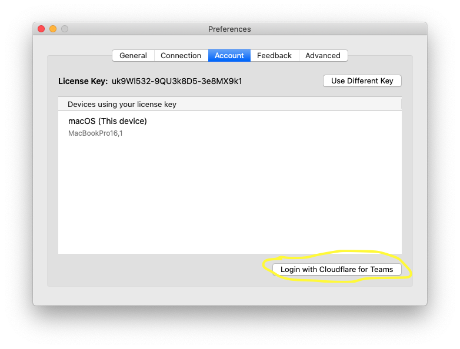

# macOS Deployment

<Aside>

Before you get started please visit [macOS Desktop Client](/setting-up/macOS/) to review the system requirements and download the macOS installer.

Once you are ready, choose how you are going to deploy the client in your organization:
* [Automated](#automated-install) (Jamf, Intune, Scripting, etc.)
* [Manual Configuration](#manual-configuration) (End users manually configure client on their own device)

</Aside>

<div id="automated-install">

## Automated Install
---------------------
</div>

The Cloudflare WARP macOS client allows for an automated install via tools like Jamf, Intune or any script or management tool that can place a `com.cloudflare.warp.plist` file in `/Library/Managed Preferences` on a supported macOS device.

Accepted plist values are as follows (for a description of each key and what it means, see [Deployment parameters](/teams/parameters/))

```xml
<?xml version="1.0" encoding="UTF-8"?>
<!DOCTYPE plist PUBLIC "-//Apple//DTD PLIST 1.0//EN" "http://www.apple.com/DTDs/PropertyList-1.0.dtd">
<plist version="1.0">
<dict>
    <key>organization</key>
    <string>yourorganization</string>
    <key>enable</key>
    <true />
    <key>gateway_unique_id</key>
    <string>your_gateway_doh_subdomain</string>
    <key>service_mode</key>
    <string>warp</string>
    <key>support_url</key>
    <string>https://support.example.com</string>
</dict>
</plist>
```
[Click here](/static/com.cloudflare.warp.plist) to download the example plist from above

Note if you manually plan to download the plist file and place it in `/Library/Managed Preferences` it must first be converted into binary format. To do that drop out to a terminal window and run the following command:
```shell
% plutil -convert binary1 com.cloudflare.warp.plist
```

### Example Configuration in Jamf
Cloudflare WARP is deployed in two distinct steps as part of Jamf. The first step is to create a policy that deploys the Cloudflare WARP Client pkf file. The second step is to create a configuration profile with the settings you want pushed down. Below you will find the minimum required steps to deploy the client via Jamf.

#### Upload the package
1. Login to your jamfcloud.com account.
1. Navigate to **Computer**.
1. Click the **All Settings** (gear) in the upper right and then click Computer Management.
1. In computer management click **Packages**.
1. Select **New**.
1. Upload the `Cloudflare_WARP.pkg` file.
    - For Display name we recommend including the version number of the package being uploaded.
1. Choose Save to complete the upload.

#### Create the policy
1. Select **Computers** > **Policies** on the menu to your left.
1. Click  **+ New**.
1. Enter a Display name such as "Cloudflare WARP Client".
    - For Triggers our recommendation is to select "Startup", "Login", "Enrollment Complete" and "Recurring Check-in", but you can select whatever works best for your organization.
1. Navigate to **Packages** on the left.
1. Click **Configure**.
1. Click **Add** next to the package you previously uploaded.
1. Click **Save**.

#### Add Configuration Profile
1. Navigate to **Configuration Profiles**.
1. Click **New**.
1. Enter a name for your new profile, such as "Cloudflare for Teams".
1. Scroll down the options list and click on **Application & Custom Settings**.
1. Click **Configure**.
1. Upload a valid plist file. Start with our example above and modify for your organization.
    - [Click here](/static/com.cloudflare.warp.plist) to download the example plist from above.
1. Click **Save**.
1. Navigate to Scope configure which devices in your organization should receive this profile.
1. Click **Save**

Congratulations! Jamf is now configured to deploy the Cloudflare WARP client.

<div id="manual-configuration">

## Manual Configuration
---------------------
</div>

If you plan to direct your users to manually download and configure the Cloudflare WARP client application, they can do so from two places in the UI:

#### Manually configure a Gateway DoH Subdomain
If your organization uses Teams Gateway then you will need to instruct your users to configure the Gateway DoH Subdomain field. You can <a href="https://developers.cloudflare.com/gateway/connecting-to-gateway/with-client">click here to find this value</a> for your Teams Gateway configuration. Then complete the following steps:
1. Click on the Cloudflare Logo in the Menu Bar.
1. Select the gear icon and then choose Preferences.
1. Select the **Connect** tab.
1. Click **Change** next to Gateway DoH Subdomain, and enter your DoH Subdomain.


#### Manually configure a Cloudflare for Teams device registration
If your organization uses Teams Access policies to control device registration, or is using the Gateway L7 Filtering and user or device specific Gateway policies, then you will need to instruct your users to login to Cloudflare for Teams.
1. Click on the Cloudflare Logo in the Menu Bar.
1. Select the gear icon and then choose Preferences.
1. Select the **Account** tab.
1. Click **Login with Cloudflare for Teams**.
1. Enter your auth domain (if your auth domain is https://example.cloudflareaccess.com you would enter **example**)
1. Complete authentication steps required by your organization.

