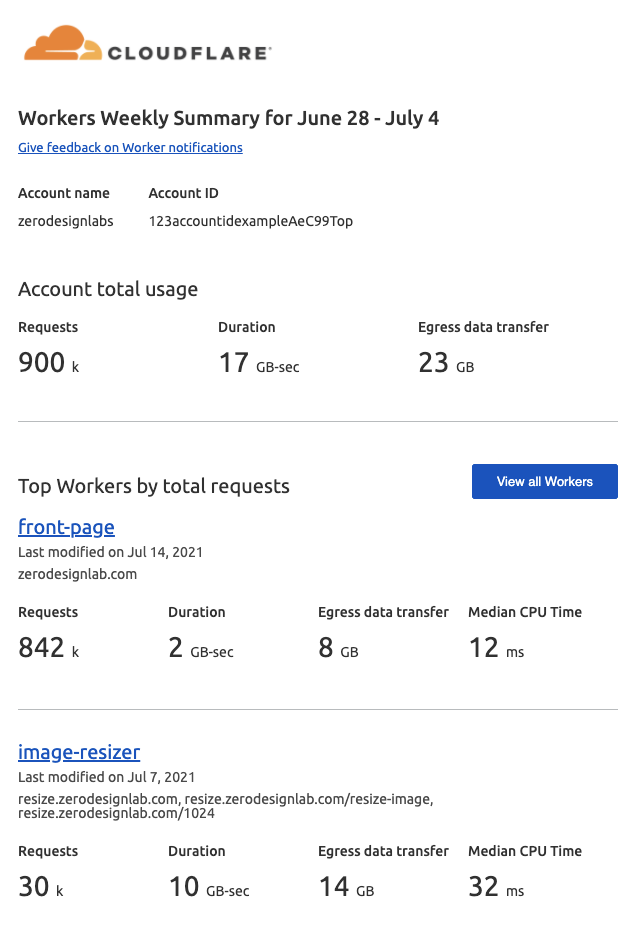
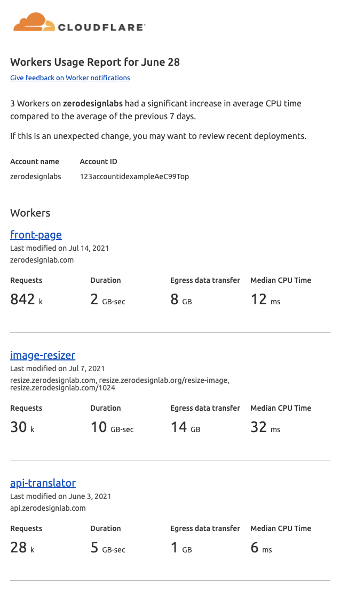
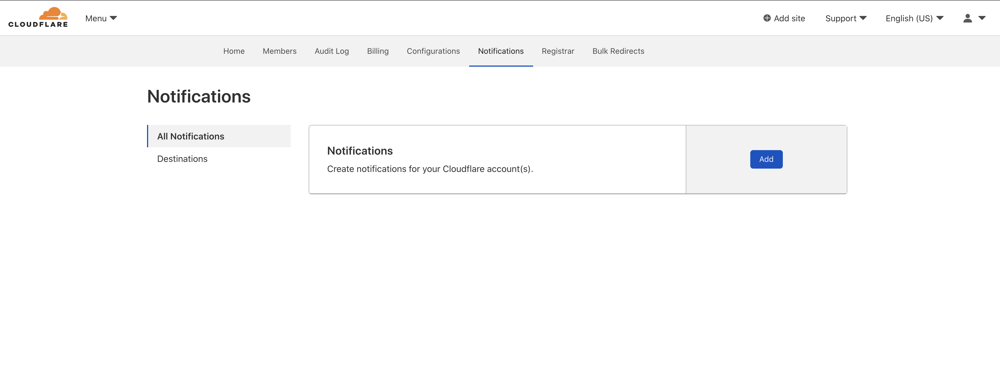
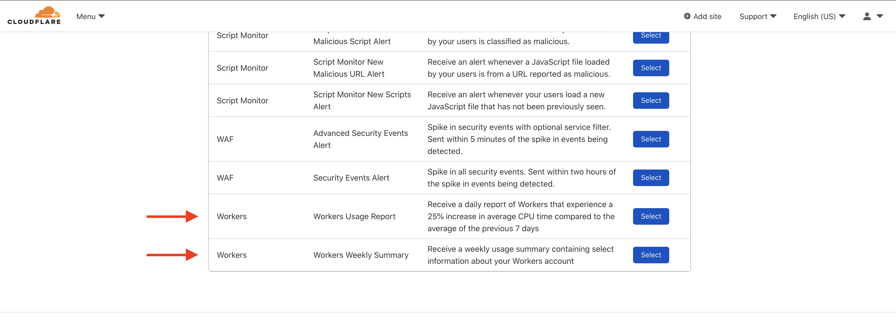

# Get started guide

Cloudflare Workers is a serverless application platform running on Cloudflare’s global [cloud network](https://www.cloudflare.com/learning/serverless/glossary/what-is-edge-computing/) in over 200 cities around the world, offering both [free and paid plans](/platform/pricing).

Learn more about [how Workers works](/learning/how-workers-works).

<Aside type ="note" header="Try the Playground">

The quickest way to experiment with Cloudflare Workers is in the [Playground](https://cloudflareworkers.com/#36ebe026bf3510a2e5acace89c09829f:about:blank). The Playground does not require any setup. It is a simple, instant way to preview and test a Workers script directly in the browser against any site.

</Aside>

This guide will instruct you through setting up a Cloudflare account to deploying your first Worker script.

--------------------------------

## 1. Sign up for a Workers account

Before you can start [publishing](/cli-wrangler/commands#publish) your Workers on your own domain or a free `*.workers.dev` subdomain, you must sign up for a Cloudflare Workers account.

<p><Button type="primary" href="https://dash.cloudflare.com/sign-up/workers">Sign up</Button></p>

The signup process will guide you through choosing a `*.workers.dev` subdomain and verifying your email address, both of which are required to publish.

--------------------------------

## 2. Install the Workers CLI

Installing `wrangler`, the Workers CLI, gives you the freedom to [`generate`](/cli-wrangler/commands#generate), [`configure`](/cli-wrangler/commands#configure), [`build`](/cli-wrangler/commands#build), [`preview`](/cli-wrangler/commands#preview), and [`publish`](/cli-wrangler/commands#publish) your Workers projects from the comfort of your development environment.

To install [`wrangler`](https://github.com/cloudflare/wrangler), ensure you have [`npm` installed](https://www.npmjs.com/get-npm), preferably using a Node version manager like [Volta](https://volta.sh/) or [nvm](https://github.com/nvm-sh/nvm) to avoid permission issues or to easily change Node.js versions, then run:

```sh
$ npm install -g @cloudflare/wrangler
```
or install with yarn:

```sh
$ yarn global add @cloudflare/wrangler
```

Then run `wrangler --version` to confirm that the installation was successful:

```sh
$ wrangler --version
👷 ✨  wrangler 1.19.4
```

--------------------------------

## 3. Configure the Workers CLI

With installation complete, `wrangler` will need access to a Cloudflare OAuth token to manage Workers resources on your behalf.

Run the command `wrangler login`, which will automate this process.

Wrangler will attempt to automatically open your web browser to complete the login process to your Cloudflare account. If you have issues completing this step or you do not have access to a browser GUI, you can copy and paste the URL generated by `wrangler login` in your terminal into a browser and log in.

```sh
$ wrangler login
Allow Wrangler to open a page in your browser? [y/n]
y
💁  Opened a link in your default browser: https://dash.cloudflare.com/oauth2/...
```

Open the browser, log into your account, and select **Allow**. This will send an OAuth Token to Wrangler so it can deploy your scripts to Cloudflare.

--------------------------------

## 4. Generate a new project

Wrangler’s `generate` [command](/cli-wrangler/commands#generate) will create a new project. By default, the [default starter](https://github.com/cloudflare/worker-template) template will be used to generate a new project. To provide a custom template, you may provide the [template argument](/cli-wrangler/commands#generate) with a URL to your desired repository. For example, to create a Worker from the default template called `my-worker`, run:

```sh
~/ $ wrangler generate my-worker
```

Wrangler will create a directory called `my-worker` and populate it with the contents of the starter template, in this case the default template. Wrangler will automatically configure the `wrangler.toml` file in the project’s root with the `name = "my-worker"`.

```sh
~/ $ cd my-worker
~/my-worker $ ls
CODE_OF_CONDUCT.md LICENSE_MIT        index.js           wrangler.toml
LICENSE_APACHE     README.md          package.json

~/my-worker $ cat wrangler.toml
name = "my-worker"
type = "javascript"
account_id = ""
workers_dev = true
route = ""
zone_id = ""
```

Refer to the [Quick Starts](/get-started/quickstarts) page to see a complete list of starter templates.

For example, to build a Workers project in TypeScript, run:

```sh
~/ $ wrangler generate my-typescript-worker https://github.com/cloudflare/worker-typescript-template
```

To start a project from your own code — rather than a starter — use [`wrangler init`](/cli-wrangler/commands#init).

--------------------------------

## 5. Write code

With your new project generated, you can begin to write your code.

### 5a. Understanding Hello World

Fundamentally, a Workers application consists of two parts:

1. An [event listener](/runtime-apis/add-event-listener) that listens for [`FetchEvents`](/runtime-apis/fetch-event), and
2. An event handler that returns a [Response](/runtime-apis/response) object which is passed to the event’s `.respondWith()` method.

When a request is received on one of Cloudflare’s edge servers for a URL matching a Workers script, it passes the request to the Workers runtime. This dispatches a [`FetchEvent`](/runtime-apis/fetch-event) in the [isolate](/learning/how-workers-works#isolates) where the script is running.

```js
---
filename: ~/my-worker/index.js
---
addEventListener("fetch", event => {
  event.respondWith(handleRequest(event.request))
})

async function handleRequest(request) {
  return new Response("Hello worker!", {
    headers: { "content-type": "text/plain" }
  })
}
```

Below is an example of the request response workflow:

1. An event listener for the `FetchEvent` tells the script to listen for any request coming to your Worker. The event handler is passed the `event` object, which includes `event.request`, a [`Request`](/runtime-apis/request) object which is a representation of the HTTP request that triggered the `FetchEvent`.

2. The call to [`.respondWith()`](/runtime-apis/fetch-event#methods) lets the Workers runtime intercept the request in order to send back a custom response (in this example, the plain text “Hello worker!”).

    - The `FetchEvent` handler typically culminates in a call to the method `.respondWith()` with either a [`Response`](/runtime-apis/response) or `Promise<Response>` that determines the response.

    - The `FetchEvent` object also provides [two other methods](/runtime-apis/fetch-event#methods) to handle unexpected exceptions and operations that may complete after a response is returned.

Learn more about [the `FetchEvent` lifecycle](/learning/fetch-event-lifecycle).

### 5b. Routing and filtering requests

After writing a basic script for all requests, the next step is generating a dynamic response based on the requests the Worker script is receiving. This is often referred to as routing.

#### Option 1: Manually route requests

Use standard JavaScript branching logic, such as `if`/`else` or `switch` statements, to conditionally return different responses or execute different handlers based on the request:

```js
---
filename: ~/my-worker/index.js
highlight: [7, 8, 9, 10, 11]
---
addEventListener("fetch", event => {
  event.respondWith(handleRequest(event.request))
})

async function handleRequest(request) {
  let response
  if (request.method === "POST") {
    response = await generate(request)
  } else {
    response = new Response("Expected POST", { status: 500 })
  }
  // ...
}
```

It is common to route requests based on:

- `request.method` — for example, `GET` or `POST`.
- `request.url` — for example, filter based on query parameters or the pathname.
- `request.headers` — filter based on specific headers.

Refer to a full list of [all properties of a `Request` object](/runtime-apis/request#properties).

In addition to standard request properties, the Workers platform populates the request with a [`cf` object](/runtime-apis/request#incomingrequestcfproperties), containing many useful properties, for example, the `region` or `timezone`.

#### Option 2: Use a template for routing on URL

For more complex routing, it is recommended to use a library. The [Workers router starter](https://github.com/cloudflare/worker-template-router) template provides an API similar to ExpressJS for handling requests based on HTTP methods and paths:

```sh
~/ $ wrangler generate my-worker-with-router https://github.com/cloudflare/worker-template-router
```

This starter is used in the tutorial for [building a Slack Bot](/tutorials/build-a-slackbot).

### 5c. Make use of runtime APIs

The example outlined in this guide is a starting point. There are many Workers [runtime APIs](/runtime-apis) available to manipulate requests and generate responses. For example, you can use the [HTMLRewriter API](/runtime-apis/html-rewriter) to parse and dynamically transform HTML, use the [Cache API](/runtime-apis/cache) to retrieve data from and put data into [the Cloudflare cache](/learning/how-the-cache-works), compute a custom response right from the edge, redirect the request to another service, and more.

For inspiration, refer to [Built with Workers](https://workers.cloudflare.com/built-with) for a showcase of projects.

--------------------------------

## 6. Preview your project

In order to preview your Worker, you need to configure your project by adding your `Account ID` to your project's `wrangler.toml` file.

Run the command `wrangler whoami` and copy your `Account ID`.

```bash
$ wrangler whoami
👋  You are logged in with an API Token, associated with the email '<Your Email>'.

+----------------------------------+----------------------------------+
| Account Name                     | Account ID                       |
+----------------------------------+----------------------------------+
| Your Account                     | $yourAccountId                   |
+----------------------------------+----------------------------------+
```

Open your project's `wrangler.toml` file and paste it in as the value for the `account_id` field.

```toml
---
filename: wrangler.toml
highlight: [2]
---
name = "my-worker"
account_id = "$yourAccountId"
```

Once you have filled in your `account_id`, you are ready to preview your code. Run the `wrangler dev` command:

```sh
~/my-worker $ wrangler dev
💁  watching "./"
👂  Listening on http://127.0.0.1:8787
```

This command will build your project, run it locally, and return a URL for you to visit to preview the Worker.

<Aside header="A note about building">

Running `wrangler dev` and `wrangler publish` both run `wrangler build` beforehand automatically, but it can be useful to run `build` separately to check for errors. Running `wrangler build` installs the necessary dependencies for your project and compiles it to make it ready for previewing or deployment. Learn [more about Wrangler](/cli-wrangler/commands).

</Aside>

--------------------------------

## 7. Configure your project for deployment

To configure your project, fill in the missing fields in the `wrangler.toml` file in the root directory of your generated project. This file contains the information Wrangler needs to connect to the Cloudflare Workers API and publish your code.

You should have already filled in the `account_id` field in the previous step. If not, run the command `wrangler whoami` and copy your `Account ID`.

```bash
$ wrangler whoami
👋  You are logged in with an API Token, associated with the email '<Your Email>'!

+----------------------------------+----------------------------------+
| Account Name                     | Account ID                       |
+----------------------------------+----------------------------------+
| Your Account                     | $yourAccountId                   |
+----------------------------------+----------------------------------+
```

Then, open up your project's `wrangler.toml` file and paste it in as the value for the `account_id` field.

```toml
---
filename: wrangler.toml
highlight: [2]
---
name = "my-worker"
account_id = "$yourAccountId"
```

After you have filled in your `account_id`, configure the `type` to `"webpack"` in your `wrangler.toml` file to tell Wrangler to use [Webpack](/cli-wrangler/webpack) to package your project for deployment. To learn more about `type` configuration, refer to the [`type` configuration](/cli-wrangler/configuration) page.

```toml
---
filename: wrangler.toml
highlight: [3]
---
name = "my-worker"
workers_dev = true
account_id = "$yourAccountId"
type = "webpack"
```

By default, this project will deploy to your `*.workers.dev` subdomain because the `workers_dev` value is set to `true`. When deploying to a `*.workers.dev` subdomain, the `name` field will be used as the secondary subdomain for the deployed script (for example, `my-worker.my-subdomain.workers.dev`).

### (Optional) Configure for deploying to a registered domain

To publish your application on a zone you own, and not a `*.workers.dev` subdomain, you can add a `route` key to your `wrangler.toml` file.

You can get your `zone_id` with the following steps:

1. [**Log in** to your Cloudflare account](https://dash.cloudflare.com/login) and select the desired zone.
2. If not already there, navigate to **Overview** in the dashboard.
3. Scroll down until you see **Zone ID** on the right.
4. Click **Click to copy** below the input.

Wrangler’s environments feature allows you to deploy the same project to multiple places under multiple names. For a complete guide on how to configure environments, refer to the [environments page](/platform/environments).

To add a `production` environment, pass in a `zone_id` and `route`:

```toml
---
filename: wrangler.toml
highlight: [6, 7, 8, 9, 10, 11]
---
name = "my-worker"
account_id = "$yourAccountId"
type = "webpack"
workers_dev = true

[env.production]
# The ID of the domain to deploying to
zone_id = "$yourZoneId"

# The route pattern your Workers application will be served at
route = "example.com/*"
```

The `route` key here is a [route pattern](/platform/routes), which can contain wildcards.

If your route is configured to a hostname, you will need to add a DNS record to Cloudflare to ensure that the hostname can be resolved externally. If your Worker acts as your origin (that is, the request terminates in a Worker), you must add a DNS record. 

You may enter a placeholder `AAAA` record pointing to `100::`, which must be proxied through Cloudflare (orange-cloud in the DNS settings). This value specifically is the [reserved IPv6 discard prefix](https://tools.ietf.org/html/rfc6666) but is not the only value allowed. For example, you may also use an `A` record pointed to `192.0.2.1` or a `CNAME` pointed to any resolvable target. 

Whichever method you choose, your record must be proxied through Cloudflare (orange-clouded) and resolve successfully. 

--------------------------------

## 8. Publish your project

With your project configured, you can now publish your Worker.

To deploy to your `*.workers.dev` subdomain, run:

```sh
---
header: Publish to workers.dev
---
~/my-worker $ wrangler publish
```

<Aside type="note" header="Note">

When pushing to your `*.workers.dev` subdomain for the first time, you may initially see [`523` errors](https://support.cloudflare.com/hc/articles/115003011431#523error) while DNS is propagating. It should work without any errors after a minute or so.

</Aside>

### (Optional) Publish your project to a registered domain

To deploy the production environment set in your `wrangler.toml` file in the [optional configuration step](/get-started/guide#optional-configure-for-deploying-to-a-registered-domain), pass the `--env` flag to the command:

```sh
---
header: Publish to example.com
---
~/my-worker $ wrangler publish --env production
```

For more information on environments, refer to the [Wrangler documentation](/cli-wrangler/configuration#environments).

You can also configure a GitHub repository to automatically deploy every time you `git push`. You can do this by either using the [Workers GitHub action](https://github.com/marketplace/actions/deploy-to-cloudflare-workers-with-wrangler), or by writing your own GitHub action and manually configuring the necessary [GitHub secrets](https://docs.github.com/en/actions/configuring-and-managing-workflows/creating-and-storing-encrypted-secrets).

--------------------------------

## 9. Turn on/off usage notifications

Cloudflare provides two kinds of usage notifications: Workers Weekly Summary and Workers Usage Report. They are automatically enabled when you create a new free account with Workers.

Workers Weekly Summary provides a breakdown of your overall Workers usage for your most popular Workers.



Workers Usage Report is an on-demand usage notification that is triggered when a Worker's CPU usage is 25% above its average CPU usage over the previous seven days.

<Aside type ="note" header="Workers Unbound">

If you are on Workers Unbound, you will also see duration and [egress data usage (which you are not billed on)](/learning/metrics-and-analytics#egress-data).

</Aside>



You can turn usage notifications on or off by going to **Account Home** > **Notifications**.



Select **Add** and scroll down to Workers.



After you enable notifications and add recipients, edit or turn off notifications by returning to **Notifications**.


--------------------------------

## Next steps

This is just the beginning of what you can do with Cloudflare Workers. To do more with Workers, refer to the [Tutorials](/tutorials) section.
