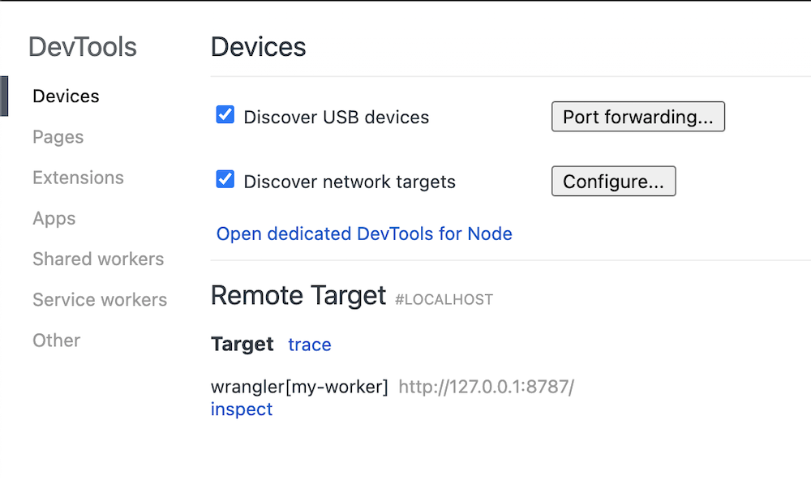
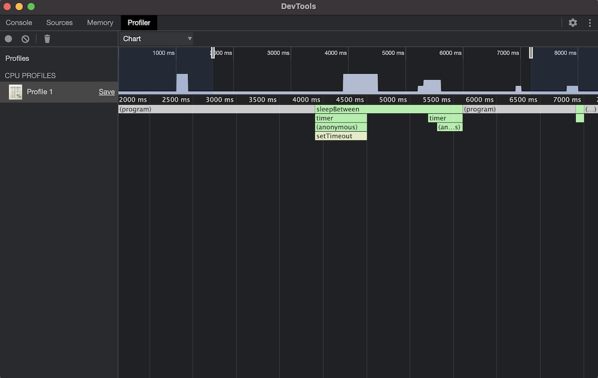

# Profiling Workers

For long-running or complex Workers, `wrangler inspect` (beta) will help you understand which parts of your code require the most time to execute.

As part of the Workers platform's integration with Chrome Developer Tools, you can use `wrangler dev --inspect` to get a CPU profile of your Worker.

<StreamVideo id="f11809a382160334e9be9a2aedf13d1d" />

`wrangler inspect` is only available in Wrangler v1.19.3 or later. Check what version you have before continuing. If you need to update Wrangler, refer to the guide on [upgrading Wrangler](https://developers.cloudflare.com/workers/cli-wrangler/install-update).

## Profiling an example project

Create a new Workers project with the `wrangler generate` command:

```sh
$ wrangler generate my-worker
```

Open the `index.js` file in your project's directory and replace the content with:

```javascript
addEventListener("fetch", (event) => {
  event.respondWith(handleRequest(event.request));
});

const timer = (ms) => new Promise((res) => setTimeout(res, ms));

async function sleepBetween() {
  let result = 0;

  for (let i = 0; i < 100; i++) {
    result += i;
    await timer(100);
  }

  return result;
}

async function handleRequest(request) {
  await sleepBetween();

  return new Response("Hello worker!", {
    headers: { "content-type": "text/plain" },
  });
}
```

This is a basic example where the Worker's request handler calls an async function `sleepBetween`. The function iterates from 0 to 100, but after each iteration, it calls `timer(100)`, which will sleep for 100 milliseconds. This function will simulate slow code, which you can use to test out the profiler.

### Profiling our Worker

With your `index.js` file updated and saved, go to your terminal and run `wrangler dev --inspect`. You will see additional instructions for configuring Chrome DevTools.

```sh
$ wrangler dev --inspect
💁  watching "./"
🕵️  Open chrome://inspect, click 'Configure', and add localhost:9230
👂  Listening on http://127.0.0.1:8787
```

Open a new tab in Chrome and enter `chrome://inspect` in the Chrome address bar to open Chrome's DevTools. Select **Configure...** and add `localhost:9230`. The Wrangler inspect process will then show up under **Remote Target**.



Select **inspect** to open DevTools.

<Aside type="note">

Currently, Wrangler only supports the **Console**, **Sources** and **Profiler** tabs.

</Aside>

### Capturing a CPU profile

With the DevTools open, select the **Profile** tab > **Start**. Open a new tab with your Worker running locally `http://127.0.0.1:8787`. Visiting this address will invoke the Worker again and allow DevTools to capture execution information. When it finishes loading, go back to the DevTools window and select **Stop**.

There are three ways to view the CPU profiling data:

1. **Tree** - a top-down view of all functions called. Starting with top-level functions and nesting subsequent calls under each one.
2. **Heavy** - a bottom-up view of all functions called. Starting with the final functions in the stack and nesting parent calls under each one.
3. **Chart** - a flame chart that will show all function calls and how much time was spent in each function execution.

To find slow functions, enter the **Chart** view and search for the last long function in a stack.



A function's total runtime is determined by the runtime of all the functions it calls. You will want to find the function with the longest **Self Time**, or the last big runtime before it finishes or splits into smaller calls. For more information on using the DevTools, refer to the [official Chrome documentation](https://developer.chrome.com/docs/devtools/).

In the example image above, `sleepBetween` has the longest runtime.

You can also arrive at this conclusion through the **Heavy** view, which allows you to sort by **Self Time** or **Total Time**. When you sort by **Self Time** and ignore any items in parenthesis, you can identify the functions with the longest execution time.
