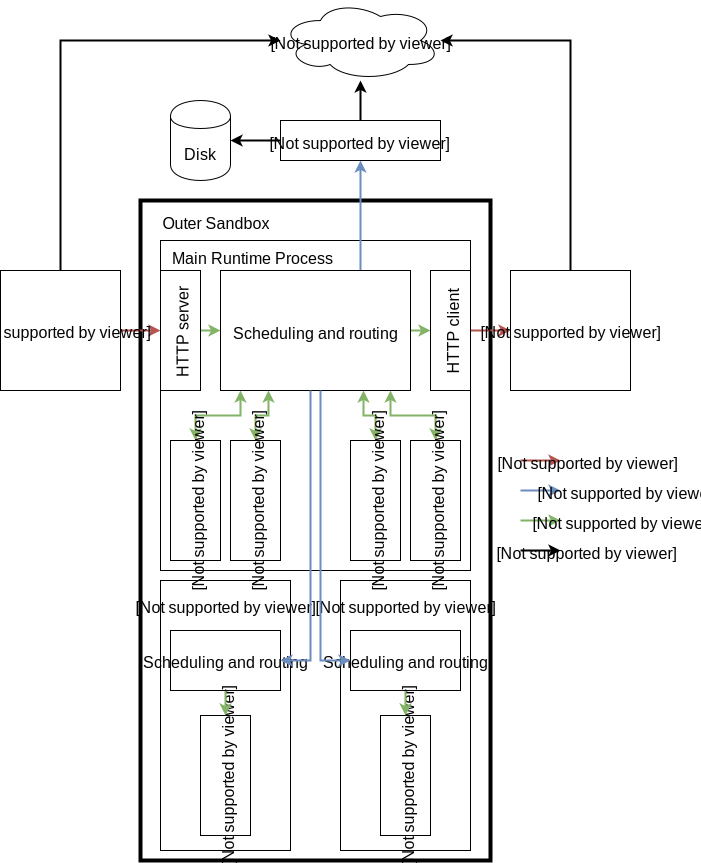

# Security model

This article includes an overview of our security architecture, and then addresses two specific issues that we are frequently asked about: V8 bugs, and Spectre.

Since the very start of the Workers project, security has been a high priority — we were concerned early on that when hosting a large number of tenants on shared infrastructure, side channels of various kinds would pose a threat. The Cloudflare Workers runtime is carefully designed to defend against side channel attacks.

To this end, Workers is designed to make it impossible for code to measure its own execution time locally. For example, the value returned by Date.now() is locked in place while code is executing. No other timers are provided. Moreover, we provide no access to concurrency (e.g. multi-threading), as it could allow attackers to construct ad hoc timers. These design choices cannot be introduced retroactively into other platforms — such as web browsers — because they remove APIs that existing applications depend on. They were possible in Workers only because we made these choices from the start.

While these early design decisions have proven effective, we are continuing to add defense-in-depth, including techniques to disrupt attacks by rescheduling workers, creating additional layers of isolation between suspicious workers and high-value workers, and more.

Our approach is very different from the approach taken by most of the industry. It is resistant to the entire range of [Spectre-style attacks](https://www.cloudflare.com/learning/security/threats/meltdown-spectre/), without requiring special attention paid to each one and without needing to block speculation in general. However, because our approach is different, we know it requires careful study. We are currently working with researchers at Graz University of Technology (TU Graz) to study what we’ve done. These researchers include some of the people who originally discovered Spectre. We will publish the results of this research as they becomes available.

For more details, please refer to [this talk](https://www.infoq.com/presentations/cloudflare-v8) by Kenton Varda, architect of Cloudflare Workers. Spectre is covered near the end.

## Architectural overview

Let’s start with a quick overview of the Workers Runtime architecture.

<div className="security-page-workers-architecture-diagram">



</div>
<style dangerouslySetInnerHTML={{__html: `
  [theme="dark"] .security-page-workers-architecture-diagram {
    filter: invert(1);
    -webkit-filter: invert(1);
  }
`}}/>

There are two fundamental parts of designing a code sandbox: secure isolation and API design.

### Isolation

First, we need to create an execution environment where code can’t access anything it’s not supposed to.

For this, our primary tool is V8, the JavaScript engine developed by Google for use in Chrome. V8 executes code inside “isolates”, which prevent that code from accessing memory outside the isolate — even within the same process. Importantly, this means we can run many isolates within a single process. This is essential for an edge compute platform like Workers where we must host many thousands of guest apps on every machine, and rapidly switch between these guests thousands of times per second with minimal overhead. If we had to run a separate process for every guest, the number of tenants we could support would be drastically reduced, and we’d have to limit edge compute to a small number of big enterprise customers who could pay a lot of money. With isolate technology, we can make edge compute available to everyone.

Sometimes, though, we do decide to schedule a worker in its own private process. We do this if it uses certain features that we feel need an extra layer of isolation. For example, when a developer uses the devtools debugger to inspect their worker, we run that worker in a separate process. This is because historically, in the browser, the inspector protocol has only been usable by the browser’s trusted operator, and therefore has not received as much security scrutiny as the rest of V8. In order to hedge against the increased risk of bugs in the inspector protocol, we move inspected workers into a separate process with a process-level sandbox. We also use process isolation as an extra defense against Spectre, which I’ll describe later in this post.

Additionally, even for isolates that run in a shared process with other isolates, we run multiple instances of the whole runtime on each machine, which we call “cordons”. Workers are distributed among cordons by assigning each worker a level of trust and separating low-trusted workers from those we trust more highly. As one example of this in operation: a customer who signs up for our free plan will not be scheduled in the same process as an enterprise customer. This provides some defense-in-depth in the case a zero-day security vulnerability is found in V8. But I’ll talk more about V8 bugs, and how we address them, later in this post.

At the whole-process level, we apply another layer of sandboxing for defense in depth. The “layer 2” sandbox uses Linux namespaces and seccomp to prohibit all access to the filesystem and network. Namespaces and seccomp are commonly used to implement containers. However, our use of these technologies is much stricter than what is usually possible in container engines, because we configure namespaces and seccomp after the process has started (but before any isolates have been loaded). This means, for example, we can (and do) use a totally empty filesystem (mount namespace) and use seccomp to block absolutely all filesystem-related system calls. Container engines can’t normally prohibit all filesystem access because doing so would make it impossible to use `exec()` to start the guest program from disk; in our case, our guest programs are not native binaries, and the Workers runtime itself has already finished loading before we block filesystem access.

The layer 2 sandbox also totally prohibits network access. Instead, the process is limited to communicating only over local Unix domain sockets, to talk to other processes on the same system. Any communication to the outside world must be mediated by some other local process outside the sandbox.

One such process in particular, which we call the “supervisor”, is responsible for fetching worker code and configuration from disk or from other internal services. The supervisor ensures that the sandbox process cannot read any configuration except that which is relevant to the workers that it should be running.

For example, when the sandbox process receives a request for a worker it hasn’t seen before, that request includes the encryption key for that worker’s code (including attached secrets). The sandbox can then pass that key to the supervisor in order to request the code. The sandbox cannot request any worker for which it has not received the appropriate key. It cannot enumerate known workers. It also cannot request configuration it doesn’t need; for example, it cannot request the TLS key used for HTTPS traffic to the worker.

Aside from reading configuration, the other reason for the sandbox to talk to other processes on the system is to implement APIs exposed to Workers. Which brings us to API design.

### API design

There is a saying: “If a tree falls in the forest, but no one is there to hear it, does it make a sound?” We have a related saying: “If a Worker executes in a fully-isolated environment in which it is totally prevented from communicating with the outside world, does it actually run?”

Complete code isolation is, in fact, useless. In order for Workers to do anything useful, they have to be allowed to communicate with users. At the very least, a Worker needs to be able to receive requests and respond to them. It would also be nice if it could send requests to the world, safely. For that, we need APIs.

In the context of sandboxing, API design takes on a new level of responsibility. Our APIs define exactly what a Worker can and cannot do. We must be very careful to design each API so that it can only express operations which we want to allow, and no more. For example, we want to allow Workers to make and receive HTTP requests, while we do not want them to be able to access the local filesystem or internal network services.

Let’s dig into the easier example first. Currently, Workers does not allow any access to the local filesystem. Therefore, we do not expose a filesystem API at all. No API means no access.

But, imagine if we did want to support local filesystem access in the future. How would we do that? We obviously wouldn’t want Workers to see the whole filesystem. Imagine, though, that we wanted each Worker to have its own private directory on the filesystem where it can store whatever it wants.

To do this, we would use a design based on [capability-based security](https://en.wikipedia.org/wiki/Capability-based_security). Capabilities are a big topic, but in this case, what it would mean is that we would give the worker an object of type `Directory`, representing a directory on the filesystem. This object would have an API that allows creating and opening files and subdirectories, but does not permit traversing “up” the tree to the parent directory. Effectively, each worker would see its private `Directory` as if it were the root of their own filesystem.

How would such an API be implemented? As described above, the sandbox process cannot access the real filesystem, and we’d prefer to keep it that way. Instead, file access would be mediated by the supervisor process. The sandbox talks to the supervisor using [Cap’n Proto RPC](https://capnproto.org/rpc.html), a capability-based RPC protocol. (Cap’n Proto is an open source project currently maintained by the Cloudflare Workers team.) This protocol makes it very easy to implement capability-based APIs, so that we can strictly limit the sandbox to accessing only the files that belong to the Workers it is running.

Now what about network access? Today, Workers are allowed to talk to the rest of the world only via HTTP — both incoming and outgoing. There is no API for other forms of network access, therefore it is prohibited (though we plan to support other protocols in the future).

As mentioned before, the sandbox process cannot connect directly to the network. Instead, all outbound HTTP requests are sent over a Unix domain socket to a local proxy service. That service implements restrictions on the request. For example, it verifies that the request is either addressed to a public Internet service, or to the Worker’s zone’s own origin server, not to internal services that might be visible on the local machine or network. It also adds a header to every request identifying the worker from which it originates, so that abusive requests can be traced and blocked. Once everything is in order, the request is sent on to our HTTP caching layer, and then out to the Internet.

Similarly, inbound HTTP requests do not go directly to the Workers Runtime. They are first received by an inbound proxy service. That service is responsible for TLS termination (the Workers Runtime never sees TLS keys), as well as identifying the correct Worker script to run for a particular request URL. Once everything is in order, the request is passed over a Unix domain socket to the sandbox process.

## V8 bugs and the “patch gap”

Every non-trivial piece of software has bugs, and sandboxing technologies are no exception. Virtual machines have bugs, containers have bugs, and yes, isolates (which we use) also have bugs. We can’t live life pretending that no further bugs will ever be discovered; instead, we must assume they will and plan accordingly.

We rely heavily on isolation provided by V8, the JavaScript engine built by Google for use in Chrome. This has good sides and bad sides. On one hand, V8 is an extraordinarily complicated piece of technology, creating a wider “attack surface” than virtual machines. More complexity means more opportunities for something to go wrong. On the bright side, though, an extraordinary amount of effort goes into finding and fixing V8 bugs, owing to its position as arguably the most popular sandboxing technology in the world. Google regularly pays out 5-figure bounties to anyone finding a V8 sandbox escape. Google also operates fuzzing infrastructure that automatically finds bugs faster than most humans can. Google’s investment does a lot to minimize the danger of V8 “zero-days” — bugs that are found by the bad guys and not known to Google.

But, what happens after a bug is found and reported by the good guys? V8 is open source, so fixes for security bugs are developed in the open and released to everyone at the same time — good guys and bad guys. It’s important that any patch be rolled out to production as fast as possible, before the bad guys can develop an exploit.

The time between publishing the fix and deploying it is known as the “patch gap”. Earlier this year, [Google announced that Chrome’s patch gap had been reduced from 33 days to 15 days](https://www.zdnet.com/article/google-cuts-chrome-patch-gap-in-half-from-33-to-15-days/).

Fortunately, we have an advantage here, in that we directly control the machines on which our system runs. We have automated almost our entire build and release process, so the moment a V8 patch is published, our systems automatically build a new release of the Workers Runtime and, after one-click sign-off from the necessary (human) reviewers, automatically push that release out to production.

As a result, our patch gap is now under 24 hours. A patch published by V8’s team in Munich during their work day will usually be in production before the end of our work day in the US.

## Spectre: Introduction


We get a lot of questions about Spectre. The V8 team at Google has stated in no uncertain terms that [V8 itself cannot defend against Spectre](https://arxiv.org/abs/1902.05178). Since Workers relies on V8 for sandboxing, many have asked if that leaves Workers vulnerable. However, we do not need to depend on V8 for this; the Workers environment presents many alternative approaches to mitigating Spectre.

Spectre is complicated and nuanced, and there’s no way we can cover everything there is to know about it or how Workers addresses it in a single article. But, hopefully we can clear up some of the confusion and concern.

### What is it?

Spectre is a class of attacks in which a malicious program can trick the CPU into “speculatively” performing computation using data that the program is not supposed to have access to. The CPU eventually realizes the problem and does not allow the program to see the results of the speculative computation. However, the program may be able to derive bits of the secret data by looking at subtle side effects of the computation, such as the effects on cache.

[For more background about Spectre, check out our Learning Center page on the topic.](https://www.cloudflare.com/learning/security/threats/meltdown-spectre/)

### Why does it matter for Workers?

Spectre encompasses a wide variety of vulnerabilities present in modern CPUs. The specific vulnerabilities vary by architecture and model, and it is likely that many vulnerabilities exist which haven’t yet been discovered.

These vulnerabilities are a problem for every cloud compute platform. Any time you have more than one tenant running code on the same machine, Spectre attacks come into play. However, the “closer together” the tenants are, the more difficult it can be to mitigate specific vulnerabilities. Many of the known issues can be mitigated at the kernel level (protecting processes from each other) or at the hypervisor level (protecting VMs), often with the help of CPU microcode updates and various tricks (many of which, unfortunately, come with serious performance impact).

In Cloudflare Workers, we isolate tenants from each other using V8 isolates — not processes nor VMs. This means that we cannot necessarily rely on OS or hypervisor patches to “solve” Spectre for us. We need our own strategy.

### Why not use process isolation?

Cloudflare Workers is designed to run your code in every single Cloudflare location, of which there are currently 200 worldwide and growing.

We wanted Workers to be a platform that is accessible to everyone — not just big enterprise customers who can pay megabucks for it. We need to handle a huge number of tenants, where many tenants get very little traffic.

Combine these two points, and things get tricky.

A typical, non-edge serverless provider could handle a low-traffic tenant by sending all of that tenant’s traffic to a single machine, so that only one copy of the application needs to be loaded. If the machine can handle, say, a dozen tenants, that’s plenty. That machine can be hosted in a mega-datacenter with literally millions of machines, achieving economies of scale. However, this centralization incurs latency and worldwide bandwidth costs when the users don’t happen to be nearby.

With Workers, on the other hand, every tenant, regardless of traffic level, currently runs in every Cloudflare location. And in our quest to get as close to the end user as possible, we sometimes choose locations that only have space for a limited number of machines. The net result is that we need to be able to host thousands of active tenants per machine, with the ability to rapidly spin up inactive ones on-demand. That means that each guest cannot take more than a couple megabytes of memory — hardly enough space for a call stack, much less everything else that a process needs.

Moreover, we need context switching to be extremely cheap. Many Workers resident in memory will only handle an event every now and then, and many Workers spend less than a fraction of a millisecond on any particular event. In this environment, a single core can easily find itself switching between thousands of different tenants every second. Moreover, to handle one event, a significant amount of communication needs to happen between the guest application and its host, meaning still more switching and communications overhead. If each tenant lives in its own process, all this overhead is orders of magnitude larger than if many tenants live in a single process. When using strict process isolation in Workers, we find the CPU cost can easily be 10x what it is with a shared process.

In order to keep Workers inexpensive, fast, and accessible to everyone, we must solve these issues, and that means we must find a way to host multiple tenants in a single process.

### There is no “fix” for Spectre

A dirty secret that the industry doesn’t like to admit: no one has “fixed” Spectre. Not even when using heavyweight virtual machines. Everyone is still vulnerable.

The current approach being taken by most of the industry is essentially a game of whack-a-mole. Every couple months, researchers uncover a new Spectre vulnerability. CPU vendors release some new microcode, OS vendors release kernel patches, and everyone has to update.

But is it enough to merely deploy the latest patches?

It is abundantly clear that many more vulnerabilities exist, but haven’t yet been publicized. Who might know about those vulnerabilities? Most of the bugs being published are being found by (very smart) graduate students on a shoestring budget. Imagine, for a minute, how many more bugs a well-funded government agency, able to buy the very best talent in the world, could be uncovering.

To truly defend against Spectre, we need to take a different approach. It’s not enough to block individual known vulnerabilities. We must address the entire class of vulnerabilities at once.

### We can’t stop it, but we can slow it down

Unfortunately, it’s unlikely that any catch-all “fix” for Spectre will be found. But for the sake of argument, let’s try.

Fundamentally, all Spectre vulnerabilities use side channels to detect hidden processor state. Side channels, by definition, involve observing some non-deterministic behavior of a system. Conveniently, most software execution environments try hard to eliminate non-determinism, because non-deterministic execution makes applications unreliable.

However, there are a few sorts of non-determinism that are still common. The most obvious among these is timing. The industry long ago gave up on the idea that a program should take the same amount of time every time it runs, because deterministic timing is fundamentally at odds with heuristic performance optimization. Sure enough, most Spectre attacks focus on timing as a way to detect the hidden microarchitectural state of the CPU.

Some have proposed that we can solve this by making timers inaccurate or adding random noise. However, it turns out that this does not stop attacks; it only makes them slower. If the timer tracks real time at all, then anything you can do to make it inaccurate can be overcome by running an attack multiple times and using statistics to filter out the noise.

Many security researchers see this as the end of the story. What good is slowing down an attack, if the attack is still possible? Once the attacker gets your private key, it’s game over, right? What difference does it make if it takes them a minute or a month?

### Cascading slow-downs
We find that, actually, measures that slow down an attack can be powerful.

Our key insight is this: as an attack becomes slower, new techniques become practical to make it even slower still. The goal, then, is to chain together enough techniques that an attack becomes so slow as to be uninteresting.

Much of cryptography, after all, is technically vulnerable to “brute force” attacks — technically, with enough time, you can break it. But when the time required is thousands (or even billions) of years, we decide that this is good enough.

So, what do we do to slow down Spectre attacks to the point of meaninglessness?

## Freezing a Spectre attack


### Step 0: Don’t allow native code

We do not allow our customers to upload native-code binaries to run on our network. We only accept JavaScript and WebAssembly. Of course, many other languages, like Python, Rust, or even Cobol, can be compiled or transpiled to one of these two formats; the important point is that we do another pass on our end, using V8, to convert these formats into true native code.

This, in itself, doesn’t necessarily make Spectre attacks harder. However, I present this as step 0 because it is fundamental to enabling everything else below.

Accepting native code programs implies being beholden to an existing CPU architecture (typically, x86). In order to execute code with reasonable performance, it is usually necessary to run the code directly on real hardware, severely limiting the host’s control over how that execution plays out. For example, a kernel or hypervisor has no ability to prohibit applications from invoking the CLFLUSH instruction, an instruction [which is very useful in side channel attacks](https://gruss.cc/files/flushflush.pdf) and almost nothing else.

Moreover, supporting native code typically implies supporting whole existing operating systems and software stacks, which bring with them decades of expectations about how the architecture works under them. For example, x86 CPUs allow a kernel or hypervisor to disable the RDTSC instruction, which reads a high-precision timer. Realistically, though, disabling it will break many programs because they are implemented to use RDTSC any time they want to know the current time.

Supporting native code would bind our hands in terms of mitigation techniques. By using an abstract intermediate format, we have much greater freedom.

### Step 1: Disallow timers and multi-threading

In Workers, you can get the current time using the JavaScript Date API, for example by calling `Date.now()`. However, the time value returned by this is not really the current time. Instead, it is the time at which the network message was received which caused the application to begin executing. While the application executes, time is locked in place. For example, say an attacker writes:

```javascript
let start = Date.now();
for (let i = 0; i < 1e6; i++) {
  doSpectreAttack();
}
let end = Date.now();
```

The values of `start` and `end` will always be exactly the same. The attacker cannot use `Date` to measure the execution time of their code, which they would need to do to carry out an attack.

<Aside>

This is a measure we actually implemented in mid-2017, long before Spectre was announced (and before we knew about it). We implemented this measure because we were worried about timing side channels in general. Side channels have been a concern of the Workers team from day one, and we have designed our system from the ground up with this concern in mind.

</Aside>

Related to our taming of `Date`, we also do not permit multi-threading or shared memory in Workers. Everything related to the processing of one event happens on the same thread — otherwise, it would be possible to “race” threads in order to ”MacGyver” an implicit timer. We don’t even allow multiple Workers operating on the same request to run concurrently. For example, if you have installed a Cloudflare App on your zone which is implemented using Workers, and your zone itself also uses Workers, then a request to your zone may actually be processed by two Workers in sequence. These run in the same thread.

So, we have prevented code execution time from being measured _locally_. However, that doesn’t actually prevent it from being measured: it can still be measured remotely. For example, the HTTP client that is sending a request to trigger the execution of the Worker can measure how long it takes for the Worker to respond. Of course, such a measurement is likely to be very noisy, since it would have to traverse the Internet. Such noise can be overcome, in theory, by executing the attack many times and taking an average.

<Aside>

Some people have suggested that if a serverless platform like Workers were to completely reset an application’s state between requests, so that every request “starts fresh”, this would make attacks harder. That is, imagine that a Worker’s global variables were reset after every request, meaning you cannot store state in globals in one request and then read that state in the next. Then, doesn’t that mean the attack has to start over from scratch for every request? If each request is limited to, say, 50ms of CPU time, does that mean that a Spectre attack isn’t possible, because there’s not enough time to carry it out? Unfortunately, it’s not so simple. State doesn’t have to be stored in the Worker; it could instead be stored in a conspiring client. The server can return its state to the client in each response, and the client can send it back to the server in the next request.

</Aside>

But is an attack based on remote timers really feasible in practice? **In adversarial testing, with help from leading Spectre experts, we have not been able to develop an attack that actually works in production.**

However, we don’t feel the lack of a working attack means we should stop building defenses. Instead, we’re currently testing some more advanced measures, which we plan to roll out in the coming weeks.

### Step 2: Dynamic process isolation

We know that if an attack is possible at all, it would take a very long time to run — hours at the very least, maybe as long as weeks. But once an attack has been running even for a second, we have a huge amount of new data that we can use to trigger further measures.

Spectre attacks, you see, do a lot of “weird stuff” that you wouldn’t usually expect to see in a normal program. These attacks intentionally try to create pathological performance scenarios in order to amplify microarchitectural effects. This is especially true when the attack has already been forced to run billions of times in a loop in order to overcome other mitigations, like those discussed above. This tends to show up in metrics like CPU performance counters.

Now, the usual problem with using performance metrics to detect Spectre attacks is that sometimes you get false positives. Sometimes, a legitimate program behaves really badly. You can’t go around shutting down every app that has bad performance.

Luckily, we don’t have to. Instead, we can choose to reschedule any Worker with suspicious performance metrics into its own process. As we described above, we can’t do this with every Worker, because the overhead would be too high. But, it’s totally fine to process-isolate just a few Workers, defensively. If the Worker is legitimate, it will keep operating just fine, albeit with a little more overhead. Fortunately for us, the nature of our platform is such that we can reschedule a Worker into its own process at basically any time.

In fact, fancy performance-counter based triggering may not even be necessary here. If a Worker merely uses a large amount of CPU time per event, then the overhead of isolating it in its own process is relatively less, because it switches context less often. So, we might as well use process isolation for any Worker that is CPU-hungry.

Once a Worker is isolated, then we can rely on the operating system’s Spectre defenses, just as like, for example, most desktop web browsers now do.

Over the past year we’ve been working with the experts at Graz Technical University to develop this approach. (TU Graz’s team co-discovered Spectre itself, and has been responsible for a huge number of the follow-on discoveries since then.) We have developed the ability to dynamically isolate workers, and we have identified metrics which reliably detect attacks. The whole system is currently undergoing testing to work out any remaining bugs, and we expect to roll it out fully within the next several weeks.

But didn’t we say earlier that even process isolation isn’t a complete defense, because it only addresses known vulnerabilities? Yes, this is still true. However, the trend over time is that new Spectre attacks tend to be slower and slower to carry out, and hence we can reasonably guess that by imposing process isolation we have further slowed down even attacks that we don’t know about yet.

### Step 3: Periodic whole-memory shuffling

After Step 2, we already think we’ve prevented all known attacks, and we’re only worried about hypothetical unknown attacks. How long does a hypothetical unknown attack take to carry out? Well, obviously, nobody knows. But with all the mitigations in place so far, and considering that new attacks have generally been slower than older ones, we think it’s reasonable to guess attacks will take days or longer.

On a time scale of a day, we have new things we can do. In particular, it’s totally reasonable to restart the entire Workers runtime on a daily basis, which resets the locations of everything in memory, forcing attacks to restart the process of discovering the locations of secrets.

We can also reschedule Workers across physical machines or cordons, so that the window to attack any particular neighbor is limited.

In general, because Workers are fundamentally preemptible (unlike containers or VMs), we have a lot of freedom to frustrate attacks.

Once we have dynamic process isolation fully deployed, we plan to develop these ideas next. We see this as an ongoing investment, not something that will ever be “done”.
