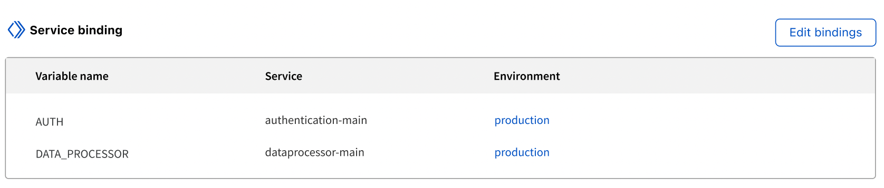
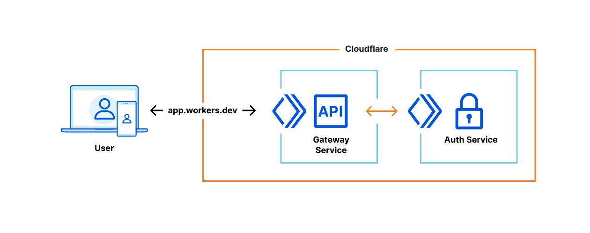
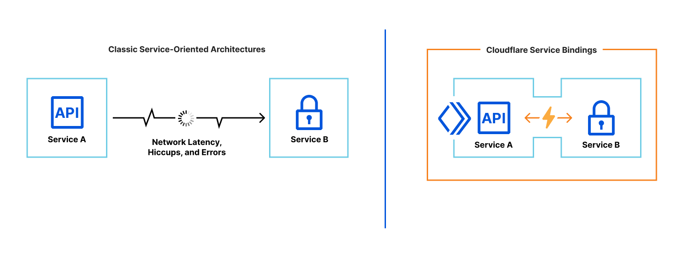

# Services

Services are the new building block for deploying applications on Cloudflare Workers. Unlike the script, a service is composable, which allows services to talk to each other, allowing to develop new kinds of services like routers, middlewares, or traffic gateways - green-blue, canary, mirror deployments gateways.
Services also support multiple environments, which allow you to test changes in a preview environment, then promote to production when you’re confident it worked.

<Aside type="note">

To enable a seamless transition to services, we’ve automatically migrated every script to become a service with one “production” environment — no action needed.

</Aside>

Each service comes with a production environment and the ability to create or clone dozens of preview environments. Every aspect of an environment is overridable: the code, environment variables, and even resources like a KV namespace. You can create and switch between environments with just a few clicks in the dashboard.

## Service environments

<Aside type="note">

Currently, the dashboard is the only way to interact with service environments. Support in Wrangler is coming in [v2.1](https://github.com/cloudflare/wrangler2/issues/27)

</Aside>

Each environment is resolvable at a unique hostname, which is automatically generated when you create or rename the environment. There’s no waiting around after you deploy. Everything you need, like DNS records, SSL certificates, and more, is ready-to-go seconds later. If you’d like a more advanced setup, you can also add custom routes from your domain to an environment.

## Service versions

Each environment in a service has its own version history. Every time there is a code change or an environment variable is updated, the version number of that environment is incremented. You can also append additional metadata to each version, like a git commit or a deployment tag.

## Service bindings

Services are composable, allowing one service to talk to another service. To support this, we’re introducing a new API to facilitate service-to-service communication: service bindings.

<Aside type="warning">

Service bindings are in closed beta currently. Visit [Service Bindings closed beta sign up](https://www.cloudflare.com/en-gb/service-bindings-closed-beta-sign-up/) page to request access.

</Aside>



A service binding allows you to send HTTP requests to another service, without those requests going over the Internet. That means you can invoke other Workers directly from your code! Service bindings open up a new world of composability. In the example below, requests are validated by an authentication service.


<Aside type="note">

Service bindings are supported in the module syntax only.

</Aside>

```js
export default {
  async fetch(request, env) {
    // Fetch AUTH service and pass request
    const response = await env.AUTH.fetch(request);

    // Return response from the AUTH service if the response status is not 200
    // It would return 403 'x-custom-token does not match, request not allowed' response in such case
    if (response.status !== 200) {
      return response;
    }

    // Request allowed
    const data = "" // For example, read data from KV, Durable Objects, or Database
    return new Response(data);
  }
}
```



Service bindings use the standard fetch API, so you can continue to use your existing utilities and libraries. You can also change the environment of a service binding, so you can test a new version of a service. In the next example, 1% of requests are routed to a “canary” deployment of a service. If a request to the canary fails, it’s sent to the production deployment for another chance.

```js
export default {
  canRetry(request) {
    return request.method === "GET" || request.method === "HEAD";
  },
  async fetch(request, environment) {
    if (Math.random() < 0.01) {
      const response = await environment.CANARY.fetch(request.clone());
      if (response.status < 500 || !canRetry(request)) {
        return response;
      }
    }
    return environment.PRODUCTION.fetch(request);
  }
}
```

While the interface among services is HTTP, the networking is not. In fact, there is no networking! Unlike the typical “microservice architecture,” where services communicate over a network and can suffer from latency or interruption, service bindings are a zero-cost abstraction. When you deploy a service, we build a dependency graph of its service bindings, then package all of those services into a single deployment. When one service invokes another, there is no network delay; the request is executed immediately.



This zero-cost model enables teams to share and reuse code within their organizations, without sacrificing latency or performance. Forget the days of convoluted YAML templates or exponential back off to orchestrate services — just write code, and we’ll stitch it all together.

## Related resources

- [Services introduction blog post](https://blog.cloudflare.com/introducing-worker-services/)
