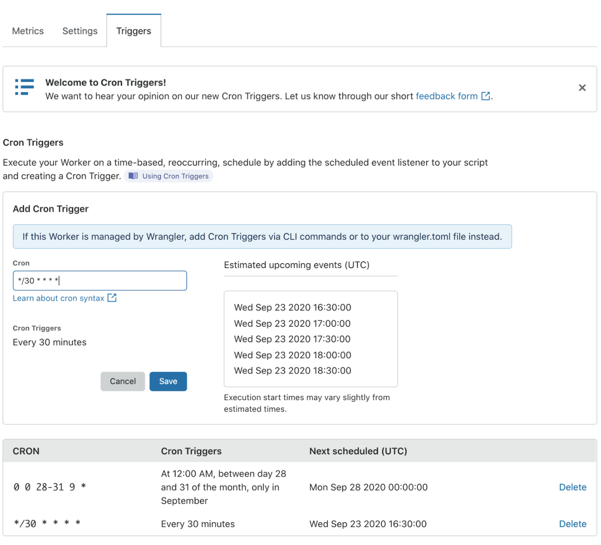
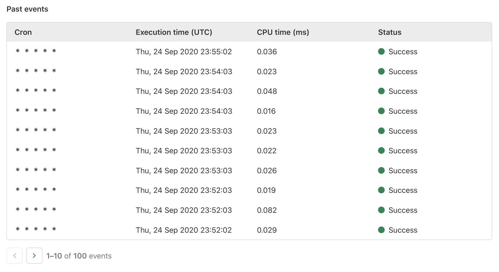

# Cron Triggers

## Background

Cron Triggers allow users to map a cron expression to a Worker script using a [ScheduledEvent](/runtime-apis/scheduled-event) listener that enables Workers to be executed on a schedule. Cron Triggers are ideal for running periodic jobs for maintenance or calling third-party APIs to collect up-to-date data. Workers scheduled by Cron Triggers will run on underutilized machines to make the best use of our capacity and route traffic efficiently.

## Adding Cron Triggers

Cron Triggers can be added to scripts with the Cloudflare API, or in the dashboard on a [Workers Triggers tab](https://dash.cloudflare.com/?to=/:account/workers) up to the [per-script limit](/platform/limits). If a script is managed with Wrangler, Cron Triggers should be exclusively managed through the **`wrangler.toml`** file.

<Aside header="Requires a ScheduledEvent Listener">

In order to respond to a Cron Trigger, a [ScheduledEvent](/runtime-apis/scheduled-event) listener must be added to the Workers script. Similar to the Fetch listener, add your code within the Scheduled listener to specify what the Worker should do under the condition that it was triggered by a Cron Trigger.

</Aside>

## Supported cron expressions

We support cron expressions with 5 fields, along with most "Quartz scheduler"-like cron syntax extensions:

<TableWrap>

Field         | Values  | Characters
--------------|---------|------------
Minute        | 0-59    | * , - /
Hours         | 0-23    | * , - /
Days of Month | 1-31    | * , - / L W
Months        | 1-12, case-insensitive 3-letter abbreviations ("JAN", "aug", etc.) | * , - /
Weekdays      | 1-7, case-insensitive 3-letter abbreviations ("MON", "fri", etc.)  | * , - / L #

</TableWrap>

### Examples

Here are some common time intervals that may be useful for setting up your Cron Trigger.

<Definitions>

- `* * * * *`
  - Every minute

- `*/30 * * * *`
  - Every 30 minutes

- `0 17 * * sun` or `0 17 * * 1`
  - 5PM on Sunday

- `10 7 * * mon-fri` or `10 7 * * 2-6`
  - 7:10AM on weekdays

- `0 15 1 * *`
  - 3PM on first day of the month

- `0 18 * * 6L` or `0 18 * * friL`
  - 6PM on the last Friday of the month

- `23 59 LW * *`
  - 11:59PM on the last weekday of the month

</Definitions>

## Viewing past events

Users can view the execution history of their Cron Triggers on the Past Events section of the [Workers Triggers tab](https://dash.cloudflare.com/?to=/:account/workers) or through Cloudflare's [GraphQL Analytics API](https://developers.cloudflare.com/analytics/graphql-api).

Note: it can take up to 30 minutes before events are displayed in Past Events when creating a new Worker or changing a Worker's name.

See [Metrics and Analytics](/learning/metrics-and-analytics) for more information.
