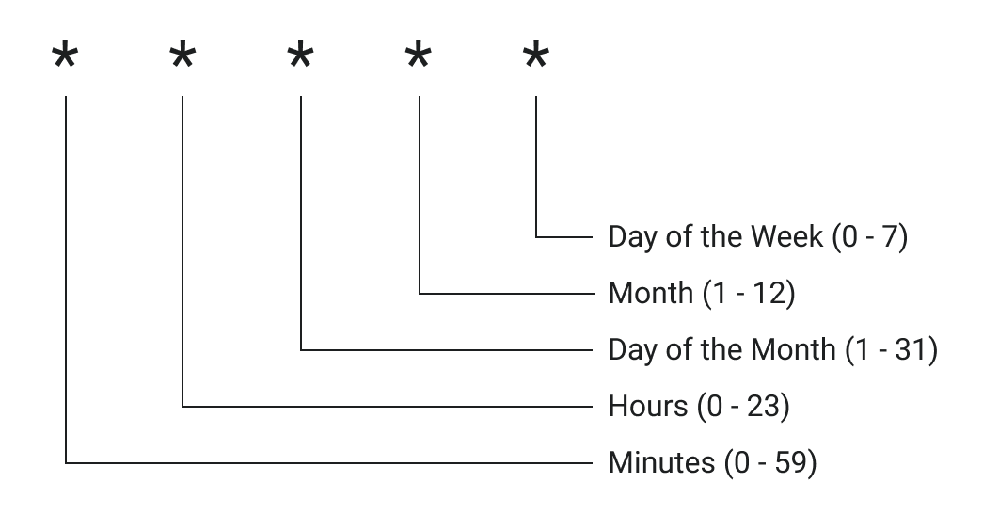

# Cron Triggers

## Background

Cron Triggers allow users to map a cron expression to a Worker script using a [ScheduledEvent](/runtime-apis/scheduled-event) listener that enables Workers to be executed on a schedule. Cron Triggers are ideal for running periodic jobs for maintenance or calling third-party APIs to collect up-to-date data. Workers scheduled by Cron Triggers will run on underutilized machines to make the best use of our capacity and route traffic efficiently.

## Adding Cron Triggers

Cron Triggers can be added to scripts with the Cloudflare API or in the dashboard on a [Workers Triggers tab](https://dash.cloudflare.com/?to=/:account/workers) up to the [per-script limit](/platform/limits).

## Supported cron expressions

We support all cron expressions, including special characters, that evaluate to the supported time specification below:
- Intervals (single executions not supported)
- Minimum interval is 1 minute
- Maximum interval is 12 months

### Examples

Here are some common time intervals that may be useful for setting up your Cron Trigger.

<Definitions>

- `* * * * *`
  - Every minute

- `*/30 * * * *`
  - Every 30 minutes

- `0 17 * * fri`
  - 5PM on Friday

- `0 15 1 * *`
  - 3PM on first day of the month

</Definitions>

## Viewing past events

Users can view the execution history of their Cron Triggers on the Past Events section of the [Workers Triggers tab](https://dash.cloudflare.com/?to=/:account/workers) or through Cloudflare's [GraphQL Analytics API](https://developers.cloudflare.com/analytics/graphql-api).

It's important to call out that it can take up to 30 minutes before events are displayed in Past Events when creating a new Worker or changing a Worker's name.

See [Metrics and Analytics](/learning/metrics-and-analytics) for more information.